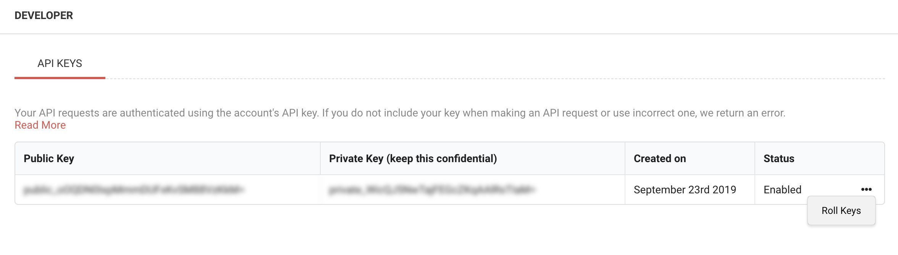
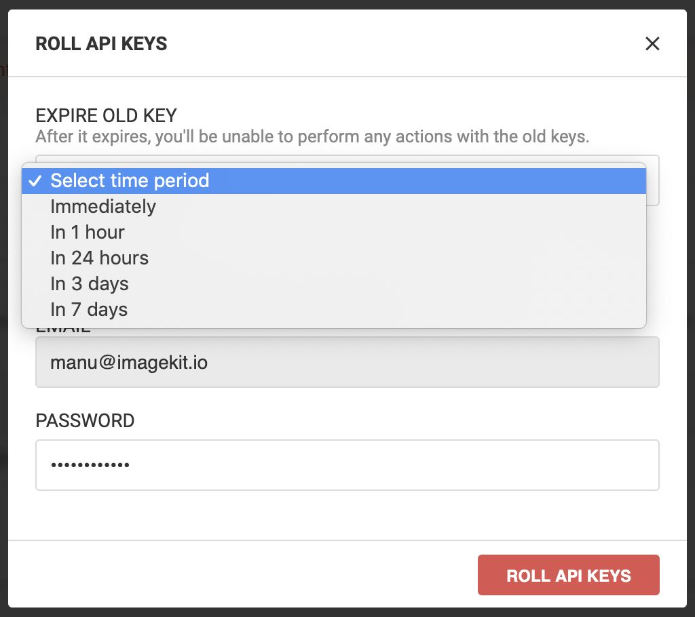

# API keys

Your API requests are [authenticated](authentication.md) using the account's API key. If you do not include your key when making an API request or use an incorrect one, we return an error.

## Obtaining your API keys

View your API keys in ImageKit.io dashboard under the [developers tab](https://imagekit.io/dashboard#developers). Every account is provided with one pair of a public and private key.

### **Public key**

This is used to identify your account in certain client-side file upload implementations. It is not meant to be secret, and you can publish this in client-side Javascript code, or an Android or iPhone app.

### **Private key**

This should be kept confidential and only stored on your servers. Private key is used to [authenticate](authentication.md) your account when you make an API request.

## Keeping your keys safe

It is strongly recommended to keep your private key safe and confidential. To help keep your API keys secure, follow these best practices:

1. Do not embed API keys directly in code. API keys that are embedded in code can be accidentally exposed to the public. For example, you may forget to remove the keys from code that you share. Instead of embedding your API keys in your applications, store them in environment variables or in files outside of your application's source tree.
2. Do not store API keys in files inside your application's source tree. If you store API keys in files, keep the files outside your application's source tree to help ensure your keys do not end up in your source code control system. This is particularly important if you use a public source code management system such as GitHub.

## Rolling keys

If an API key is compromised, you should roll that pair and start using the newly generated keys.

You can select an expiry time for the old key. After this duration the key pair will stop working.

