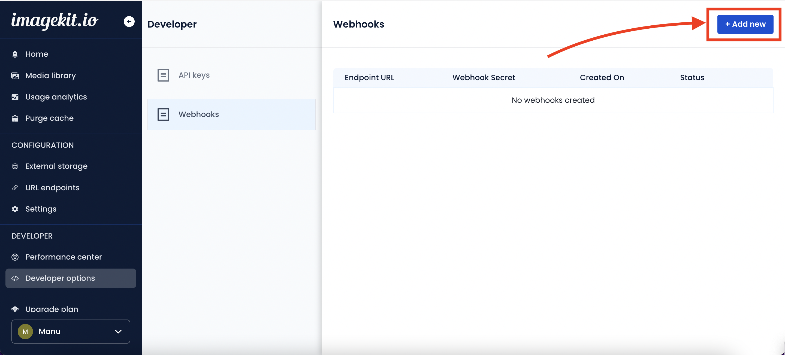
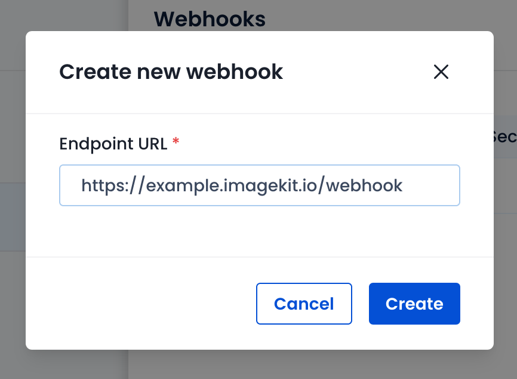
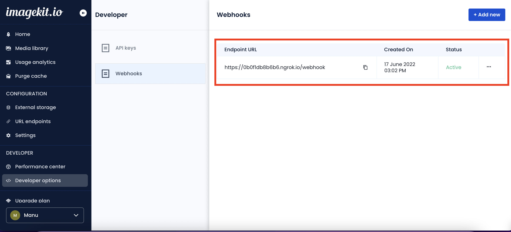
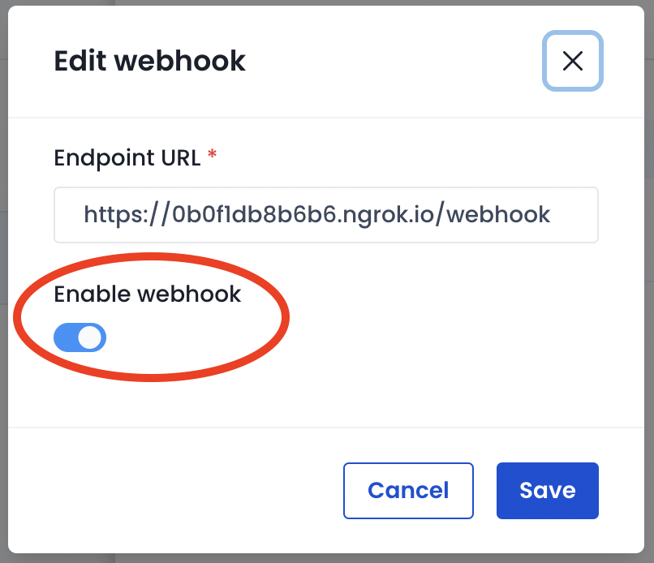

# Webhooks

Imagekit uses webhooks to notify your application when an event happens in your account. Webhooks are particularly useful for asynchronous events such as video encoding and extension processing during upload.

## Steps to receive webhooks

1. Configure the webhook in your ImageKit dashboard.
2. Create a webhook endpoint as an HTTP endpoint (URL) on your server.
3. Handle requests from ImageKit by parsing each event object and returning `2xx` response status codes.

## How to configure a Webhook?

Go to [developer options](https://imagekit.io/dashboard/developer) in ImageKit dashboard. Under Webhooks, you will see the list of webhook endpoints configured.

Click on the "Add new" button to create a new webhook endpoint.



Enter a valid HTTP(S) endpoint and click on "Create".



You should see the webhook endpoint in the list now.



To update an existing endpoint, click on `...` and change the status.



## Listen to Webhook

Use a tool like [Ngrok](https://ngrok.com/) to make your webhook endpoint publicly accessible for testing webhook implementation.

All webhook bodies are JSON encoded. The schema of the body may differ based on the event type, but the following fields are common.

| Field     | DataType | Description                              |
|-----------|----------|------------------------------------------|
| type      | `string` | Type of event.                           |
| id        | `string` | Unique identifier of the event.          |
| createdAt | `string` | Timestamp of the event in ISO8601 format.|
| data      | `JSON`   | Actual payload of event in JSON format.  |

## Verify webhook signature

Webhook endpoints are publicly accessible, therefore it is essential to filter out malicious requests. We recommend using the webhook signature to verify the authenticity of the webhook request and payload.

To achieve this, Imagekit sends the signature in `x-ik-signature` request header in every webhook request. In your backend, you can generate the same signature using the [webhook secret](https://imagekit.io/dashboard/developer/webhooks) and compare it with the header value.


Keep webhook secret secure in your backend stored in an environment variable.


### Verify signature with ImageKit SDK

You can use imagekit SDK to verify & parse webhook request payload.




```javascript
const express = require('express');
const Imagekit = require('imagekit');

// Webhook configs
const WEBHOOK_SECRET = 'whsec_...'; // Copy from Imagekit dashboard
const WEBHOOK_EXPIRY_DURATION = 300 * 1000; // 300 seconds for example

const imagekit = new Imagekit({
  publicKey: 'public_...',
  urlEndpoint: 'https://ik.imagekit.io/imagekit_id',
  privateKey: 'private_...',
})

const app = express();

app.post('/webhook', express.raw({ type: 'application/json' }), (req, res) => {
    const signature = req.headers["x-ik-signature"];
    const requestBody = req.body;
    let webhookResult;
    try {
        webhookResult = imagekit.verifyWebhookEvent(requestBody, signature, WEBHOOK_SECRET);
    } catch (e) {
        // `verifyWebhookEvent` method will throw an error if signature is invalid
        console.log(e);
        res.status(400).send(`Webhook Error`);
    }

    const { timestamp, event } = webhookResult;

    // Check if webhook has expired
    if (timestamp + WEBHOOK_EXPIRY_DURATION < Date.now()) {
        res.status(400).send(`Webhook Error`);
    }

    // Handle webhook
    switch (event.type) {
        case 'video.transformation.accepted':
            // It is triggered when a new video transformation request is accepted for processing. You can use this for debugging purposes.
            break;
        case 'video.transformation.ready':
            // It is triggered when a video encoding is finished, and the transformed resource is ready to be served. You should listen to this webhook and update any flag in your database or CMS against that particular asset so your application can start showing it to users.
            break;
        case 'video.transformation.error':
            // It is triggered if an error occurs during encoding. Listen to this webhook to log the reason. You should check your origin and URL-endpoint settings if the reason is related to download failure. If the reason seems like an error on the ImageKit side, then raise a support ticket at support@imagekit.io.
            break;
        default:
            // ... handle other event types
            console.log(`Unhandled event type ${event.type}`);
    }

    // Return a response to acknowledge receipt of the event
    res.send();
})

app.listen(3000, () => {
    console.log(`Example app listening on port 3000`)
})
```




### Verify signature manually

Imagekit webhook request contains a `x-ik-signature` header like this:

```txt
x-ik-signature: t=1655795539264,v1=b6bc2aa82491c32f1cbef0eb52b7ffaa51467ea65a03b5d4ccdcfb9e0941c946
```

- The Timestamp of signature is a Unix timestamp in milliseconds, prefixed with `t=`.
- The HMAC signature is prefixed with `v1=`.

Once you have retrieved the webhook signature from the request header & raw request body, you can verify the authenticity of the webhook request in the following steps:

**Step 1:** Extract each item from the `x-ik-signature`, by splitting on `,` separator.

```javascript
items = 't=1655795539264,v1=b6bc2aa82491c32f1cbef0eb52b7ffaa51467ea65a03b5d4ccdcfb9e0941c946'.split(',')
// [ 't=1655795539264', 'v1=b6bc2aa82491c32f1cbef0eb52b7ffaa51467ea65a03b5d4ccdcfb9e0941c946' ]
```

**Step 2:** Extract timestamp.

```javascript
timestamp = 't=1655795539264'.split('=')[1]
// '1655795539264'
```

**Step 3:** Extract signature encoded as a hex string.

```javascript
signature = 'v1=b6bc2aa82491c32f1cbef0eb52b7ffaa51467ea65a03b5d4ccdcfb9e0941c946'.split('=')[1]
// 'b6bc2aa82491c32f1cbef0eb52b7ffaa51467ea65a03b5d4ccdcfb9e0941c946'
```

**Step 4:** Compute the HMAC hash using the webhook secret, signature timestamp, and raw request body.

- HAMC key is the webhook secret.
- HMAC payload is formed by concatenating the Timestamp (as numeric string), character `.`, and raw request body (encoded as UTF8 string).
- Use the SHA256 algorithm to compute the HMAC hash.
- HMAC hash is encoded as a hex string.

Here is an example in Node.js:

```javascript
const createHmac = require("crypto").createHmac;
var signature = createHmac('sha256', webhookSecret)
  .update(timestamp + '.' + rawRequestBody)
  .digest('hex');
```

**Step 5:** Compare the signature with the signature received in the `x-ik-signature` header. The webhook request is valid if they are the same.

## Preventing replay attacks

When an attacker intercepts a webhook request, they can replay it multiple times with a valid signature.

To mitigate this, Imagekit webhook signature contains a timestamp. The Timestamp is generated before the webhook request is sent to your server.

The `verifyWebhookEvent` method in ImageKit SDK returns the Timestamp & parsed event object.

If the Timestamp is within the tolerance limit, the request can be considered valid, or you can reject it.

Optionally, a stronger approach is to use a nonce to prevent replay attacks. You can use Event ID as a nonce, it is guaranteed to be unique across all events. You can find the event ID in `id` field of the event object.

## Sample Codes




```javascript
const express = require('express');
const Imagekit = require('imagekit');

// Webhook configs
const WEBHOOK_ENDPOINT = '/webhook';
const WEBHOOK_SECRET = 'whsec_...'; // Copy from Imagekit dashboard
const WEBHOOK_EXPIRY_DURATION = 60 * 1000; // 60 seconds

const imagekit = new Imagekit({
  publicKey: 'public_...',
  urlEndpoint: 'https://ik.imagekit.io/imagekit_id',
  privateKey: 'private_...',
})

const app = express();

app.post('/webhook', express.raw({ type: 'application/json' }), (req, res) => {
  const signature = req.headers['x-ik-signature'];
  const rawBody = req.body;

  // Verify webhook signature
  let webhookResult;
  try {
    webhookResult = imagekit.verifyWebhookEvent(rawBody, signature, WEBHOOK_SECRET);
  } catch (e) {
    // Failed to verify webhook
    return res.status(401).send(`Webhook error: ${e.message}`);
  }
  const { timestamp, event } = webhookResult;

  // Check if webhook has expired
  if (timestamp + WEBHOOK_EXPIRY_DURATION < Date.now()) {
    // Stall webhook
    return res.status(401).send('Webhook signature expired');
  }

  // Handle webhook
  switch (event.type) {
    case 'video.transformation.accepted':
      // It is triggered when a new video transformation request is accepted for processing. You can use this for debugging purposes.
      break;
    case 'video.transformation.ready':
      // It is triggered when a video encoding is finished, and the transformed resource is ready to be served. You should listen to this webhook and update any flag in your database or CMS against that particular asset so your application can start showing it to users.
      break;
    case 'video.transformation.error':
      // It is triggered if an error occurs during encoding. Listen to this webhook to log the reason. You should check your origin and URL-endpoint settings if the reason is related to download failure. If the reason seems like an error on the ImageKit side, then raise a support ticket at support@imagekit.io.
      break;
    // ... handle other event types
    default:
      console.log(`Unhandled event type ${event.type}`);
  }

  // Acknowledge webhook is received and processed successfully
  res.status(200).end();
});

app.listen(3000, () => {
  console.log("Server listening on port 3000");
  console.log(
    `Webhook endpoint: 'http://localhost:${PORT}${WEBHOOK_ENDPOINT}'`,
    'Do replace 'localhost' with public endpoint'
  );
});
```





```javascript
const fastify = require('fastify');
const fastifyRawBody = require('fastify-raw-body');
const Imagekit = require('imagekit');

// Webhook configs
const WEBHOOK_ENDPOINT = '/webhook';
const WEBHOOK_SECRET = 'whsec_...'; // Copy from Imagekit dashboard
const WEBHOOK_EXPIRY_DURATION = 60 * 1000; // 60 seconds

const imagekit = new Imagekit({
  publicKey: 'public_...',
  urlEndpoint: 'https://ik.imagekit.io/imagekit_id',
  privateKey: 'private_...',
})

const server = fastify();

const startServer = async (port) => {
  // Use 'fastify-raw-body' package to retrive raw request body as utf8 string
  await server.register(fastifyRawBody, { routes: [WEBHOOK_ENDPOINT] });

  // Add webhook endpoint route
  server.route({
    method: 'POST',
    url: WEBHOOK_ENDPOINT,
    handler: (req, res) => {
      // Handle webhook
      const signature = req.raw.headers['x-ik-signature'];
      const rawBody = req.body;

      // Verify webhook signature
      let webhookResult;
      try {
        webhookResult = imagekit.verifyWebhookEvent(rawBody, signature, WEBHOOK_SECRET);
      } catch (e) {
        // Webhook verification failed
        return res.status(401).send(`Webhook error: ${e.message}`);
      }
      const { timestamp, event } = webhookResult;

      // Check if webhook has expired
      if (timestamp + WEBHOOK_EXPIRY_DURATION < Date.now()) {
        // Stall webhook
        return res.status(401).send('Webhook signature expired');
      }
      
      // Handle webhook
      switch (event.type) {
        case 'video.transformation.accepted':
          console.log('Video transformation request accepted');
          break;
        case 'video.transformation.ready':
          console.log('Video transformation ready');
          break;
        case 'video.transformation.error':
          console.log('Video transformation error');
          break;
      }

      // Acknowledge webhook is received and processed successfully
      res.status(200).send();
    },
  });

  await server.listen({ port });
};

startServer(3000).then(() => {
  console.log("Server listening on port 3000");
  console.log(
    `Webhook endpoint: 'http://localhost:${PORT}${WEBHOOK_ENDPOINT}'`,
    'Do replace 'localhost' with public endpoint'
  );
});
```





```javascript
const http = require('http');
const Imagekit = require('imagekit');

// Webhook configs
const WEBHOOK_ENDPOINT = '/webhook';
const WEBHOOK_SECRET = 'whsec_...'; // Copy from Imagekit dashboard
const WEBHOOK_EXPIRY_DURATION = 60 * 1000; // 60 seconds

const imagekit = new Imagekit({
  publicKey: 'public_...',
  urlEndpoint: 'https://ik.imagekit.io/imagekit_id',
  privateKey: 'private_...',
})

const webhookRoute = (req, res) => {
  const signature = req.headers['x-ik-signature'];
  const reqChunks = [];
  req.setEncoding('utf8');
  req.on('data', (chunk) => {
    reqChunks.push(chunk);
  });
  req.on('end', () => {
    const rawBody = reqChunks.join('');

    // Verify webhook signature
    let webhookResult;
    try {
      webhookResult = imagekit.verifyWebhookEvent(rawBody, signature, WEBHOOK_SECRET);
    } catch (e) {
      // Webhook signature verification failed
      res.writeHead(401, `Webhook error: ${e.message}`);
      res.end();
      return;
    }
    const { timestamp, event } = webhookResult;

    // Check if webhook has expired
    if (timestamp + WEBHOOK_EXPIRY_DURATION < Date.now()) {
      // Stall webhook
      res.writeHead(401, 'Webhook signature expired');
      res.end();
      return;
    }

    // Handle webhook
    switch (event.type) {
      case 'video.transformation.accepted':
        console.log('Video transformation request accepted');
        break;
      case 'video.transformation.ready':
        console.log('Video transformation ready');
        break;
      case 'video.transformation.error':
        console.log('Video transformation error');
        break;
    }

    // Acknowledge webhook is received and processed successfully
    res.writeHead(200, 'OK');
    res.end();
  });
};

const server = http.createServer((req, res) => {
  switch (req.url) {
    case WEBHOOK_ENDPOINT:
      webhookRoute(req, res);
      break;
    default: {
      res.writeHead(404);
      res.end();
    }
  }
});

server.listen(3000, () => {
  console.log("Server listening on port 3000");
  console.log(
    `Webhook endpoint: 'http://localhost:${PORT}${WEBHOOK_ENDPOINT}'`,
    'Do replace 'localhost' with public endpoint'
  );
});

```





## List of events

Below is the list of events for which ImageKit calls your configured webhook.

- [video.transformation.accepted](../../features/video-transformation/video-webhook-events.md#video.transformation.accepted)
- [video.transformation.ready](../../features/video-transformation/video-webhook-events.md#video.transformation.ready)
- [video.transformation.error](../../features/video-transformation/video-webhook-events.md#video.transformation.error)
