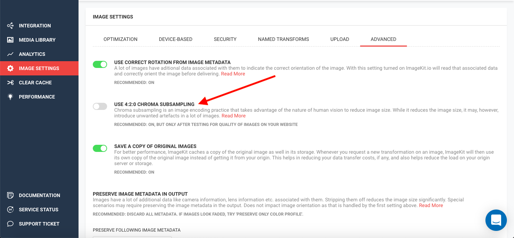

# Chroma Subsampling

## Chroma Subsampling

Chroma Subsampling is an optimization technique that is used for JPEG encoding. This takes advantage of the lower sensitivity of the human eye towards colour (chroma) than towards brightness (luma).

It is generally recommended to use 4:2:0 chroma subsampling on all images for a smaller output image. But in certain cases, especially ones with a bright object in the foreground over a completely white background, this optimization introduces unwanted artefacts, i.e., as your image size gets smaller, the visual quality goes down as well.

ImageKit.io keeps this setting turned OFF by default to avoid changing the image's visual quality. It is recommended to test this setting with your images before implementing it on your live site.


**Note:**

Since Chroma Subsampling is turned OFF by default, web analysis tools like Google's PageSpeed Insights might show that your images can be further optimized by a couple of KBs.


### Setting on the Dashboard

4:2:0 Chroma Subsampling setting is available within the Advanced section of [Image Settings](https://imagekit.io/dashboard?redirectTo=settings#settings) on the dashboard.

