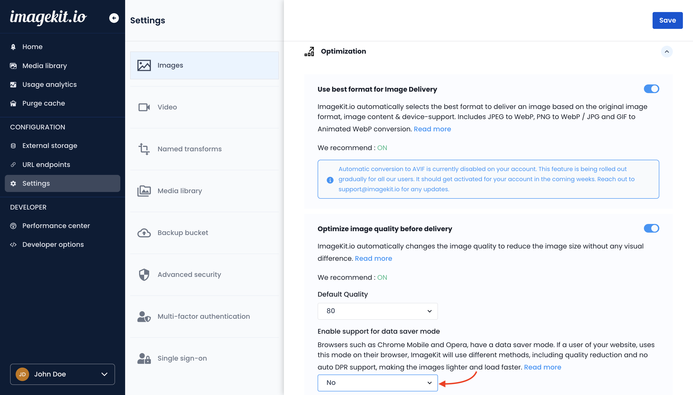

# Data Saver Mode

Mobile browsers like Chrome Mobile and Opera Mobile allow users to activate a data-saver mode. With this mode enabled, the browser sends a `Save-data` header within the request, with the value set to `ON` 

> By identifying this header, a web page can customize and deliver an optimized user experience to cost- and performance-constrained users." - [Google](https://developers.google.com/web/fundamentals/performance/optimizing-content-efficiency/save-data/).

If a user is using data saver mode within their browser, ImageKit.io compresses the images even further. This reduces the image size even further. If the user doesn't use data saver mode, ImageKit.io continues to deliver the same image as with all the other end users. In both these cases, the same URL is used to cater to different performance requirements.

## Data-Saver setting in the dashboard

This additional compression for data-saver mode is completely opt-in. This setting is turned OFF by default.

You can turn on this setting within the Optimization section of the [Image Settings](https://imagekit.io/dashboard/settings/images).

