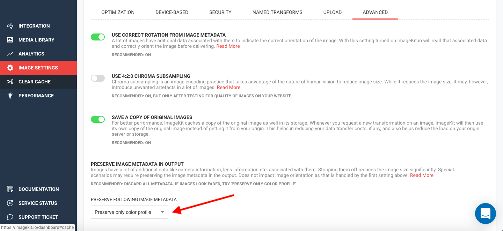
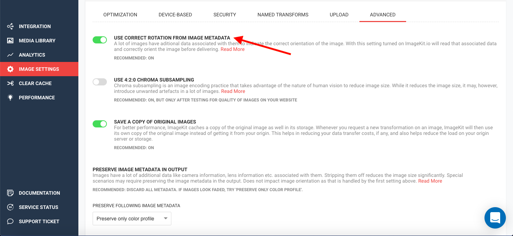

# Metadata, Color Profile and Orientation

ImageKit.io lets you control the metadata, color profile, and image orientation through the dashboard as well as URL parameters.

## Image Metadata

Images contain and carry textual information with them like date and time information, camera settings (aperture, shutter speed, orientation, and more), and Copyright Information. While this information may be relevant for a lot of applications, it is of little use when delivering images on a website or app. Removing this metadata can shave off many KBs from the image size, resulting in faster image load times.

By default, ImageKit.io removes all image metadata to deliver the final optimized output image. However, the original master image at your origin or in the media library would still contain all the original metadata.

The metadata can be preserved for an image in two ways:

### Using the URL parameter

The `md` parameter overrides the default dashboard setting and preserves the entire metadata of the image.

**Syntax** : `md-true`

Image URL:[http://ik.imagekit.io/demo/img/tr:md-true/mediumcafe](http://ik.imagekit.io/demo/img/tr:md-true/mediumcafe) B1iTdD0C.jpg

### Using the Dashboard Setting

Instead of appending `md-true` to every image URL, you can enable 'Preserve Complete Metadata' within the Advanced Section under [Image Settings](https://imagekit.io/dashboard?redirectTo=settings#settings) on the dashboard.


Preserving all the metadata would increase the size of your images, and correspondingly, reflect in the page load time and bandwidth consumption.


## Color Profile

Color Profile is a part of the [image metadata](metadata-color-profile-and-orientation.md#image-metadata) that indicates how a particular color is to be displayed on the end-user's device screen. Since ImageKit.io removes metadata by default, the color profile gets removed as well.

You can preserve all the metadata of the image to retain the color profile, by using the `md-true` . However, for most cases, preserving the color profile alone is sufficient for websites and apps, where users expect lighter images but with good color and none of the other metadata information that increase the image size, and consequently, the load time.

Color Profile can be preserved for an image in two ways:

### Using the URL parameter

The `cp` parameter overrides the default dashboard setting and preserves the color profile from the original master image to the final output image. All other image data is removed.

**Syntax :** `cp-true`

Image URL: [http://ik.imagekit.io/demo/img/tr:cp-true/medium_cafe_B1iTdD0C.jpg](http://ik.imagekit.io/demo/img/tr:cp-true/medium_cafe_B1iTdD0C.jpg)

### Using the Dashboard Setting

Instead of appending `cp-true` to every URL, you can enable 'Preserve only color profile' within the Advanced section of [Image Settings](https://imagekit.io/dashboard?redirectTo=settings#settings).

## Image Orientation

The orientation of an image is based on the EXIF (Exchangeable Image File) orientation tag within the image metadata. This tag dictates and corrects the image orientation before sending the image to the end-user.

Since the image orientation is a part of the image metadata, and ImageKit.io removes the image metadata by default, the image would be displayed in an incorrect orientation to the user.

ImageKit.io provides auto orientation, which corrects the image orientation before removing all the metadata. This reduces the file size considerably and retains the correct orientation. The proper orientation can also be achieved by preserving all the metadata, but this would result in larger image sizes.

The correct rotation can be preserved by using the transformation parameter `rt-auto` in the URL or through the dashboard within the Advanced section of [Image Settings](https://imagekit.io/dashboard/settings/images):

