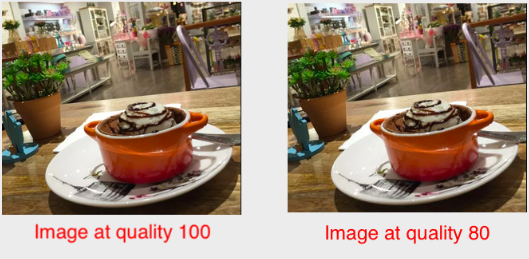

# Quality Optimization

## Image Quality

Image quality is a measure of the perceived visual quality of the image. ImageKit.io measures the image quality on a scale of 1 to 100, 100 indicating the best quality and 1 indicating the lowest quality. Image quality and image size are also directly proportional. Higher the image quality, larger the image size.

The inability of the human eye to perceive pixel-level changes in the image can be advantageous for serving smaller sized images.

For example, images at quality 100 and quality 80 have no perceived visual difference as seen in the below images.

When you start using ImageKit.io, the default image quality is set to 80. This means that images having quality above 80 are automatically brought down to quality 80. This reduces the file size while maintaining a good visual quality for your end-users.


:bulb: **Tip:**\
****Specific industries like eCommerce, which depend on image quality to drive conversions, can choose a quality level between 85-95. As mentioned earlier, higher the image quality, larger the file size.


### Image Quality from the dashboard

The image quality can be selected from the ImageKit.io dashboard. This setting is accessible under the Optimization section of [Image Settings](https://imagekit.io/dashboard/settings/images).

This setting is turned ON by default at quality 80. If you do not want ImageKit.io to change your image's quality, you can turn this setting OFF.


Avoid setting your image quality at 100. This will lead to a larger image size, without much perceptible improvement in the visual quality of the image.


### Image Quality using the URL parameter

ImageKit.io lets you control the quality of the image using the URL parameter `q` . Using the `q` parameter overrides the default quality setting specified within the dashboard. This is helpful when you want to deliver all your images at the same consistent quality while changing the quality of a few selected images.

**Syntax** : `q-integer` integer between 1-100

Image URL using `q` parameter: [http://ik.imagekit.io/demo/img/tr:q-80/medium\_cafe\_B1iTdD0C.jpg](http://ik.imagekit.io/demo/img/tr:q-80/medium\_cafe\_B1iTdD0C.jpg)


Use the `orig` [URL parameter](broken-reference) if you want to deliver the original image without applying any ImageKit.io quality optimizations.

