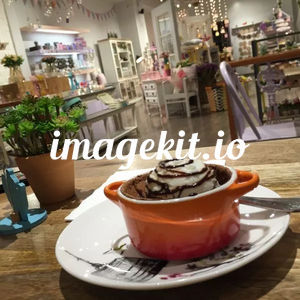
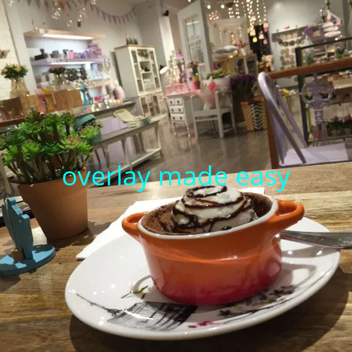

# Image Transformations

## URL Based transformations

ImageKit.io can perform real-time transformations to deliver perfect images to the end-users. These transformations can be performed by using the URL-based transformation [parameters](resize-crop-and-other-transformations.md).&#x20;



```markup
        URL-endpoint        transformation       image path                                    
┌──────────────────────────┐┌────────────┐┌───────────────────────┐
https://ik.imagekit.io/demo/tr:w-300,h-300/medium_cafe_B1iTdD0C.jpg
```



* **Original 600x600 image**\
  [https://ik.imagekit.io/demo/medium\_cafe\_B1iTdD0C.jpg](https://ik.imagekit.io/demo/medium\_cafe\_B1iTdD0C.jpg)
* **Resized 300x300 image**\
  [https://ik.imagekit.io/demo/`tr:w-300,h-300`/medium\_cafe\_B1iTdD0C.jpg](https://ik.imagekit.io/demo/tr:w-300,h-300/medium\_cafe\_B1iTdD0C.jpg)

These transformation parameters `w-300,h-300` can be added in the URL as path params or as query parameters.

* **As path parameter** [https://ik.imagekit.io/demo/`tr:w-200,h-200`/medium\_cafe\_B1iTdD0C.jpg](https://ik.imagekit.io/demo/tr:w-200,h-200/medium\_cafe\_B1iTdD0C.jpg)
* **As query parameter** [https://ik.imagekit.io/demo/medium\_cafe\_B1iTdD0C.jpg?`tr=w-200,h-200`](https://ik.imagekit.io/demo/medium\_cafe\_B1iTdD0C.jpg?tr=w-200,h-200)


Images transformation are subject to [certain limits](../../limits-and-troubleshooting/limits.md#image-limits).


## Use cases:

The transformations can be as basic as manipulating the height and width of the image, to complex transformations like watermarking or smart cropping of your images. A few common use-cases are explained below.

### 1. Creating multiple variants from a single master image

Often you need multiple variations of a single image to cater to different devices and sections within your application layout. Now you can create as many variations using ImageKit.io real-time image transformation parameters. Just change the URL to get a new image.

**Learn about all commonly used resizing parameters**


[resize-crop-and-other-transformations.md](resize-crop-and-other-transformations.md)


**Learn how to used named transformations for better code readability**


[named-transformations.md](../named-transformations.md)


### 2. Low-quality image placeholder&#x20;

You can load a small size blurred image as a placeholder while the actual image loads in the background. ImageKit.io provides a blur parameter `bl` that can give you a blurred file that is smaller in file size but can be used as a placeholder as it shows the content. This technique is used by many applications, including Medium publication.

.jpg>)

### 3. Deliver Responsive and Art Directed Images

With the ability to resize images by changing URL, it becomes very easy to implement [responsive images](https://imagekit.io/responsive-images/) in your web applications. Learn more about responsive images in our detailed guide:



### 4. Smart-cropping for generating meaningful thumbnails

ImageKit.io can automatically detect the most important part of the image and preserves it in the output thumbnail. This could be super useful while creating small thumbnails. Learn more from the blog post below.


Practical applications of smart crop


### 5. Watermarking or image overlay

You can overlay multiple images or colored rectangles on your original image directly from the URL. If you happen to change the overlay image, it can be done in minutes instead of days.

Here we have put the ImageKit.io logo ([https://ik.imagekit.io/demo/logo-white_SJwqB4Nfe.png](https://ik.imagekit.io/demo/logo-white_SJwqB4Nfe.png)) on another image using overlay syntax i.e. `l-image,i-logo-white_SJwqB4Nfe.png,l-end`

Learn more about [image overlay using layers](overlay-using-layers.md#add-images-over-image).



### 6. Text overlay

You can overlay text on an image and create dynamic banners. You can also control the font, font size, weight, color, and position of the text.

Learn more about [text overlay using layers](overlay-using-layers.md#add-text-over-image).



### 7. SVG to raster format conversion

ImageKit.io allows you to convert SVG images to raster formats by using the [format transformation parameter (f)](../image-transformations/resize-crop-and-other-transformations.md#format---f).

To perform this conversion, you need to specify the desired raster format as `f-<raster_format>` in the image URL. For example: `f-png`, `f-jpg`, etc.

If you enable [automatic format conversion](../image-optimization/automatic-image-format-conversion.md) or use `f-auto` in the image URL, SVG images will not be converted to raster formats and will be delivered as SVG files only. Specifying `f-<raster_format>` in the URL is the only way to convert SVGs to raster formats.


To apply image transformations such as resizing, adding overlays, etc., SVG images must be converted to raster formats.




URL - [https://ik.imagekit.io/ikmedia/imagekitlogo.svg](https://ik.imagekit.io/ikmedia/imagekitlogo.svg)





URL - [https://ik.imagekit.io/ikmedia/tr:f-png/imagekitlogo.svg](https://ik.imagekit.io/ikmedia/tr:f-png/imagekitlogo.svg)


The SVG image is transformed to PNG format. The transparency is preserved in PNG format by default.

The dimension of the raster output is determined by the [`viewBox` attribute](https://developer.mozilla.org/en-US/docs/Web/SVG/Attribute/viewBox) of the SVG when no height or width is defined in the transformation. In this case, the dimension of the raster output is 158x33 pixels, since the `viewBox` attribute of the original SVG is set to `0 0 158 33`.



URL - [https://ik.imagekit.io/ikmedia/tr:f-jpg,w-200,bg-pink/imagekitlogo.svg](https://ik.imagekit.io/ikmedia/tr:f-jpg,w-200,bg-pink/imagekitlogo.svg)


The SVG image is transformed into a JPG format with a width of 200 pixels and a pink background color added to it.


