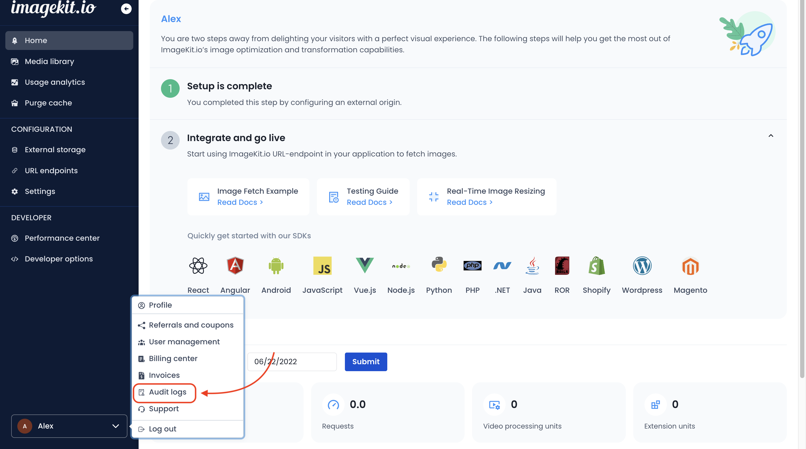
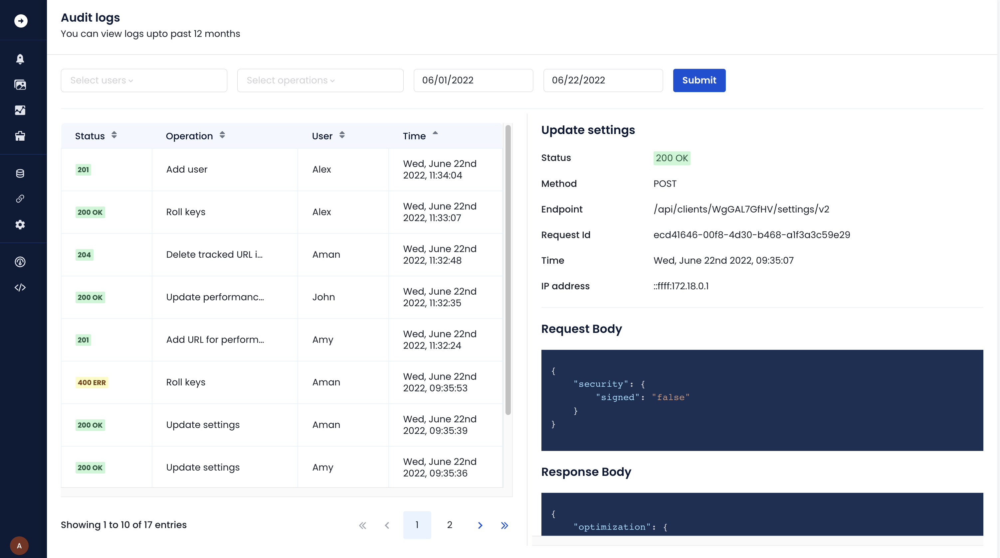

# Media library audit logs


**Enterprise plan only**\
This feature is only available in custom enterprise pricing plans.


ImageKit provides audit logs for all edit (update and delete) operations performed on media library assets (files, folders and media collections).
These logs can be helpful for organization administrators and auditors to diagnose and troubleshoot various issues, like misconfigurations, suspicious activities, etc.

Audit logs will be saved for these features:

- Sharing assets
- Renaming assets
- Updating custom metadata for assets
- Using extensions like [background removal](../extensions/overview/background-removal.md)
- Adding, updating or removing [public links](../collaboration-and-sharing/public-shareable-links.md) for assets
- Moving assets
- Deleting assets
- Adding & removing tags or [auto-tags](../extensions/overview/ai-based-auto-tagging.md) for a file
- Creating, Restoring or Deleting a [file version](../media-library/overview/asset-versioning.md)
- Adding or removing assets from a media collection
- Using [draft assets](../media-library/overview/draft-assets.md)

## Audit logs page

 // TODO: update image link

You can access the audit logs page from the user menu in the bottom left corner of the screen.

 // TODO: update image link

Here you can view all the logs in the table and the associated request and response details like method, endpoint, etc. Moreover, you can filter the logs based on operations, users, asset path, request ID and time intervals.
