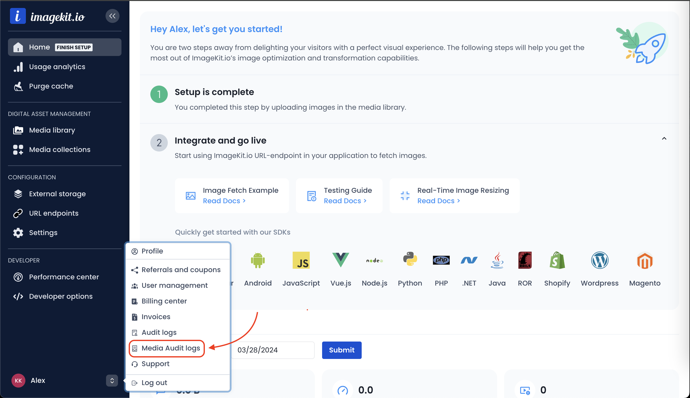
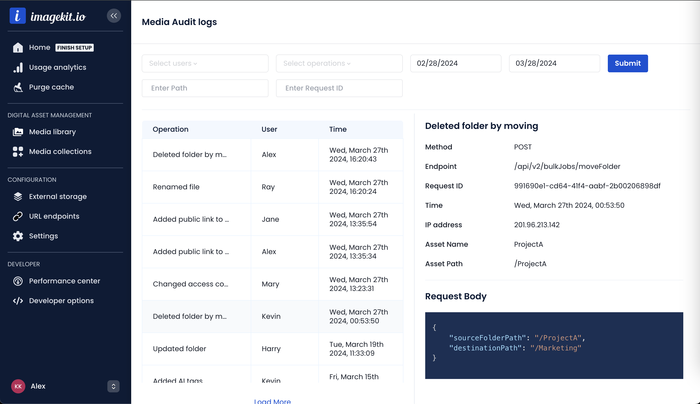
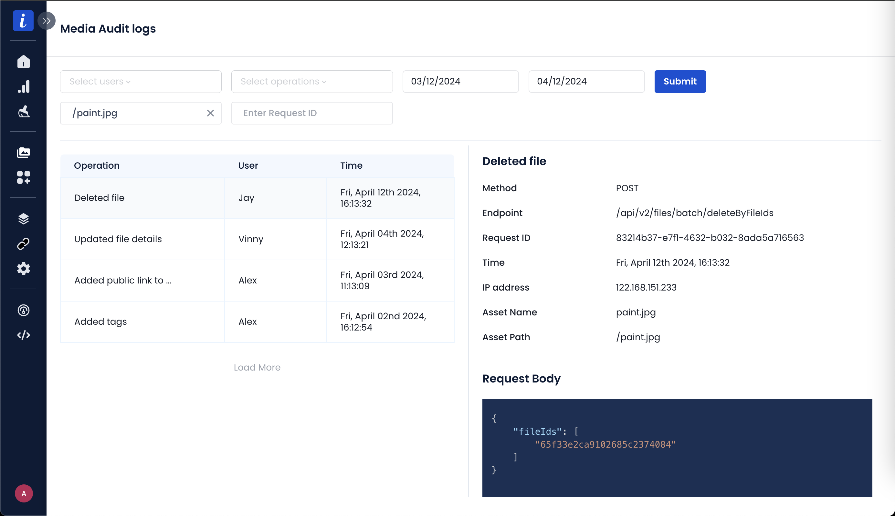
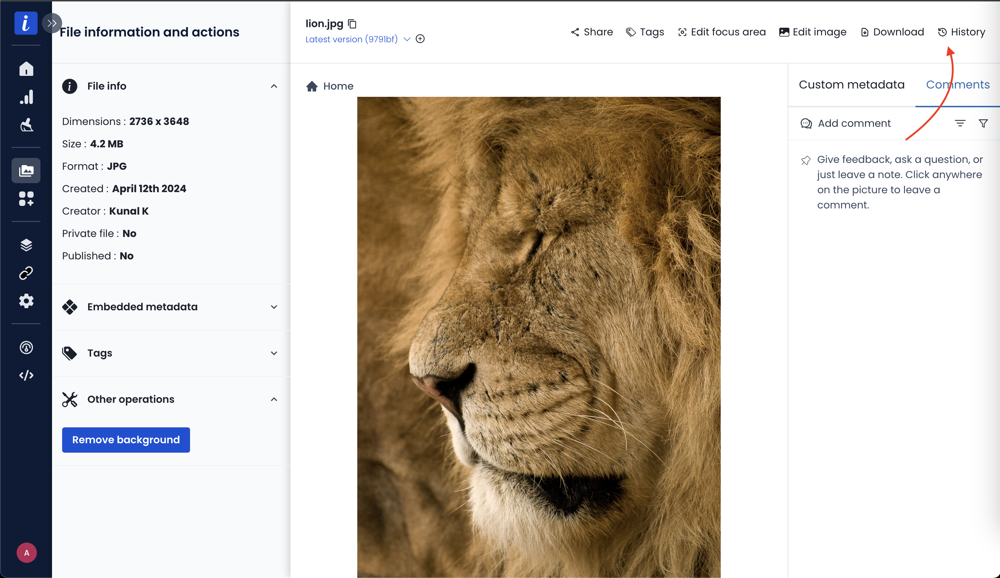
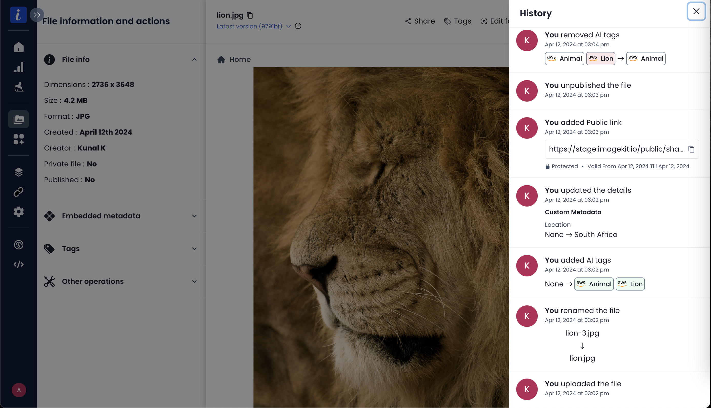
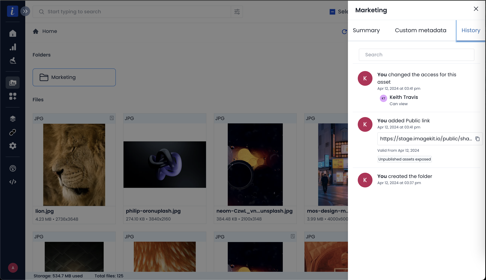

# Media library audit logs


**Enterprise plan only**\
This feature is only available in custom enterprise pricing plans. If you've [Central Audit Logs](./central-audit-logs.md) enabled, then this feature is also enabled for you.


ImageKit provides audit logs for all edit (update and delete) operations performed on media library assets (files, folders and media collections).
These logs can be helpful for organization administrators and auditors to diagnose and troubleshoot various issues, like misconfigurations, suspicious activities, etc.

Audit logs will be saved for these features:

- Sharing assets
- Renaming assets
- Updating custom metadata for assets
- Using extensions like [background removal](../extensions/overview/background-removal.md)
- Adding, updating or removing [public links](../collaboration-and-sharing/public-shareable-links.md) for assets
- Moving assets
- Deleting assets
- Adding & removing tags or [auto-tags](../extensions/overview/ai-based-auto-tagging.md) for a file
- Creating, Restoring or Deleting a [file version](../media-library/overview/asset-versioning.md)
- Adding or removing assets from a media collection
- Using [draft assets](../media-library/overview/draft-assets.md)

## Audit logs page

If you're an administrator, you can access the audit logs page from the user menu in the bottom left corner of the screen.

Here you can view all the logs in the table and the associated request and response details like method, endpoint, etc.

You can also filter these logs based on:

- Operations (like adding tags, renaming an asset, deleting an asset, adding [public links](../collaboration-and-sharing/public-shareable-links.md) and so on)
- Users (to view the entire history of their actions in the media library)
- Asset Path (eg: `/forest/tree.png`)
- Request ID (sent back in the HTTP response headers for API requests to ImageKit)
- Time Interval

### View File Deletion History

Using the asset path, you can easily track when a file was deleted and view its historical changes.


You can combine the available filters to customize your search in the media library audit logs.


## Asset History

All users with view access to the Media Library will be able to see the history of changes to each **file, folder or media collection**.

---

For folders and media collections, you can select the asset and open **"Folder details"** or **"Media collection details"** respectively to show their history.

