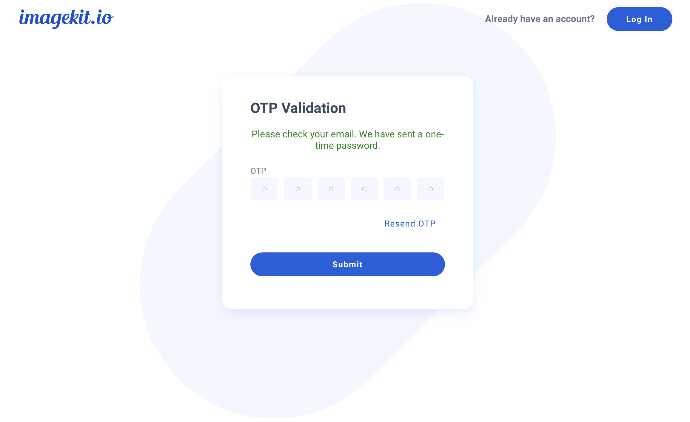

# Multi-account user association

A user can be associated with multiple ImageKit accounts using the same email address. A previously registered user can be added to a different account. Read how to add a user to an account [here](./user-access-management/README.md).

The login flow for a multi-account user is as follows:

At the login screen, you will be asked to enter your email address and password (any valid password for one of the accounts).

On clicking "Submit", a one-time password (OTP) will be sent to your registered email address. You will be asked to enter this OTP on the next screen.

Upon successfully validating the OTP provided, you may select the ImageKit ID of the account you want to access on the next screen.

## Multi-factor authentication (MFA) for multi-account users

For users added to multiple ImageKit accounts, login always requires a one-time password (OTP) sent to the registered email.

Turning [multi-factor authentication](./multi-factor-authentication.md) on or off does not affect the login process of such users. They will always be required to enter the OTP to log in to the dashboard.

## Support

If you face any issues while using these features or have a question or suggestion, please get in touch with us at support@imagekit.io.
