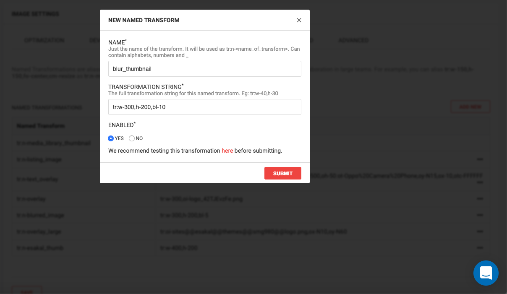

# Named Transformations

Named Transformations within ImageKit.io are aliases or names you can give for a complex URL transformation string. For example, suppose you are [resizing](image-transformations/resize-crop-and-other-transformations.md) an image to 300x200px and adding a blur to the image.

Original URL: [https://ik.imagekit.io/ikmedia/tr:w-300,h-200,bl-10/default-image.jpg](https://ik.imagekit.io/ikmedia/tr:w-300,h-200,bl-10/default-image.jpg)

URL with Named Transformation: [https://ik.imagekit.io/ikmedia/tr:n-blur_thumbnail/default-image.jpg](https://ik.imagekit.io/ikmedia/tr:n-blur_thumbnail/default-image.jpg)

Here, we replace the transformation string `tr:w-300,h-200,bl-10` with an easy-to-remember alias - `blur_thumbnail` .

## Creating Named Transformations

Navigate to the Named Transforms section within [Image Settings](https://imagekit.io/dashboard?redirectTo=settings#settings) on your dashboard. Click on 'Add New'.

Within the popup, give a name for the transformation string. For example, the name could be `blur_thumbnail` , and the transformation string could be `tr:w-300,h-200,bl-10`.

Always test your transformation before saving it as a named transformation. You can test by clicking on the message that appears at the bottom of the popup.

Save the transformation. You can now replace the string `tr:w-300,h-200,bl-10` with `tr:n-blur_thumbnail` to use named transformations within your URL.


**Note: **ImageKit.io transformation strings start with **tr:** and named transformations begin with **tr:n-{the name of transformation}**



URLs containing non-existent named transformation keys will return an error response with 400 status code


## Editing Named Transformations

Navigate to the Named Transforms section within [Image Settings](https://imagekit.io/dashboard?redirectTo=settings#settings) on your dashboard.

Click on `...` next to the named transformation you want to edit. A popup window appears.

Edit the named transformation name and/or string, and Enable/Disable the named transformation from the popup.

Click "Submit". The changes apply to every new image URL request. For older images, please clear the cache or contact support through your dashboard, or email us at [support@imagekit.io](mailto:customer-support@imagekit.io)

## Secure Images with Named Transformations

You can secure your images using named transformations by [restricting unnamed image transformations](security/#restricting-unnamed-image-transformations) for all your image URLs.
