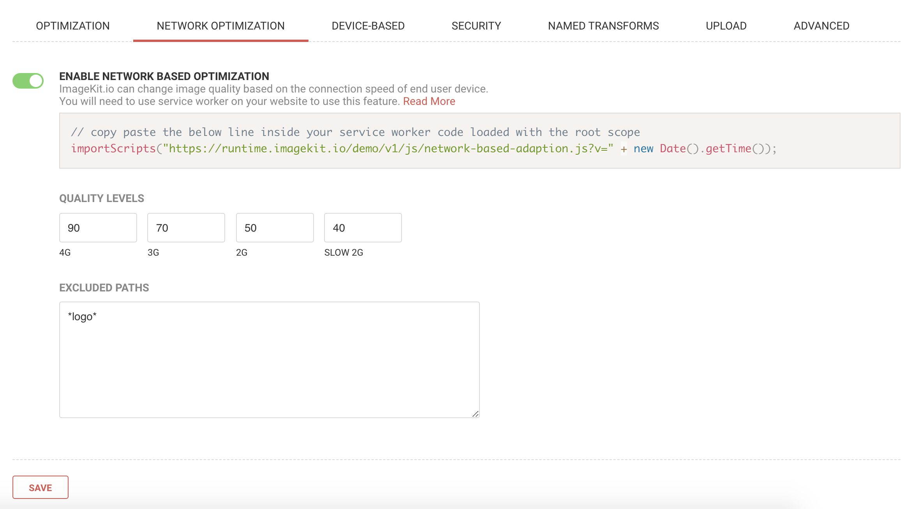
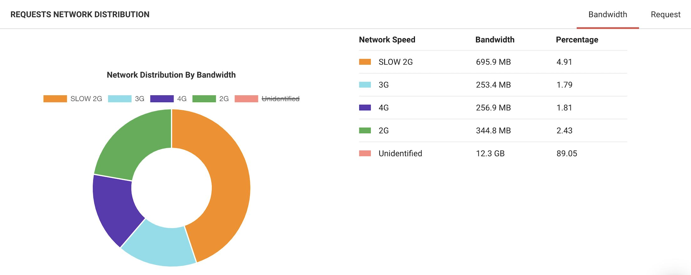

# Network-based image optimization

ImageKit.io provides you with the functionality to deliver different images based on the end user's network connection. For example, a user on a 2G network would see an [image of quality](image-optimization/quality-optimization.md) 60, while users on a 4G network would see images at quality 90. This method works when the same user switches between different network conditions, as well.

This helps you deliver the best available version of an image so that your end-users experience consistent web performance.

## How to enable network-based image optimization?

### Step 1: Enable network-based optimization

Go to the Network-optimization tab under [image settings](https://imagekit.io/dashboard?redirectTo=settings) and enable the setting.



### Step 2: Configure quality settings and exclusions

A network connection is divided into four broad categories - 4G, 3G, 2G, and Slow 2G. You can set 4 different quality levels based on the application. If there are few images that you want to exclude, then specify the full path in Excluded paths section \(it supports wildcard\) e.g., `https://ik.imagekit.io/<your_imagekit_id>/*logo*.jpg`.

### Step 3: Install the service worker on your website

You will need to use a service worker on your website to use this feature. Copy-paste the below line inside your service worker code loaded with the root scope. Replace `your_imagekit_id` with your actual imagekit Id.

```javascript
// copy-paste the below line inside your service worker code loaded with the root scope
importScripts("https://runtime.imagekit.io/<your_imagekit_id>/v1/js/network-based-adaption.js?v=" + new Date().getTime());
```

### Step 4: See the analytics in your ImageKit.io dashboard



