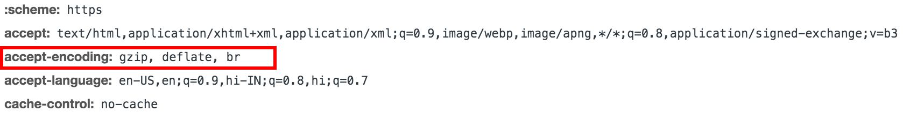
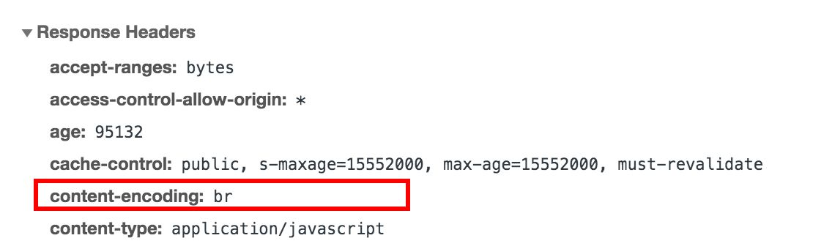
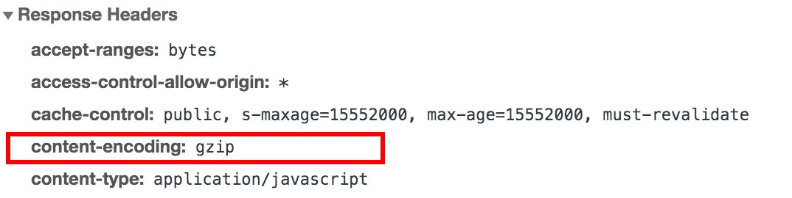

# Non-image file compression

ImageKit.io supports the delivery of images and [non-image files](non-image-file-compression.md#non-image-file-extensions) using its CDN. All non-image files delivered via ImageKit.io CDN are compressed using Brotli and gzip compression, with a preference for Brotli compression over gzip compression.

Over 90% of browsers currently support Brotli compression.

If the browser supports Brotli compression and is advertised within the Accept Encode Request Header, ImageKit.io uses Brotli compression. Otherwise, gzip compression is used by default. All the resources compressed using either algorithm are cached at the CDN, and all the end users get a cached copy of the resource.

## Non-image file extensions

| **List of supported non-image file extensions**  | **List of unsupported non-image file extensions**  |
| :--- | :--- |
| .js | .ogg |
| .css | .ogv |
| .svg | .zip |
| .json | .tgz |
| .pdf | .rar |
| .mp4 | .bz2 |
| .txt | .tar |
| .html | .avi |
| .m3u8 | .mid/.midi |
| .ts | .wav |


Images, except SVG, are not subject to Brotli or gzip compression. Images are already compressed using dedicated lossy and lossless compression algorithms.


## Checking for Brotli Compression

Support for Brotli compression with a browser can be checked within its Accept Encode Request Header. The browsers that support Brotli would include `br` as shown below.

Look at the Content-Encoding Response Header to check whether the resource is Brotli encoded.

If you have any queries regarding the compressions performed on non-image files, please reach out to our team through your dashboard or at [support@imagekit.io](mailto:supprort@imagekit.io).

