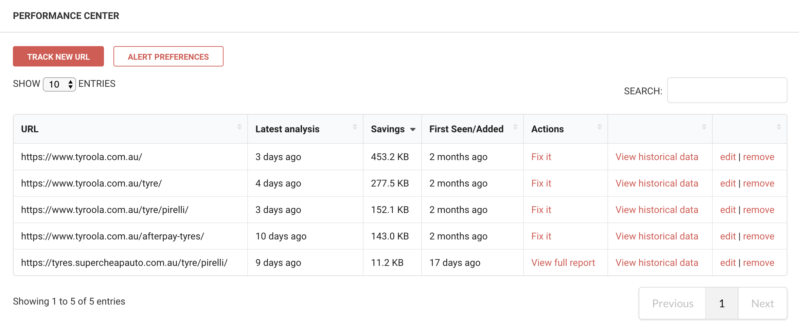
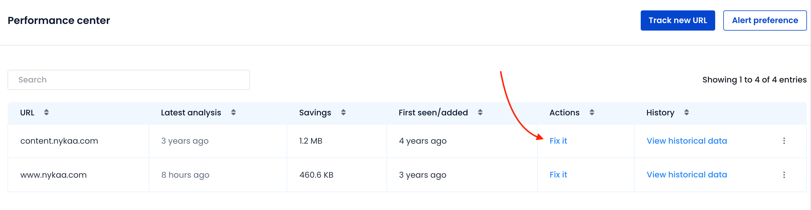
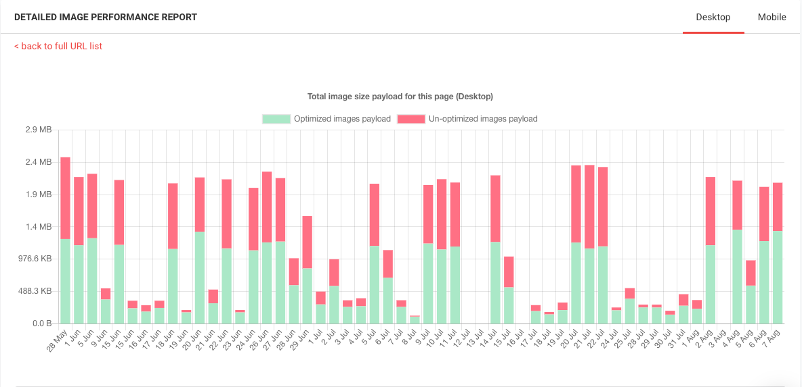

# Performance monitoring

ImageKit.io automates image performance monitoring and provides alerts regarding performance bottlenecks.

Once you complete your [integration](../integration/integration-overview.md) and start delivering images using ImageKit.io, you can track the performance of images for both desktop and mobile devices using the Performance Center.


**Paid plan only**\
****Performance Center is currently available only to paid users.


## Setting Up the Performance Center

Navigate to [Performance Center](https://imagekit.io/dashboard?redirectTo=performance#performance) within the dashboard, and click on 'Track New URL' to add URLs of your webpages that you would like to monitor. It is a good practice to add at least 3-4 URLs of the most important pages of your website to monitor image performance.

### What Pages Should you Monitor?

An eCommerce business should be monitoring its homepage, few product listing pages, search pages, and product detail pages. If you manage news, entertainment, or blog sites, be sure to track a few of your busiest pages like the actual article page or an article category page.

Once you add the URL, ImageKit.io starts collecting performance data and generates a daily report.

## Monitor and Fix Performance Issues

Click on 'Fix It' under 'Actions' within the [Performance Center](https://imagekit.io/dashboard?redirectTo=settings#performance). It directs you to a detailed image performance report which shows all information related to the health of images on that particular URL/web page.

Some of the common issues highlighted by the performance center:

1. Change Format: This issue can be because certain images aren't being delivered through ImageKit.io. Check our [integration guide](../integration/integration-overview.md) to integrate with ImageKit.io properly. Another possible solution is that the [automatic format conversion](image-optimization/automatic-image-format-conversion.md) might be turned OFF.
2. Images not appropriately resized: You can refer to the guide on performing [image transformations](image-transformations/).
3. Loading higher quality images: The performance report compares images against quality 80, and you will see this warning if you have set your [image quality](image-optimization/quality-optimization.md#image-quality) higher than 80.

## Historical Performance Data

Click on 'View Historical Data' to see the past performance report for any URL you have added within the performance center.

You can switch between Desktop and Mobile report on the top right corner.
