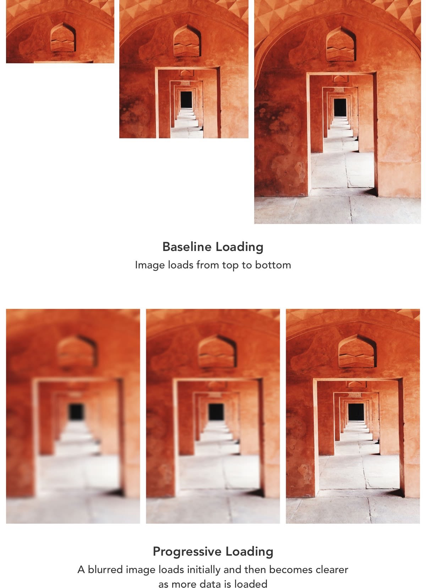

# Progressive JPEGs

ImageKit.io provides the option to load JPEG images progressively using its URL parameter `pr-true` .

With progressive rendering, the image renders as a low-quality pixelated full image and the pixels and information are gradually added to the image. This is different from baseline loading, where the images are downloaded row-wise \(baseline loading\). Progressive JPEGs give faster perceived load times.

Progressive JPEG can also be smaller than Baseline JPEG, especially for high resolution images.

To deliver progressive JPEGs, use the parameter - `pr-true` within the image URL. This delivers a progressively encoded JPEG.

For example - [https://ik.imagekit.io/demo/img/tr:w-300,f-jpg,pr-true/default-image.jpg](https://ik.imagekit.io/demo/img/tr:w-300,f-jpg,pr-true/default-image.jpg)

