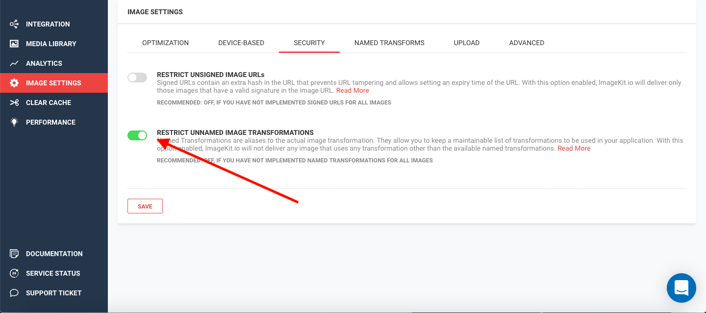
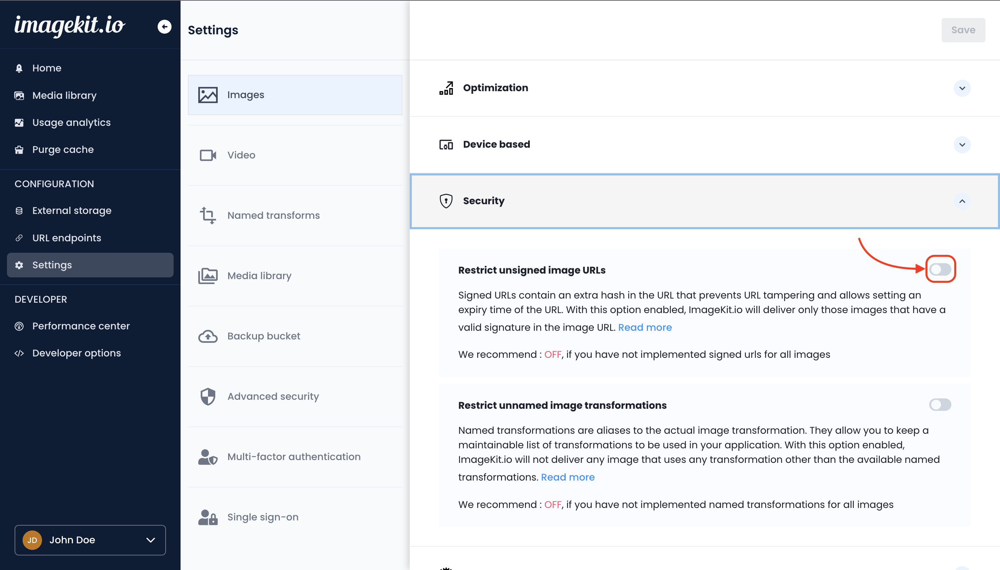

# Security

ImageKit.io provides certain features to secure your images and restrict the transformations that can be performed. Implementing these security features will stop the unauthorized use of your image URLs.

You can secure your images by [restricting unsigned URLs](./#restricting-unsigned-urls), [restricting unnamed image transforms](./#restricting-unnamed-image-transformations), and using [private images](private-images.md).

## Restricting Unnamed Image Transformations

To use this security feature, you must be using [Named Transformations](../named-transformations.md).

Navigate to the Security Section within [Image Settings](https://imagekit.io/dashboard?redirectTo=settings#settings) on your dashboard.

Enable 'Restrict Unnamed Image Transformations' and click on 'Save'.


Restricting Unnamed Transformations does not allow explicit transformations. For eg: enabling this feature and then trying to use tr:w-100,h-100 within the URL, or any other transform mentioned explicitly would return a 'Bad Image Transformation Request' error.


## Restricting Unsigned URLs

To use this security feature, you must be [signing your image URLs](signed-urls.md#generating-signed-urls-on-your-own).

Navigate to the Security Section within [Image Settings](https://imagekit.io/dashboard?redirectTo=settings#settings) on your dashboard.

Enable 'Restrict Unsigned Image URLs' and click on 'Save'.

