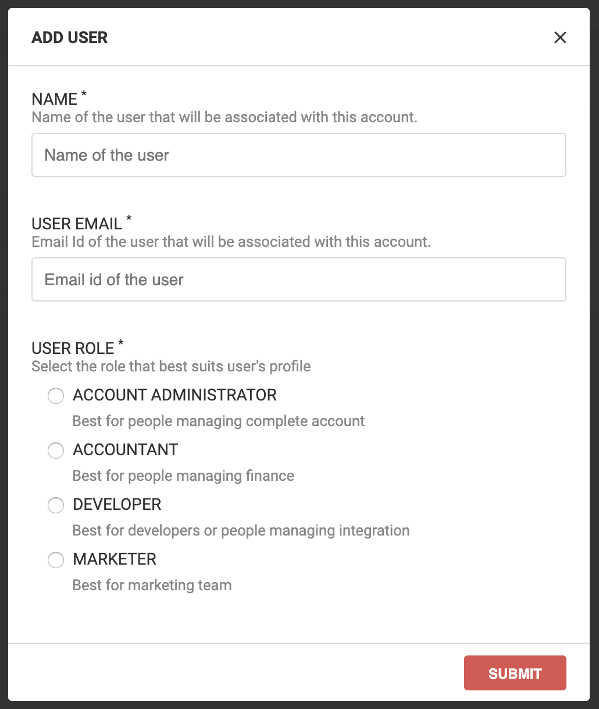

# User access management

User access management allows you to manage how your team members access [ImageKit.io dashboard](https://imagekit.io/dashboard). You can add users with different roles and permission e.g. developers, accountant, account administrator.


**Paid plan only**  
User access management is currently available only to paid users.


## Adding a new user in ImageKit.io account

Go to [users section](https://imagekit.io/dashboard?redirectTo=users) in ImageKit.io dashboard and click on Add user button. Fill out the form and choose the [user role](user-access-management.md#user-roles).


**Maximum number of users** 🙌   
****An ImageKit.io account can have a maximum of 5 users. Please reach out to support at support@imagekit.io if you want to add more users.


## User roles

A user can have four different roles:

1. Account administrator - Best for people managing complete account. User with this role has full access to your ImageKit.io account and can add other users.
2. Accountant - Your finance team member should have this role. A user with accountant role can access [analytics](https://imagekit.io/dashboard?redirectTo=analytics) and [billing](https://imagekit.io/dashboard?redirectTo=billing) section. The user has the permission to change the subscription.
3. Developer - Your development team member should have this role. A user with developer role can access [integration](https://imagekit.io/dashboard?redirectTo=integration), [media-library](https://imagekit.io/dashboard?redirectTo=media-library), [analytics](https://imagekit.io/dashboard?redirectTo=analytics), [cache purge utility](https://imagekit.io/dashboard?redirectTo=cache), [performance center](https://imagekit.io/dashboard?redirectTo=performance), [developers section](https://imagekit.io/dashboard?redirectTo=developers), and [image settings](https://imagekit.io/dashboard?redirectTo=settings).
4. Marketer - A user with this role can access [media-library](https://imagekit.io/dashboard?redirectTo=media-library). This role is suitable for marketing team members who need to upload marketing assets.

