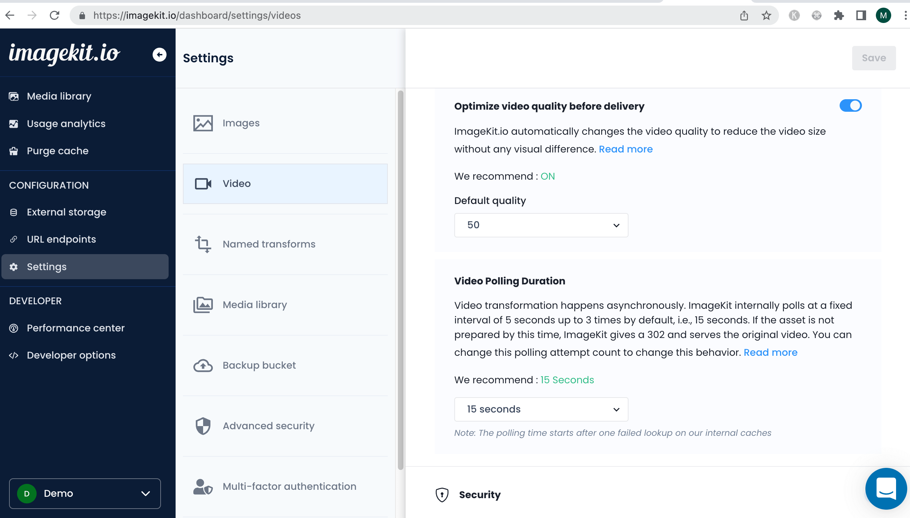

# Video Transformation

## URL Based transformations

Using ImageKit.io, you can perform real-time transformations to deliver perfect videos to the end-users. These transformations can be performed by using the URL-based transformation [parameters](../image-transformations/resize-crop-and-other-transformations.md). 



```markup
        URL-endpoint        transformation   video path                                    
┌──────────────────────────┐┌────────────┐┌───────────────┐
https://ik.imagekit.io/demo/tr:w-300,h-300/sample-video.mp4
```



* **Original video**\
  [https://ik.imagekit.io/demo/sample-video.mp4](https://ik.imagekit.io/demo/sample-video.mp4)
* **Resized 300x300 video**\
  [https://ik.imagekit.io/demo/`tr:w-300,h-300`/sample-video.mp4](https://ik.imagekit.io/demo/tr:w-300,h-300/sample-video.mp4)

These transformation parameters `w-300,h-300` can be added in the URL as path params or as query parameters.

* **As path parameter** [https://ik.imagekit.io/demo/`tr:w-200,h-200`/sample-video.mp4](https://ik.imagekit.io/demo/tr:w-200,h-200/sample-video.mp4)
* **As query parameter** [https://ik.imagekit.io/demo/sample-video.mp4?`tr=w-200,h-200`](https://ik.imagekit.io/demo/sample-video.mp4?tr=w-200,h-200)

## Limitations

* Input video upto `300MB` in size is supported for transformations. This limit can be adjusted based on your pricing plan.
* Video transformation happens asynchronously. ImageKit internally polls at a fixed interval of 5 seconds up to 3 times by default, i.e., 15 seconds. If the asset is not prepared by this time, ImageKit gives a 302 and serves the original video. You can change the polling attempt count setting from the dashboard to change this behavior.



Within a few seconds, optimized transformations are generated and stored in our caches. From that point onwards, we will serve the actual transformed video.

## Supported codecs for inputs

The following table lists the codecs that ImageKit supports in input for resizing and optimization.

| Container format | Video codec            | Audio codec |
| ---------------- | ---------------------- | ----------- |
| mp4              | h264, mpeg4, hevc, av1 | aac, opus   |
| mov              | mpeg4, h264            | aac         |
| webm             | vp8, vp9, av1          | opus        |
| mpeg             | mpeg1video, mpeg2video | mp2         |
| 3gp              | h263                   | aac         |
| ogg              | theora                 | vorbis      |
| ogv              | theora                 | vorbis      |
| hevc             | hevc                   |             |
| mts              | mpeg2video             |             |

### Supporting files without mp4 extension
For video transformation and optimization to work, the file extension should be `mp4`. If your resource doesn't have an `mp4` extension, you can add `/ik-video.mp4` suffix at the end. ImageKit will ignore that suffix while fetching the original asset from your media library or origin, and video transformation/optimization will work as expected. You can further append `/ik-thumbnai.jpg`, `/ik-master.mpd`, `/ik-master.m3u8` to generate thumbnail, DASH, and HLS playlist, respectively.

Examples:

```
Original asset - https://ik.imagekit.io/demo/img/video-no-extension_X9my06BI- (resource has no file extension)

DASH playlist - https://ik.imagekit.io/demo/img/video-no-extension_X9my06BI-/ik-video.mp4/ik-master.mpd?tr=sr-240_360_480

Thumbnail - https://ik.imagekit.io/demo/img/video-no-extension_X9my06BI-/ik-video.mp4/ik-thumbnail.jpg?tr=w-100

Simple optimization - https://ik.imagekit.io/demo/img/video-no-extension_X9my06BI-/ik-video.mp4
```

## Pricing
Every new video transformation that has never been done before will contribute toward video processing units using the below definition. Subsequent views of the same video transformation only count towards bandwidth. 

### Video processing units used depends on output video codec, duration and resolution:

Calculation of units for resolution:

* 1 second of SD video output = 1 unit
* 1 second of HD video output = 2 units
* 1 second of 4K video output = 4 units
* 1 second of 8K video output = 8 units
* 1 second of 16K video output = 16 units

Calculation of units for video codec:

* 1 second of video output in H.264 codec = 1 unit
* 1 second of video output in VP9 codec = 1 unit
* 1 second of video output in AV1 codec = 10 units

VPU (Video Processing Unit) usage = Duration (in seconds) x Resolution (in units) x Video Codec (in units)

Special operations:

* **Audio extraction** - Using [`vc-none`](./resize-crop-and-other-common-video-transformations.md#video-codec-vc) transformation results in audio output. This operation is equal to processing the input video in SD output resolution for the duration of the output audio.
* **Adaptive bitrate streaming** - This operation is equal to processing a 30 seconds SD resolution video. In addition, all generated representations are charged based on requested resolutions.
* **Get thumbnail** - This operation is equal to processing a 30 seconds SD resolution video.

We define resolutions in terms of total pixel count as the following.

| Resolution | Description                                                     |
| ---------- | --------------------------------------------------------------- |
| SD         | Less than 921,600 total pixels, i.e., less than 1280 x 720.     |
| HD         | Greater than or equal to 1280 x 720 but less than 3840 x 2160.  |
| 4K         | Greater than or equal to 3840 x 2160 but less than 7680 x 4320. |
| 8K         | Greater than or equal to 7680 x 4320 but less than 15360 x 8640.|
| 16K        | Greater than or equal to 15360 x 8640.                          |

## Recommendations

Here are a few recommendations you should follow while using video API in a live environment.

### Eagerly generate transformation
Whether a video is optimized or transformed, a new video(s) is generated and saved internally by ImageKit. This process could take a few seconds, depending on the video duration, output format, and transformation parameters. Therefore, you should eagerly generate the transformation before using the video URL in a live environment to ensure it works as expected. It guarantees that all necessary transformations are prepared and ready to be served. This avoids unnecessary data transfer costs on your origin. You can listen to [video webhook events](./video-webhook-events.md) to get updates on asset transformations.

### Check assets in Chrome and Safari
ImageKit prepares a `webm` and `mp4` variant of the video to serve optimized video to your users. In a few cases, for specific input videos, the encoding could permanently fail for one or both formats. In this case, you will always get `302` instead of `200`. Using such a URL in a live environment would result in repeated transformation attempts. This will unnecessarily increase origin data transfer at your end. To ensure that the video is ready in both formats, always fetch the same URL in both Chrome and Safari.
