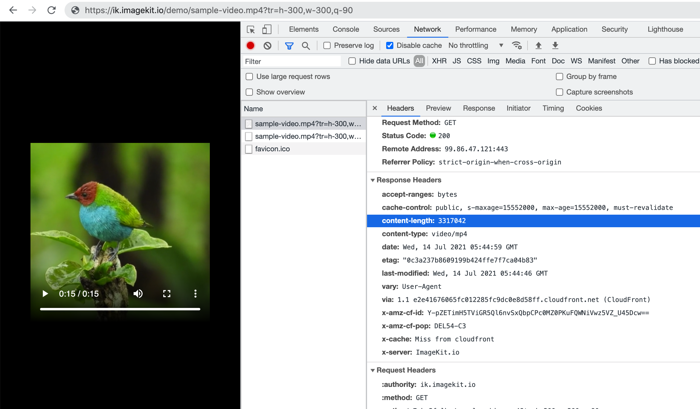
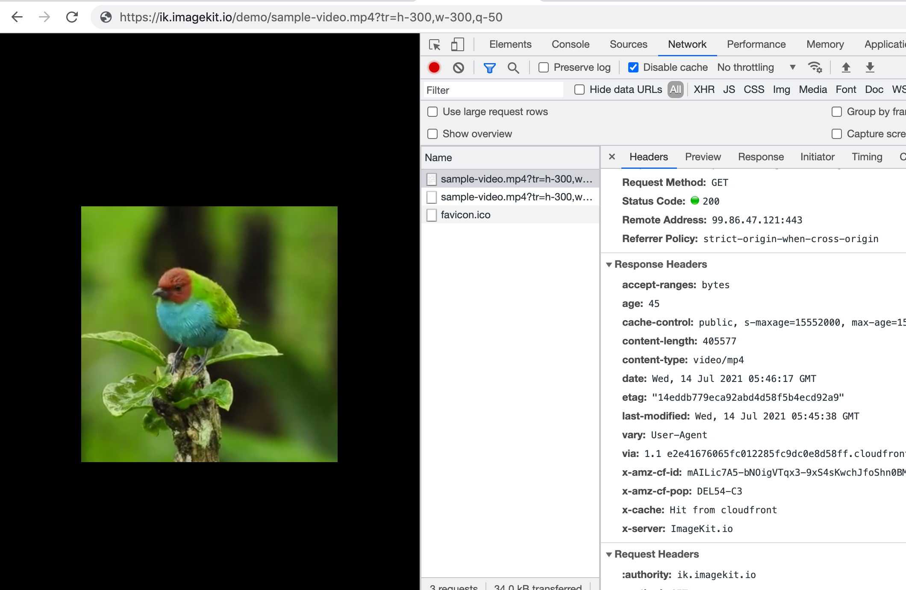

# Resize, crop, and other common video transformations

## Basic video resizing

### Width - (w)

Used to specify the width of the output video. Accepts integer value greater than 1.

When you specify just width, the height is adjusted accordingly to maintain the aspect ratio.



[https://ik.imagekit.io/demo/sample-video.mp4](https://ik.imagekit.io/demo/sample-video.mp4)\
\
Original 1280x720 px video.

.png>)



[https://ik.imagekit.io/demo/sample-video.mp4?tr=w-300](https://ik.imagekit.io/demo/sample-video.mp4?tr=w-300)

Notice that height is automatically adjusted to maintain the aspect ratio.

.png>)



### Height - (h)

Used to specify the height of the output video. Accepts integer value greater than 1.&#x20;

When you specify only height, the width is adjusted accordingly to maintain the aspect ratio.



[https://ik.imagekit.io/demo/sample-video.mp4](https://ik.imagekit.io/demo/sample-video.mp4)

Original 1280x720 px video.

.png>)



[https://ik.imagekit.io/demo/sample-video.mp4?tr=h-300](https://ik.imagekit.io/demo/sample-video.mp4?tr=h-300)

Notice that width is automatically adjusted to maintain the aspect ratio.

.png>)



### Aspect ratio - (ar)

Used to specify the aspect ratio of the output video. It is the ratio of width to height of the output video. This parameter must be used along with either the [height(h)](resize-crop-and-other-common-video-transformations.md#height-h) or [width(w)](resize-crop-and-other-common-video-transformations.md#width-w) parameter but not both.

Usage = `ar-<width>-<height>`


If you specify both [height(h)](resize-crop-and-other-common-video-transformations.md#height-h) and [width(w)](resize-crop-and-other-common-video-transformations.md#width-w) in the URL along with [aspect ratio(ar)](resize-crop-and-other-common-video-transformations.md#aspect-ration-ar), then the aspect ratio is ignored.




URL - [https://ik.imagekit.io/ikmedia/sample-video.mp4](https://ik.imagekit.io/ikmedia/sample-video.mp4)



URL - [https://ik.imagekit.io/ikmedia/sample-video.mp4?tr=ar-4-1,h-100](https://ik.imagekit.io/ikmedia/sample-video.mp4?tr=ar-4-1,h-100)



## Crop, Crop Modes, and Focus

If only, one of the [height(h)](resize-crop-and-other-common-video-transformations.md#height-h) or [width(w)](resize-crop-and-other-common-video-transformations.md#width-w) is specified, then ImageKit.io adjusts the other dimension accordingly to preserve aspect ratio and no cropping takes place.

But when you specify both [height(h)](resize-crop-and-other-common-video-transformations.md#height-h) and [width(w)](resize-crop-and-other-common-video-transformations.md#width-w) dimensions, you need to choose the right cropping strategy based on your website layout and desired output video.


**Tip for choosing the right cropping strategy**\
****When choosing among different strategies for cropping, think in terms of your website layout and desired output video dimension.


* If you want to preserve the whole video content without any cropping and need the exact same dimensions (height and width) in the output as requested, choose either the [pad resize crop](resize-crop-and-other-common-video-transformations.md#pad-resize-crop-strategy-cm-pad\_resize) or [forced crop strategy](resize-crop-and-other-common-video-transformations.md#forced-crop-strategy-c-force).
* If you want to preserve the whole video content without any cropping, but it is okay if one or both the dimensions (height or width) in the output are adjusted to preserve the aspect ratio. Then choose either the [max-size cropping](resize-crop-and-other-common-video-transformations.md#max-size-cropping-strategy-c-at\_max) or [min-size cropping](resize-crop-and-other-common-video-transformations.md#min-size-cropping-strategy-c-at\_least) strategy.
* If you need the exact same dimensions (height and width) in the output video as requested but it's okay to crop the video to preserve the aspect ratio. Then choose either the [maintain ratio crop](resize-crop-and-other-common-video-transformations.md#maintain-ratio-crop-strategy-c-maintain\_ratio) or the [extract crop](resize-crop-and-other-common-video-transformations.md#extract-crop-strategy-cm-extract) strategy. You can combine the extract crop strategy with different [focus](resize-crop-and-other-common-video-transformations.md#focus-fo) values to get the desired result.

### Pad resize crop strategy - (cm-pad\_resize)

In the pad resize crop strategy, the output dimension (height and width) is the same as requested, no cropping takes place, and the aspect ratio is preserved. This is accomplished by adding padding around the video to get it to match the exact dimension as requested.

#### Example - All padding on one side

In the examples above, we saw that when the video is padded using the [pad resize crop strategy](resize-crop-and-other-common-video-transformations.md#pad-resize-crop-strategy-cm-pad\_resize), the padding is equal on both sides of the video. However, there might be cases where we want all the padding to be added on only one side of the video. This can be done using the [focus (fo)](resize-crop-and-other-common-video-transformations.md#focus-fo) parameter.



[https://ik.imagekit.io/demo/sample-video.mp4?tr=w-400,h-200](https://ik.imagekit.io/demo/sample-video.mp4?tr=w-400,h-200)\
\
The video is 400x200 but it is cropped from all sides to preserve the aspect ratio.

.png>)



[https://ik.imagekit.io/demo/sample-video.mp4?tr=w-400,h-200,cm-pad\_resize,bg-F3F3F3](https://ik.imagekit.io/demo/sample-video.mp4?tr=w-400,h-200,cm-pad\_resize,bg-F3F3F3)\
\
The video is exactly 400x200 and there is no cropping. Extra padding with [background color](resize-crop-and-other-common-video-transformations.md#background-color-bg) F3F3F3 has been added to get 400x200 output dimensions.

.png>)



You can also control the focus point using [fo parameter](resize-crop-and-other-common-video-transformations.md#focus-fo) to move the actual content to one side using relative positioning.

We added the `fo-left`. Now, all the padding is on the right of the video.

.png>)



### Forced crop strategy - (c-force)

In a forced crop strategy, the output video's dimension (height and width) is exactly the same as requested, no cropping takes place, but the aspect ratio is not preserved. It forcefully squeezes the original video to get it to fit completely within the output dimensions.&#x20;

URL - [https://ik.imagekit.io/demo/sample-video.mp4?tr=w-200,h-200,c-force](https://ik.imagekit.io/demo/sample-video.mp4?tr=w-200,h-200,c-force)\
\
Notice that the aspect ratio is changed and the video looks squeezed.

.png>)


### Max-size cropping strategy - (c-at_max)

In the max-size crop strategy, whole video content is preserved without any cropping, the aspect ratio is preserved, but one of the dimensions (height or width) is adjusted.

The output video is less than or equal to the dimensions specified in the URL,i.e., at least one dimension will exactly match the output dimension requested, and the other dimension will be equal to or smaller than the corresponding output dimension requested.

URL - [https://ik.imagekit.io/demo/sample-video.mp4?tr=w-200,h-200,c-at\_max](https://ik.imagekit.io/demo/sample-video.mp4?tr=w-200,h-200,c-at\_max)

Notice that the aspect ratio is maintained and there is no cropping. But the height is reduced so that the video fits within a 200x200 container.

.png>)

### Min-size cropping strategy - (c-at_least)

This strategy is similar to the [max-size cropping](resize-crop-and-other-common-video-transformations.md#max-size-cropping-strategy-c-at\_max) strategy, with the only difference being that, unlike the max-size strategy, the output video dimension is equal to or larger than the requested dimensions. One of the dimensions will be exactly the same as what is requested, while the other dimension will be equal to or larger than what is requested.

URL - [https://ik.imagekit.io/demo/sample-video.mp4?tr=w-200,h-200,c-at\_least](https://ik.imagekit.io/demo/sample-video.mp4?tr=w-200,h-200,c-at\_least)

Notice that the height is 200px as requested, but the width is more than 200px. The aspect ratio is maintained and there is no cropping.\


.png>)

### Maintain ratio crop strategy

This is the default crop strategy. If nothing is specified in the URL, this strategy gets applied automatically. In this strategy, the output video's dimension (height and width) is the same as requested, and the aspect ratio is preserved. This is accomplished by resizing the video to the requested dimension and then cropping extra parts to get desired height & width.


By default, ImageKit.io crops the video from the center but you can change this using the [focus parameter](../image-transformations/resize-crop-and-other-transformations.md#focus-fo).


URL - [https://ik.imagekit.io/demo/sample-video.mp4?tr=w-400,h-200](https://ik.imagekit.io/demo/sample-video.mp4?tr=w-400,h-200)\
\
Notice that the video's dimension matches 400x200 but the content is cropped from all edges i.e by default ImageKit will extract the video from the center. You can change this behaviour using the [focus parameter](resize-crop-and-other-common-video-transformations.md#focus-fo).

.png>)

### Extract crop strategy - (cm-extract)

In this strategy, the output video's dimension (height and width) is exactly the same as requested, and the aspect ratio is preserved. In this strategy, instead of trying to resize the video as we did in [maintain ratio](resize-crop-and-other-common-video-transformations.md#maintain-ratio-crop-strategy) strategy, we extract out a region of the requested dimension from the original video.


By default, ImageKit.io extracts the video from the center but you can change this using the [focus parameter](resize-crop-and-other-common-video-transformations.md#focus-fo).


#### Examples - Center and relative focus



URL - [https://ik.imagekit.io/demo/sample-video.mp4?tr=h-300,w-300,cm-extract](https://ik.imagekit.io/demo/sample-video.mp4?tr=h-300,w-300,cm-extract)

A 300x200 part is extracted from the center of the original video.

.png>)



In the relative method, you can use the [focus (fo) parameter](resize-crop-and-other-common-video-transformations.md#focus-fo) to specify that the extract should be done from, let's say, the bottom of the original video.

Valid relative values for `fo` parameters are - `center`, `top`, `left`, `bottom`, `right`, `top_left`, `top_right`, `bottom_left` and `bottom_right`.

.png>)





### Focus - (fo)

This parameter can be used along with [pad resize](resize-crop-and-other-common-video-transformations.md#pad-resize-crop-strategy-cm-pad\_resize), [maintain ratio](resize-crop-and-other-common-video-transformations.md#maintain-ratio-crop-strategy) or [extract crop](resize-crop-and-other-common-video-transformations.md#extract-crop-strategy-cm-extract) to change the behaviour of padding or cropping. Learn more from the different examples shown in respective sections.&#x20;

This parameter can have the following values depending upon where it is being used:

1. `left`, `right`, `top`, `bottom` can be to control the position of padding when used with pad resize. [Learn from example](resize-crop-and-other-common-video-transformations.md#example-all-padding-on-one-side).
2. `center`, `top`, `left`, `bottom`, `right`, `top_left`, `top_right`, `bottom_left` and `bottom_right` can be used to define relative cropping during extract crop. [Learn from examples.](resize-crop-and-other-common-video-transformations.md#examples-center-and-relative-focus)

## Commonly used transformations

### Quality - (q)

ImageKit.io allows you to choose a quality level between `1` and `100`. `1` results in the lowest perceptual quality and smallest file size. `100` results in the highest perceptual quality and biggest file size.


Choosing 100 quality will not improve an already low-quality video. However, it will increase the size of the video file. It is recommended to not use a 100 quality setting.


**Default Value** - `50`. You can be change [automatic video quality optimization](../video-optimization/quality-optimization.md) setting from the dashboard.

#### Video at quality 90

URL - [https://ik.imagekit.io/demo/sample-video.mp4?tr=h-300,w-300,q-90](https://ik.imagekit.io/demo/sample-video.mp4?tr=h-300,w-300,q-90)

Video size is 3.3MB which is larger than the original 1.1MB video.



#### Video at quality 50

URL - [https://ik.imagekit.io/demo/sample-video.mp4?tr=h-300,w-300,q-50](https://ik.imagekit.io/demo/sample-video.mp4?tr=h-300,w-300,q-50)

Video size is 406KB which is less than half of the original 1.1MB video. File size is reduced by 60% and there is no perceptual change in the output video.



### Format - (f)

Used to specify the format of the output video. If no output format is specified then based on your settings in the dashboard, ImageKit.io automatically picks the best format for that video request.

Possible values include `auto` ,`mp4` , `webm`.

**Default Value** - `auto`. You can disable [automatic video format conversion](../video-optimization/automatic-video-format-conversion.md) from the dashboard settings.&#x20;

### Audio codec - (ac)

Used to specify the audio codec for encoding the output.

Possible values include `aac`, `opus`, and `none`.

Use `none` for removing audio from the source video. So the output will have no audio.

### Video codec - (vc)

Used to specify the video codec for encoding the output.

Possible values include `h264`, `vp9`, `av1` and `none`

Use `none` for extracting audio from the source video. So the output will be an audio file.

#### Valid combinations for format (f), audio codec (ac) & video codec (vc)

| f    | ac   | vc   |
| ---- | ---- | ---- |
| mp4  | aac  | h264 |
| mp4  | aac  | none |
| mp4  | none | h264 |
| webm | opus | vp9  |
| webm | opus | none |
| webm | none | vp9  |
| webm | opus | av1  |
| webm | none | av1  |

### Named transformation - (n)

[Named Transformations](../named-transformations.md) are an alias for the entire transformation string. \
\
For example, we can create a named transformation - `video_thumbnail` for a transformation string - `tr:w-300,h-300` and is used like:

URL - [https://ik.imagekit.io/demo/sample-video.mp4?tr=n-video\_thumbnail](https://ik.imagekit.io/demo/sample-video.mp4?tr=n-video\_thumbnail)

.png>)

### Background color - (bg)

It is used to specify the background color in RGB Hex Code (e.g. FF0000). This is usually used with [pad\_resize](resize-crop-and-other-common-video-transformations.md#pad-resize-crop-strategy-cm-pad\_resize) cropping to control the color of extra background padding.

URL - [https://ik.imagekit.io/demo/sample-video.mp4?tr=w-400,h-200,cm-pad\_resize,bg-862C2C](https://ik.imagekit.io/demo/sample-video.mp4?tr=w-400,h-200,cm-pad\_resize,bg-862C2C)

.png>)

\
**Default Value** -  By default the background is black.

**Possible Values** - Valid RGB Hex Code

### Border - (b)

This adds a border to the video. It accepts two parameters - the width of the border and the color of the border.

Usage - `b-<border-width>_<hex code>`

The width is specified as a number which is equivalent to the border width in pixels. The color code is specified as a 6-character hex code RRGGBB.



URL - [https://ik.imagekit.io/ikmedia/sample-video.mp4?tr=b-5_yellow](https://ik.imagekit.io/ikmedia/sample-video.mp4?tr=b-5_yellow)



URL - [https://ik.imagekit.io/ikmedia/sample-video.mp4?tr=b-15_red](https://ik.imagekit.io/ikmedia/sample-video.mp4?tr=b-15_red)



URL - [https://ik.imagekit.io/ikmedia/sample-video.mp4?tr=b-15_5587d9](https://ik.imagekit.io/ikmedia/sample-video.mp4?tr=b-15_5587d9)




### Radius - (r)

Get a video with a rounded corner. Control the radius of the corner using this parameter. To get a circle or oval shape, set the value to `max`.

Usage - `r-<value>`

**Possible Values** - Any positive integer or `max`.


You can also change the background color of the video from the default black color using the [background parameter](resize-crop-and-other-common-video-transformations.md#background-color-bg).




URL - [https://ik.imagekit.io/ikmedia/sample-video.mp4?tr=r-20](https://ik.imagekit.io/ikmedia/sample-video.mp4?tr=r-20)



URL - [https://ik.imagekit.io/ikmedia/sample-video.mp4?tr=r-50](https://ik.imagekit.io/ikmedia/sample-video.mp4?tr=r-50)



If the input asset has 1:1 aspect ratio, using `max` will result in a circle shape. However, if the input asset is rectangular, using `max` will result in an oval shape.

URL - [https://ik.imagekit.io/ikmedia/sample-video.mp4?tr=r-max](https://ik.imagekit.io/ikmedia/sample-video.mp4?tr=r-max)



### Rotate - (rt)

It is used to specify the degree by which the output video must be rotated.

**Possible Values** - `0` , `90` , `180` , `270` and `360`.



URL - [https://ik.imagekit.io/ikmedia/sample-video.mp4?tr=w-200,rt-90](https://ik.imagekit.io/ikmedia/sample-video.mp4?tr=w-200,rt-90)



URL - [https://ik.imagekit.io/ikmedia/sample-video.mp4?tr=w-200,rt-180](https://ik.imagekit.io/ikmedia/sample-video.mp4?tr=w-200,rt-180)



## Trimming

You can trim a video using using `so`, `eo` and `du` options to specify start offset, end offset or duration.

### Start offset - (so)

Specify start offset in seconds. The video before the start offset is removed from the output.

Usage - `so-<value>`

**Possible Values** - Specify the time in seconds as a positive number up to 2 decimal places e.g. 20 or 10.55. It must be less than the duration of the input video.

### End offset - (eo)

Specify end offset in seconds. The video after end offset is removed from the output.

Usage - `eo-<value>`

**Possible Values** - Specify the time in seconds as a positive number up to 2 decimal places e.g. 20 or 10.55. It must be less than the duration of the input video.

### Duration - (du)

Specify duration in seconds. It is often used with `so` to control duration of the video to keep in output starting after `so` seconds.

Usage - `du-<value>`

**Possible Values** - Specify the duration in seconds as a positive number up to 2 decimal places e.g. 20 or 10.55. It must be less than or equal to the duration of the input video.

## Get thumbnail from a video

To get the first frame from the video `ik-thumbnail.jpg` after the video resource URL.

```markup
https://ik.imagekit.io/demo/sample-video.mp4/ik-thumbnail.jpg
```

To get the snapshot from a specific time point, use the `so` parameter. 

You can tranform the output image using following parameters.

| Parameter   | Description |
| ----------- | ----------- |
| `l` and other [layer positional parameters](../video-transformation/overlay.md#position-of-layer).           | [Layers](../video-transformation/overlay.md#layers) to overlay images and text.   |
| [w](../image-transformations/resize-crop-and-other-transformations.md#width-w)                                 | Width of overlay image.  |
| [h](../image-transformations/resize-crop-and-other-transformations.md#height-h)                                | Height of overlay image. |
| [ar](../image-transformations/resize-crop-and-other-transformations.md#aspect-ratio-ar)                        | Aspect ratio of overlay image. |
| [c](../image-transformations/resize-crop-and-other-transformations.md#crop-crop-modes-and-focus)               | Cropping method. Accepts `force`, `at_max`, and `at_least`. |
| [cm](../image-transformations/resize-crop-and-other-transformations.md#crop-crop-modes-and-focus)              | Crop mode. Supports `extract` and `pad_resize`. |
| [fo](../image-transformations/resize-crop-and-other-transformations.md#focus-fo)                               | Relative focus area used during cropping. Accpets `center`, `top`, `left`, `bottom`, `right`, `top_left`, `top_right`, `bottom_left` and `bottom_right`. |
| [b](../image-transformations/resize-crop-and-other-transformations.md#border-b)                                | This adds a border to the overlay image. It accepts two parameters - the width of the border and the color of the border in format `b-<border-width>-<hex code>` |
| [bg](../image-transformations/resize-crop-and-other-transformations.md#background-color-bg)                    | It is used to specify the background color in RGB Hex Code (e.g. FF0000) or an RGBA Code (e.g. FFAABB50) that must be used for the image. If you specify an 8 character background, the last two characters must be a number between 00 and 99 , which is used to indicate the opacity level of the background. `00` represents an opacity level of `0.00`, `01`  represents opacity level `0.01`, and so on. |
| [r](../image-transformations/resize-crop-and-other-transformations.md#radius-r)                                | It is used to control the radius of the corner. To get a circle or oval shape, set the value to `max`. |
| [so](../video-transformation/resize-crop-and-other-common-video-transformations.md#start-offset-so)         | Start offset in seconds in overlay video. Video before `so` time will be trimmed. |
| fs                                 | Font size  |
| ff                                 | Font family |
| co                                 | Color  |
| ia                                 | Inner alignment. Accepts `left`, `right` and `center`. The default value is `center`. |
| pa                                 | Padding |
| al                                 | Alpha |
| tg                                 | Typography |

## Gif to MP4

To covert a gif to mp4 video, add `ik-gif-video.mp4` after the gif resource URL.

```markup
https://ik.imagekit.io/demo/gif-test.gif/ik-gif-video.mp4
```

You can transform the final video using any video transformation supported by ImageKit.