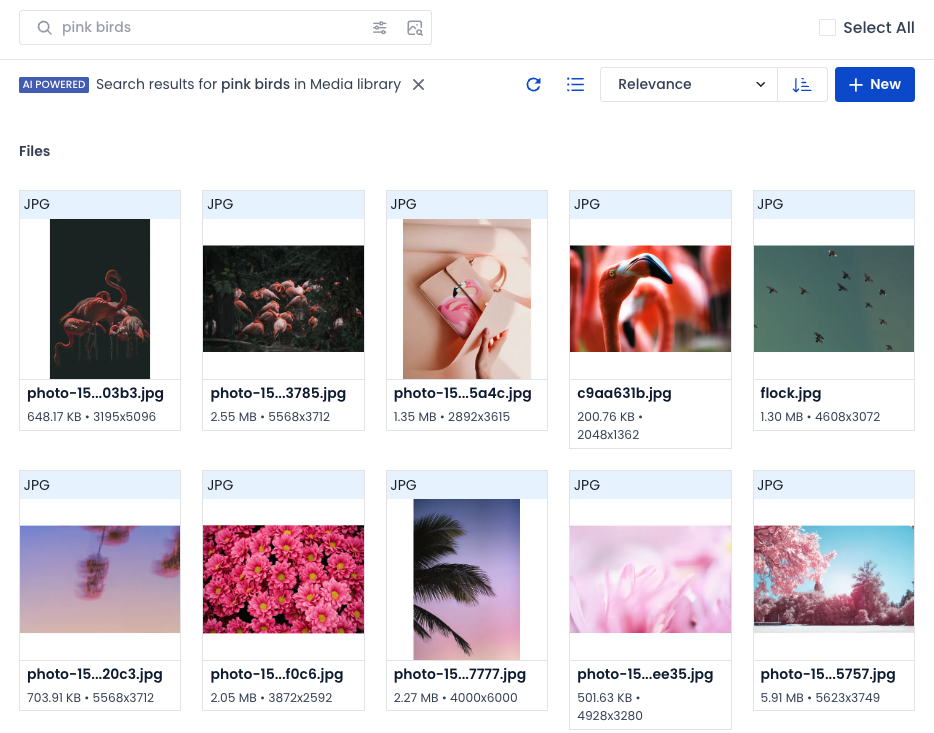
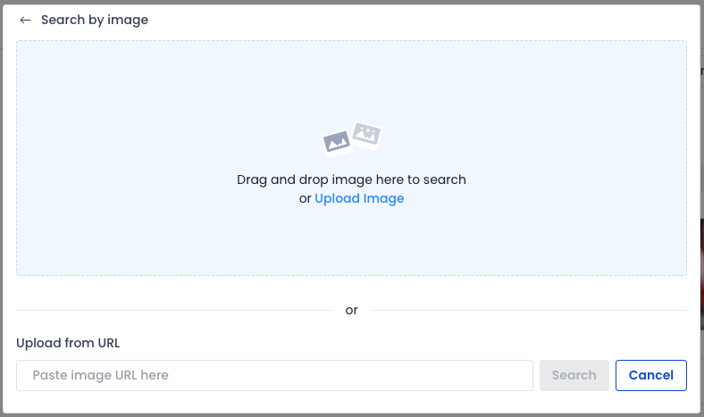
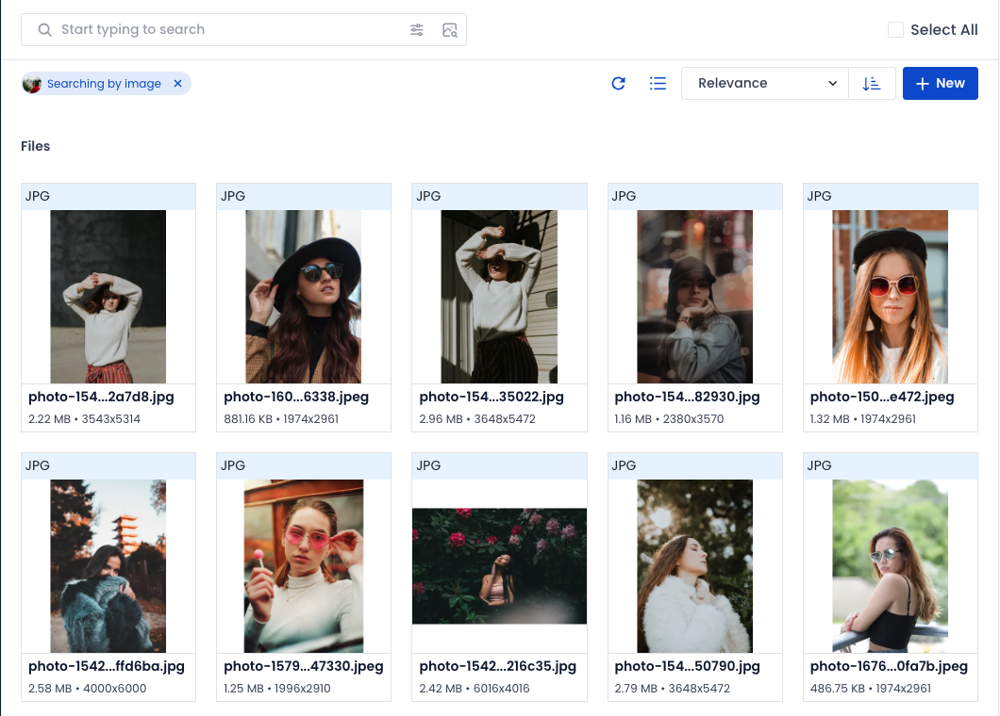
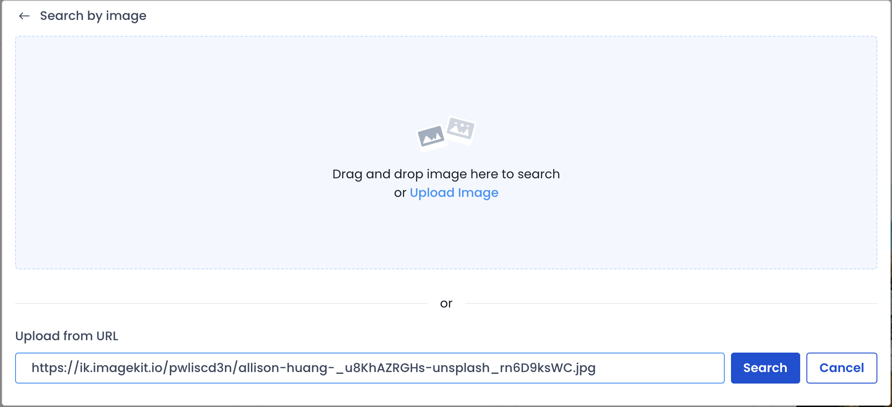
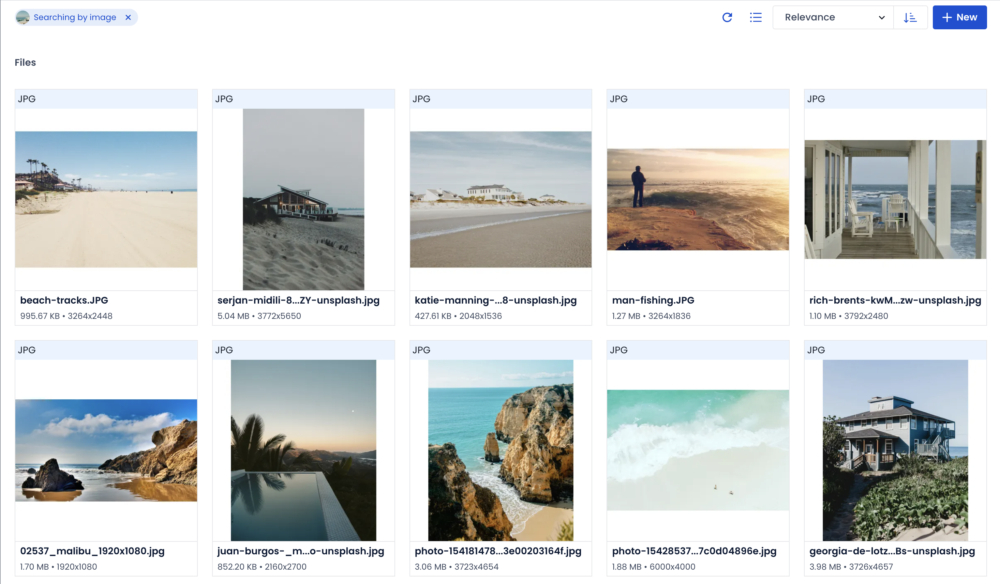
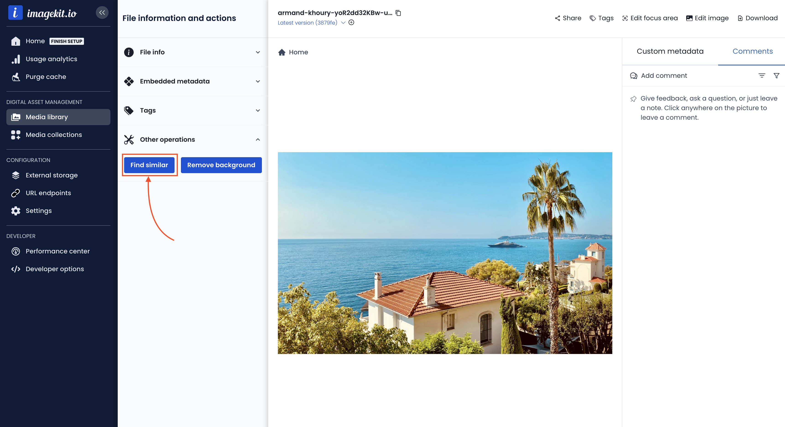
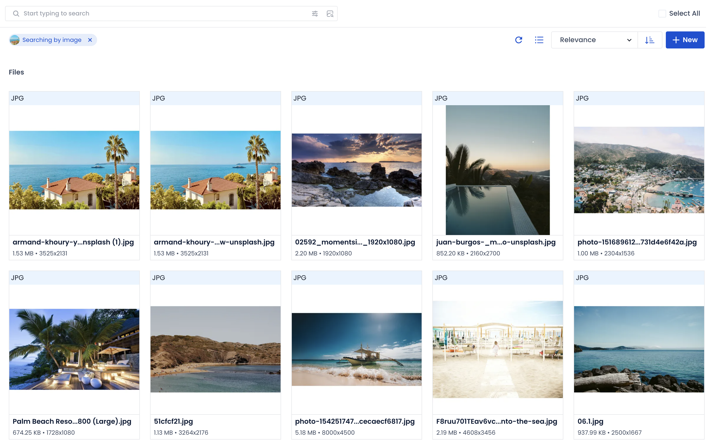

# Visual search


**Note**

This feature is only available on request for specific plans.\
For more information, please contact the [support team](mailto:support@imagekit.io) or your ImageKit Customer Success Manager.


Visual search allows you to search for similar images based on visual content. Instead of relying on text-based keywords or metadata, you can search based on visual elements like colors, shapes, textures, and any other information derived from the image.

By searching visually rather than by name or metadata, you can:

* Easily locate images without needing to remember the tags or names of the files.
* Search for similar images in your media library.
* Identify duplicates in your media library with ease.
* Discover images in your media library through visual characteristics.
* Group visually similar images together for better organization.
* Enhance the discoverability of your assets.

You can perform visual search from the dashboard either by text or by image:

*   **Searching by Text**: You can type in a word or a phrase to find images that visually match it.\
    For example, you can type in `pink birds`; all the images related to `pink birds` will be retrieved from your media library.\

    <figure><figcaption></figcaption></figure>

    <figure><figcaption></figcaption></figure>
*   **Searching by Image**: You can find matches based on the image you upload.\

    <figure><figcaption>
Upload image or specify a URL
</figcaption></figure>

    For example, uploading the image from [this URL](https://ik.imagekit.io/pwliscd3n/photo-1491972690050-ba117db4dc09\_9\_0DBlXmS.jpeg) will retrieve images related to a woman wearing a red shirt with sunglasses.\

    <figure><figcaption></figcaption></figure>
*   **Searching by Image URL**: You can find matches based on the image URL you provide.\

    <figure><figcaption>
Search by Image URL
</figcaption></figure>

    For example, entering [this URL](https://ik.imagekit.io/pwliscd3n/allison-huang-\_u8KhAZRGHs-unsplash\_rn6D9ksWC.jpg) in the input box will retrieve images related to a scenic view of a beach with a house.\

    <figure><figcaption></figcaption></figure>

## Finding Similar Images to assets uploaded in the Media Library

Visual Search lets you easily and quickly identify duplicate assets or find similar images in your media library.\
\
You can do this directly from the File Details page in the Media Library.

<figure><figcaption></figcaption></figure>

Use the "Find Similar" button to execute a visual search using the image URL.

<figure><figcaption></figcaption></figure>

The search results will include all images that match the context of the image you are trying to find similar ones to. As seen in the example above, the first couple of results will likely be duplicates.

## Limitations

* Visual Search will only work on the following image types: JPEG, PNG, WebP, GIF, AVIF, and SVG.
* Images larger than 25MB will not be included in the search results.
* Images larger than 10MB cannot be uploaded for "Search by Image".\
  However, you can run a search for images up to 25MB by searching by image URL.
