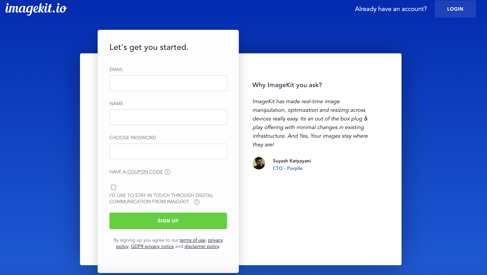

# Getting started

Whether you are serving a few hundred, or a few billion images, you can easily integrate ImageKit.io in the existing infrastructure to instantly get real-time resizing and automatic optimization functionality. Let's get started.

## Step 1: Create an account

👉 If you have not created an account yet, [sign-up for free.](https://imagekit.io/registration?planType=free)

ImageKit.io offers a forever free plan with generous limits. If you are just getting started with your website, our free plan has got you covered.



#### Choosing Imagekit Id

Post signup, you will be asked to choose a unique identifier called ImageKit ID. This identifier will be part of your image URL. For example:

```text
https://ik.imagekit.io/your_imagekit_id/image.jpg
```

#### Choosing an image processing region

👉 If you plan to use ImageKit with your [existing image storage or server](../../integration/configure-origin/), choose one of the following processing regions. Choose a region that is closest to your origin server location:

1. North California \(United States\)
2. North Virginia \(United States\)
3. Frankfurt \(Europe\)
4. Mumbai \(India\)
5. Singapore \(Singapore\)
6. Sydney \(Australia\)

## Step 2: Configure external storage \(optional\)

ImageKit comes with an [integrated media library](../../media-library/overview/) with infinite storage, folder management, file tagging,  powerful search features. 

If you don't want to upload files in the media library, you can choose to [configure your external storage](../../integration/configure-origin/) so that ImageKit can pull files from there.

## Step 3: Integrate ImageKit in your application

For demonstration purposes, we upload a sample image in your account during sign-up.

The sample image can be accessed like:

```text
https://ik.imagekit.io/your_imagekit_id/default-image.jpg
```

#### Resizing to width 300 and height 300

```text
https://ik.imagekit.io/your_imagekit_id/default-image.jpg?tr=w-300,h-300
```

#### Changing quality to 50

```text
https://ik.imagekit.io/your_imagekit_id/default-image.jpg?tr=q-50
```

👉 See the full list of [image transformation](../../features/image-transformations/) options available in ImageKit.io.

Follow one of the platform-specific quick start guides to integrate ImageKit in your application:











## SDK and libraries

We have published libraries in popular programming languages so that you can easily integrate ImageKit.

### Client-side

* [x] [JavaScript](https://github.com/imagekit-developer/imagekit-javascript)
* [x] [React](https://github.com/imagekit-developer/imagekit-react)
* [x] [Vue.js](https://github.com/imagekit-developer/imagekit-vuejs)
* [x] [Android](https://github.com/imagekit-developer/imagekit-android)
* [x] [Angular](https://github.com/imagekit-developer/imagekit-angular)
* [x] [iOS](https://github.com/imagekit-developer/imagekit-ios)

### Server-side SDKs

* [x] [Python](https://github.com/imagekit-developer/imagekit-python)
* [x] [NodeJS](https://www.npmjs.com/package/imagekit)
* [x] [PHP](https://github.com/imagekit-developer/imagekit-php)
* [x] [JAVA](https://github.com/imagekit-developer/imagekit-java)
* [x] [Ruby on rails](https://github.com/imagekit-developer/imagekit-ruby)
* [x] [.Net](https://github.com/imagekit-developer/imagekit-dotnet)

