# Next.js

This quick start guide demonstrates how to integrate ImageKit into a Next.js application. The code samples provided are available on GitHub: [https://github.com/imagekit-samples/quickstart/tree/master/next](https://github.com/imagekit-samples/quickstart/tree/master/next).

This guide covers the following topics:

- [Setting up ImageKit Next.js SDK](nextjs.md#setup-imagekit-next.js-sdk)
- [Rendering images](nextjs.md#rendering-images)
- [Setting the ImageKit context for the SDK](nextjs.md#setting-imagekit-context-for-the-sdk)
- [Applying common image manipulations](nextjs.md#basic-image-manipulation)
- [Adding overlays](nextjs.md#adding-overlays)
- [Lazy loading images](nextjs.md#lazy-loading-images-in-next.js)
- [Blurred image placeholder](nextjs.md#blurred-image-placeholder)
- [Client-side file uploading](nextjs.md#uploading-files-in-next.js)
- [Advanced file uploading](nextjs.md#advanced-file-upload)
- [Rendering videos](nextjs.md#rendering-videos)

## **Setup ImageKit Next.js SDK**

For this tutorial, it is recommended to create a dummy Next.js app, as demonstrated below.

**Create a Next.js app:**

Let's use the `create-next-app` CLI utility provided by Next.js to build a new project:

```bash
npx create-next-app@latest imagekit-next-app
```

We will be using the below configuration for the dummy app.

```js
✔ Would you like to use TypeScript?  No
✔ Would you like to use ESLint? Yes
✔ Would you like to use Tailwind CSS? No
✔ Would you like to use `src/` directory? No
✔ Would you like to use App Router? (recommended) Yes
✔ Would you like to customize the default import alias (@/*)? No
```

Navigate to the project directory:

```
cd imagekit-next-app/
```

Open up the project in your text editor of choice, and navigate to `app/page.js`. This is where we will do most of our work. It should look like this:



```jsx
import Image from "next/image";
import styles from "./page.module.css";

export default function Home() {
  return (
    <main className={styles.main}>
      <div className={styles.description}>
        <p>
          Get started by editing&nbsp;
          <code className={styles.code}>app/page.js</code>
        </p>
        <div>
          <a
            href="https://vercel.com?utm_source=create-next-app&utm_medium=appdir-template&utm_campaign=create-next-app"
            target="_blank"
            rel="noopener noreferrer"
          >
            By <Image src="/vercel.svg" alt="Vercel Logo" className={styles.vercelLogo} width={100} height={24} priority />
          </a>
        </div>
      </div>
      <div className={styles.center}>
        <Image className={styles.logo} src="/next.svg" alt="Next.js Logo" width={180} height={37} priority />
      </div>
      ...
    </main>
  );
}
```



&#x20;Now run the app:

```
npm run dev
```

In your web browser, navigate to `http://localhost:3000/`

You should now see the dummy app created by the Next.js CLI. We can begin our work from here. It should look like this.

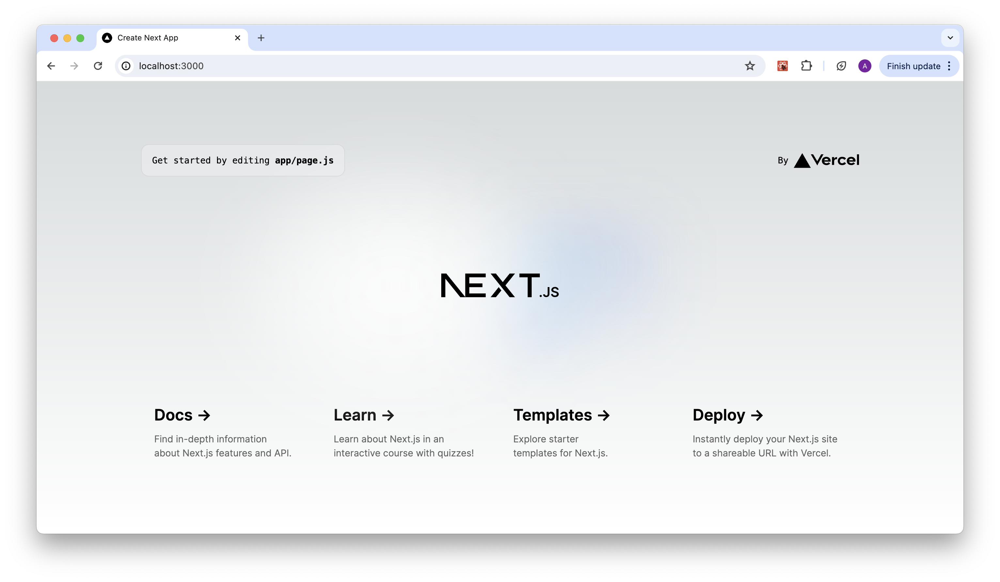

**Install the ImageKit Next.js SDK:**

Installing the ImageKit Next.js SDK in our app is pretty simple:

```
npm install imagekit-next
```

#### **Initialize the Next.js SDK:**

Before the SDK can be used, let's learn about and obtain the requisite initialization parameters:

- `urlEndpoint` is a required parameter. This can be obtained from the [URL-endpoint section](https://imagekit.io/dashboard/url-endpoints) or the [developer section](https://imagekit.io/dashboard/developer/api-keys) on your ImageKit dashboard.
- `publicKey` and `authenticator` parameters are optional and only needed if you want to use the SDK for client-side file upload. `publicKey` can be obtained from the [Developer section](https://imagekit.io/dashboard/developer/api-keys) on your ImageKit dashboard.
- `authenticator` expects an asynchronous function that resolves with an object containing the necessary security parameters i.e `signature`, `token`, and `expire`.

```javascript
// required parameter to fetch images
const urlEndpoint = "<YOUR_IMAGEKIT_URL_ENDPOINT>";

// optional parameters (needed for client-side upload)
const publicKey = "<YOUR_IMAGEKIT_PUBLIC_KEY>";
const authenticator = () => {
  return new Promise((resolve, reject) => {
    resolve({ signature, token, expiry });
  });
};
```


_**Note:**_ _Do not include your _[_API private key_](../../api-reference/api-introduction/api-keys.md#private-key)_ in any client-side code, including this SDK or its initialization. If you pass the `privateKey` parameter while initializing this SDK, it will throw an error._


**ImageKit Components:**

This SDK provides 4 components:

- `IKImage` for [image rendering](https://github.com/imagekit-developer/imagekit-next?tab=readme-ov-file#image-resizing). This utilizes `next/image` and renders an `` tag.
- `IKVideo` for [video resizing](https://github.com/imagekit-developer/imagekit-next#video-resizing). This renders a `<video>` tag.
- `IKUpload` for [file uploading](https://github.com/imagekit-developer/imagekit-next#file-upload). The output is a `<input type="file">` tag.
- `IKContext` for defining [authentication context](https://github.com/imagekit-developer/imagekit-next#ikcontext), i.e. `urlEndpoint`, `publicKey` and `authenticator` to all child elements.

You can import components individually:

```javascript
import { IKImage, IKVideo, IKContext, IKUpload } from "imagekit-next";
```

#### Configure the app for ImageKit:

Let's remove the existing dummy code in `app/page.js` file, then add the `urlEndpoint`:



```jsx
"use client";
import React from "react";

const urlEndpoint = "<YOUR_IMAGEKIT_URL_ENDPOINT>";

export default function Home() {
  return <div className="App"></div>;
}
```



In the code above, we add "use client" at the top of the component to designate it as a Client Component.

Next, go to `app/globals.css`, remove the existing code, and replace it with the following code.



```css
.App {
  text-align: center;
}
```



## **Rendering images**

The `IKImage` component acts as a wrapper around the [Next.js Image component](https://nextjs.org/docs/pages/api-reference/components/image). This allows you to access all the built-in features of the Next.js Image component.

Before using external images, we need to add a configuration. This ensures that only external images from your account can be served through the Next.js Image Optimization API.

Navigate to `next.config.mjs` and update it with the following code.

```js
/** @type {import('next').NextConfig} */
const nextConfig = {
  images: {
    remotePatterns: [
      {
        protocol: "https",
        hostname: "ik.imagekit.io",
        port: "",
      },
    ],
  },
};

export default nextConfig;
```

**Loading image from relative path:**

We will use an image that can be accessed at the following URL:

```
https://ik.imagekit.io/<YOUR_IMAGEKIT_ID>/default-image.jpg
```

Let's fetch and display it! For this, we will use the `IKImage` component.&#x20;

Import `IKImage` from the SDK:

```jsx
import { IKImage } from "imagekit-next";
```

Now let's add it to our `page.js`. Along with the image `path` prop, it also needs the prop for `urlEndpoint`:

```jsx
<IKImage urlEndpoint={urlEndpoint} path="default-image.jpg" width={400} height={400} alt="Alt text" />
```

**Rendered HTML element:**

```jsx

```

The `page.js` file should look like this now:



```jsx
"use client";
import React from "react";
import { IKImage } from "imagekit-next";

const urlEndpoint = "<YOUR_IMAGEKIT_URL_ENDPOINT>";

export default function Home() {
  return (
    <div>
      <h1>ImageKit Next.js quick start</h1>
      <IKImage urlEndpoint={urlEndpoint} path="default-image.jpg" width={400} height={400} alt="Alt text" />
    </div>
  );
}
```



**This is how the output should look now:**

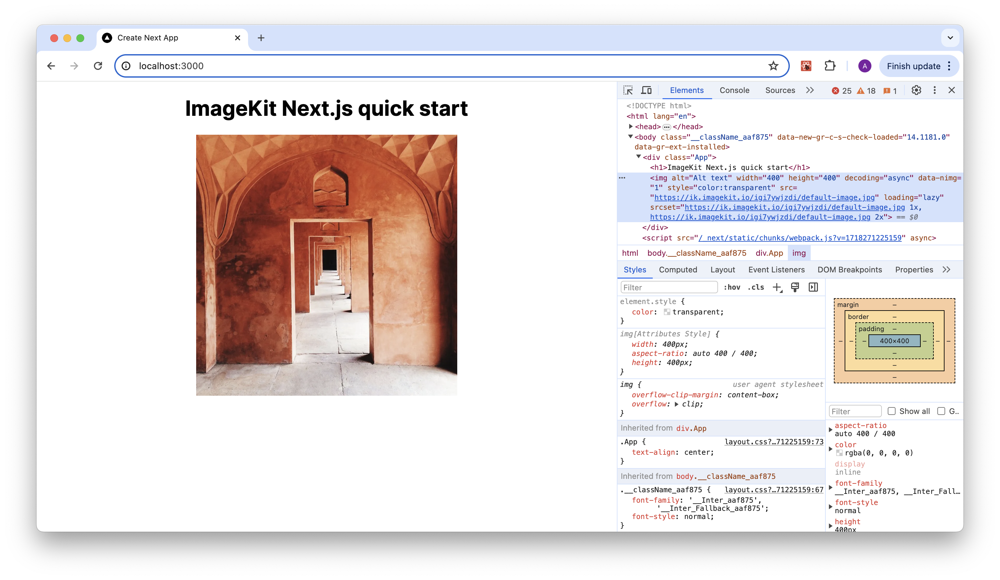

**Loading image from an absolute path:**

If you have an absolute image path coming from the backend API e.g. `https://www.custom-domain.com/default-image.jpg` then you can use `src` prop to load the image.

**For example:**

```jsx
<IKImage urlEndpoint={urlEndpoint} src="https://ik.imagekit.io/demo/default-image.jpg" width="400" height="400" alt="Alt text" />
```

**The output looks like this:**

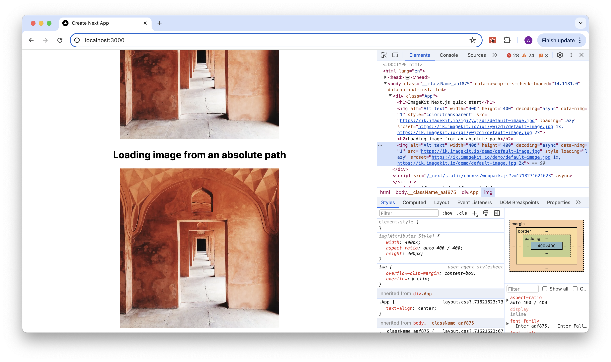

## **Setting ImageKit context for the SDK**

It is not necessary to specify the `urlEndpoint` in every instance of `IKImage`. This can be managed much more easily with the `IKContext` component.

`IKContext` is a wrapper that can be configured with your [SDK initialization parameters](nextjs.md#initialize-the-next.js-sdk). Pass your `urlEndpoint` to it as a prop, and you're good to go!

Let's go ahead and import it within the `Page.js` file:

```jsx
import { IKContext, IKImage } from "imagekit-next";
```

Now add the `IKContext` component to the render function:

```jsx
<IKContext urlEndpoint={urlEndpoint}></IKContext>
```

Let's nest our `IKImage` components within it, so that those can access the `urlEndpoint` from the context wrapper.



```jsx
"use client";
import React from "react";
import { IKImage, IKContext } from "imagekit-next";

const urlEndpoint = "<YOUR_IMAGEKIT_URL_ENDPOINT>";

export default function Home() {
  return (
    <div className="App">
      <IKContext urlEndpoint={urlEndpoint}>
        <h1>ImageKit Next.js quick start</h1>
        <IKImage path="default-image.jpg" width={400} height={400} alt="Alt text" />
        <h2>Loading image from an absolute path</h2>
        <IKImage src="https://ik.imagekit.io/demo/default-image.jpg" width="400" height="400" alt="Alt text" />
      </IKContext>
    </div>
  );
}
```



## **Basic image manipulation**

Let’s now learn how to manipulate images using transformations.

- [Resizing images](nextjs.md#height-and-width-manipulation)&#x20;
- [Quality manipulation](nextjs.md#quality-manipulation)
- [Crop mode](nextjs.md#crop-mode)
- [Chained transformation](nextjs.md#chained-transformation)

The Next.js SDK gives a name to each transformation parameter, e.g. `height` for `h` and `width` for `w` parameter. It makes your code more readable. If the property does not match any of the available options, it is added as it is. See the [full list of supported transformations](https://github.com/imagekit-developer/imagekit-next#list-of-supported-transformations) in Next.js SDK on Github.


You can also use `h` and `w` parameter instead of `height` and `width`.\
See the complete list of transformations supported in ImageKit [here](../../features/image-transformations/resize-crop-and-other-transformations.md).


In addition to these, you can use all the options supported by `next/image` except for `loading` and `src`. You can find the full list of supported `next/image` props [here](https://nextjs.org/docs/pages/building-your-application/optimizing/images#props).

### **Height and width manipulation**

‌To resize an image along with its [height](../../features/image-transformations/resize-crop-and-other-transformations.md#height-h) or [width](../../features/image-transformations/resize-crop-and-other-transformations.md#width-w), we need to pass the `transformation` object as a prop to `IKImage`.

Let’s resize the default image to 200px height and width:

```jsx
<IKImage
  path="default-image.jpg"
  transformation={[
    {
      height: 200,
      width: 200,
    },
  ]}
  width="200"
  height="200"
  alt="Alt text"
/>
```

**Rendered HTML element:**

```markup

```

Refresh your browser to get the resized image.

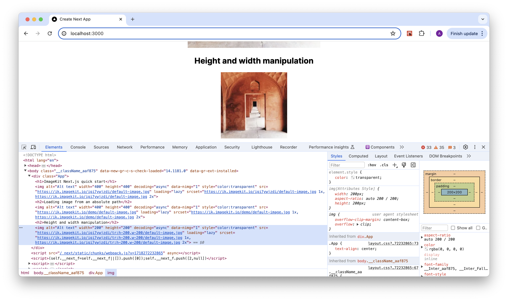

### **Quality manipulation**

You can use the [quality parameter](../../features/image-transformations/resize-crop-and-other-transformations.md#quality-q) to change image quality like this:

```jsx
<IKImage path="default-image.jpg" transformation={[{ quality: 10 }]} width="400" height="400" alt="Alt text" />
```

**Rendered HTML:**

```jsx

```

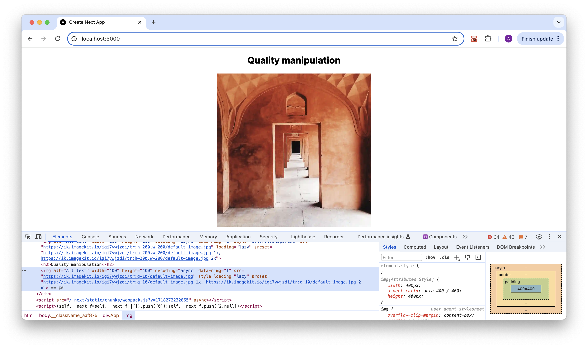

### **Crop mode**‌

Let’s now see how [cropping](../../features/image-transformations/resize-crop-and-other-transformations.md#crop-crop-modes-and-focus) works. We will try the [`extract`](../../features/image-transformations/resize-crop-and-other-transformations.md#extract-crop-strategy-cm-extract) crop strategy. In this strategy, instead of resizing the whole image, we extract out a region of the requested dimension from the original image. You can read more about this [here](https://docs.imagekit.io/features/image-transformations/resize-crop-and-other-transformations#extract-crop-strategy-cm-extract).&#x20;

```jsx
<IKImage
  path="default-image.jpg"
  transformation={[
    {
      height: 300,
      width: 200,
      cropMode: "extract",
    },
  ]}
  width="200"
  height="300"
  alt="Alt text"
/>
```

**Rendered HTML element:**

```markup

```

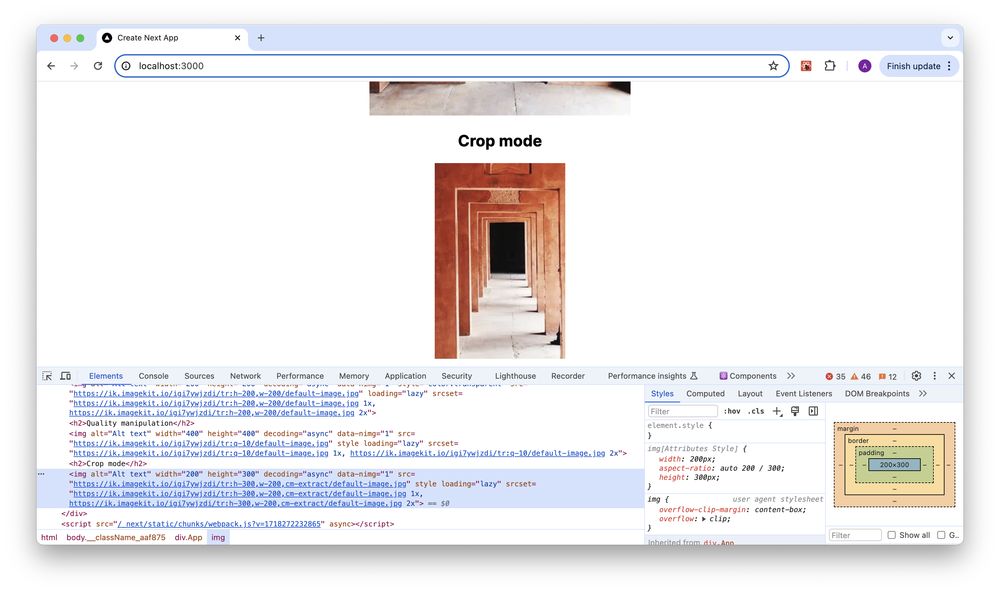

### **Chained transformation**

[Chained transformations](https://docs.imagekit.io/features/image-transformations/chained-transformations) provide a simple way to control the sequence in which transformations are applied.

Let’s try it out by [resizing](../../features/image-transformations/resize-crop-and-other-transformations.md#basic-image-resizing) an image, then [rotating](../../features/image-transformations/resize-crop-and-other-transformations.md#rotate-rt) it:

```jsx
<IKImage
  path="default-image.jpg"
  transformation={[
    {
      height: 300,
      width: 200,
    },
  ]}
  width="200"
  height="300"
  alt="Alt text"
/>
```

**Transformation URL:**

```markup
/tr:h-300,w-200/default-image.jpg"
  path="default-image.jpg"
  alt="">
```

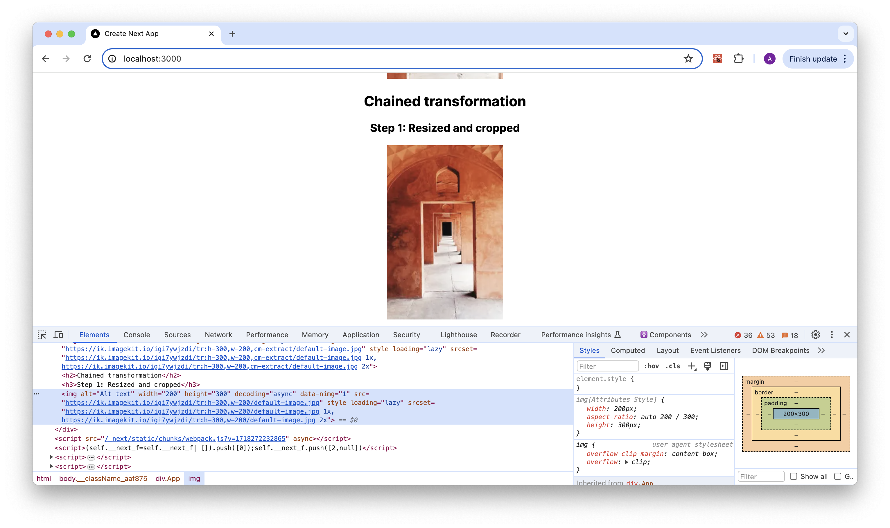

Now, rotate the image by 90 degrees.

```jsx
<IKImage
  path="default-image.jpg"
  transformation={[
    {
      height: 300,
      width: 200,
    },
    {
      rt: 90,
    },
  ]}
  width="200"
  height="300"
  alt="Alt text"
/>
```

**Chained Transformation URL:**

```markup
/tr:h-300,w-200:rt-90/default-image.jpg"
  path="default-image.jpg"
  alt="">
```

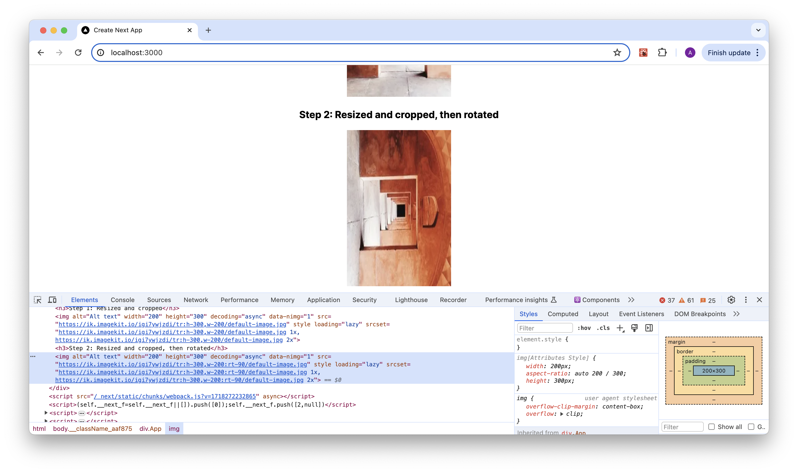

Let’s flip the order of transformation and see what happens.

```jsx
<IKImage
  path="default-image.jpg"
  transformation={[
    {
      rt: 90,
    },
    {
      height: 300,
      width: 200,
    },
  ]}
  width="200"
  height="300"
  alt="Alt text"
/>
```

**Chained Transformation URL:**

```markup
/tr:rt-90:h-300,w-200/default-image.jpg"
  path="default-image.jpg"
  alt="">
```

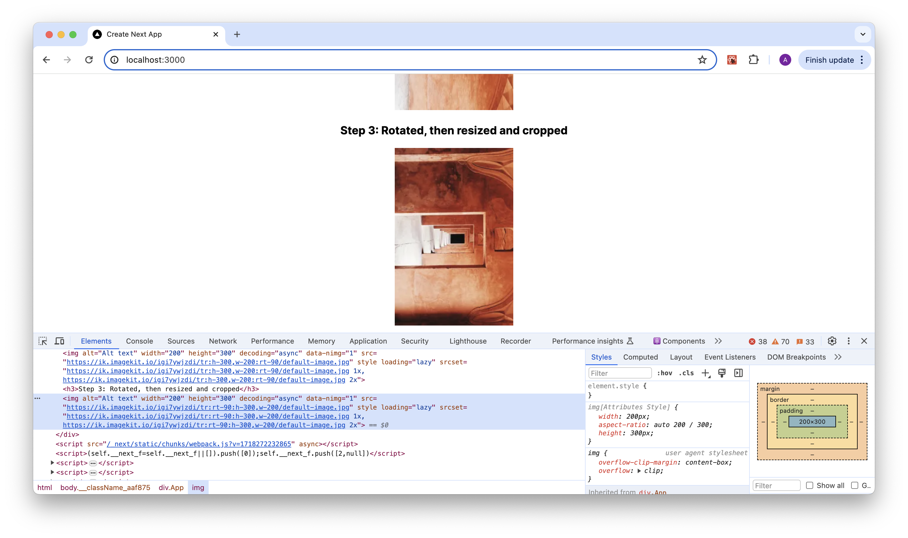

## **Adding overlays**

ImageKit.io enables you to apply overlays to [images](../../features/image-transformations/overlay-using-layers.md) and [videos](../../features/video-transformation/overlay.md) using the raw parameter with the concept of [layers](../../features/image-transformations/overlay-using-layers.md#layers). The raw parameter facilitates incorporating transformations directly in the URL. A layer is a distinct type of transformation that allows you to define an asset to serve as an overlay, along with its positioning and additional transformations.

**Text as overlays**

You can add any text string over a base video or image using a text layer (l-text).

For example:

```js
<IKImage
  path="/default-image.jpg"
  transformation={[{ width: 400, height: 300 }, { raw: "l-text,i-Imagekit,fs-50,l-end" }]}
  width="400"
  height="300"
  alt="Alt text"
/>
```

**Sample Result URL**

```
https://ik.imagekit.io/your_imagekit_id/tr:h-300,w-400,l-text,i-Imagekit,fs-50,l-end/default-image.jpg
```

**Output Image:**

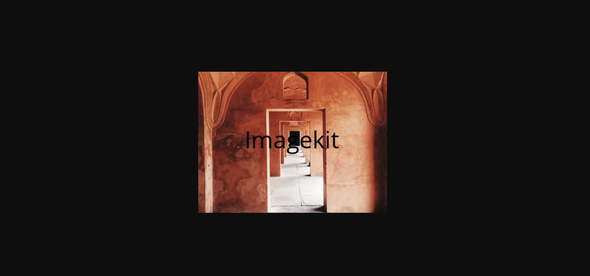

**Image as overlays**

You can add an image over a base video or image using an image layer (l-image).

For example:

```js
<IKImage
  path="/default-image.jpg"
  transformation={[{ width: 400, height: 300 }, { raw: "l-image,i-default-image.jpg,w-100,b-10_CDDC39,l-end" }]}
  width="400"
  height="300"
  alt="Alt text"
/>
```

**Sample Result URL**

```
https://ik.imagekit.io/your_imagekit_id/tr:h-300,w-400,l-image,i-default-image.jpg,w-100,b-10_CDDC39,l-end/default-image.jpg
```

**Output Image:**

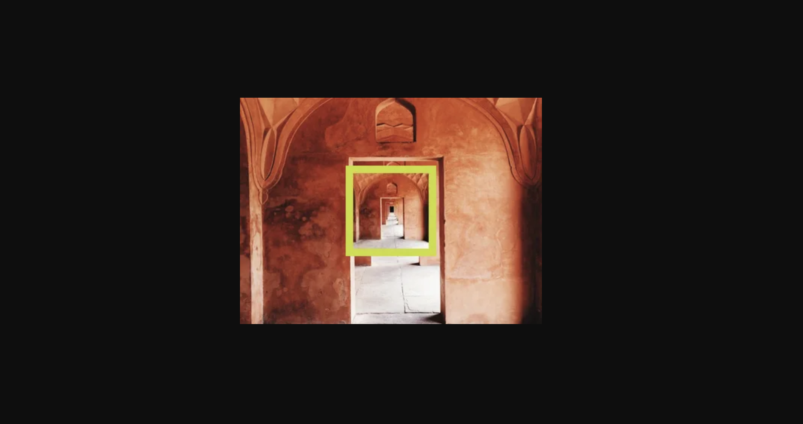

**Solid color blocks as overlays**

You can add solid color blocks over a base video or image using an image layer (l-image).

For example:

```js
<IKVideo
  path="/img/sample-video.mp4"
  transformation={[{ width: 400, height: 300 }, { raw: "l-image,i-ik_canvas,bg-FF0000,w-300,h-100,l-end" }]}
  width="400"
  height="300"
  alt="Alt text"
/>
```

**Sample Result URL**

```
https://ik.imagekit.io/your_imagekit_id/tr:h-300,w-400,l-image,i-ik_canvas,bg-FF0000,w-300,h-100,l-end/img/sample-video.mp4
```

**Output Image:**

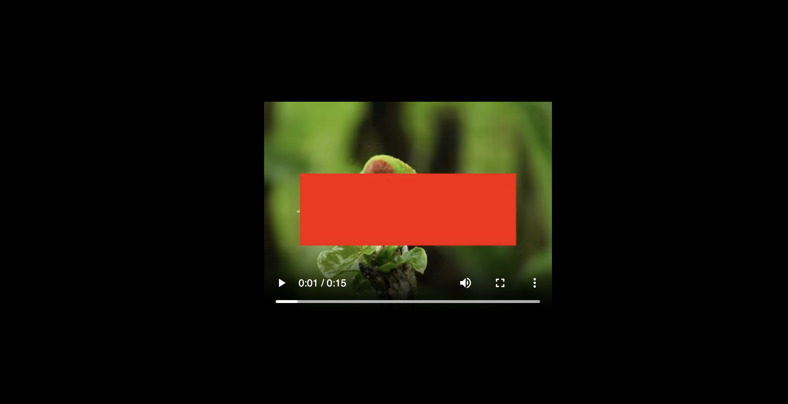

## **Lazy-loading images in Next.js**

You can lazy load images using the `loading` prop in `IKImage` component. When you use `loading="lazy"`, all images that are immediately viewable without scrolling load normally. Those that are far below the device viewport are only fetched when the user scrolls near them.

The SDK uses a fixed threshold based on the effective connection type to ensure that images are loaded early enough so that they have finished loading once the user scrolls near to them.


You should always set the height and width of the image element to avoid[ layout shift](https://www.youtube.com/watch?v=4-d_SoCHeWE) when lazy-loading images.


```jsx
<IKImage path="default-image.jpg" transformation={[{ height: 300, width: 400 }]} loading="lazy" height="300" width="400" alt="Alt text" />
```

**Rendered HTML element:**

```jsx

```

## **Blurred image placeholder**

To improve user experience, you can use a low-quality [blurred](../../features/image-transformations/resize-crop-and-other-transformations.md#blur-bl) variant of the original image as a placeholder while the original image is being loaded in the background. Once the loading of the original image is finished, the placeholder is replaced with the original image.

```jsx
// Loading a blurred low quality image placeholder
// while the original image is being loaded
<IKImage path="default-image.jpg" lqip={{ active: true, quality: 20 }} height="400" width="400" alt="Alt text" />
```

### **Combining lazy loading with low-quality placeholders**

You have the option to lazy-load the original image only when the user scrolls near them. Until then, only a low-quality placeholder is loaded. This saves a lot of network bandwidth if the user never scrolls further down.

```jsx
// Loading a blurred low quality image placeholder
// and lazy-loading original when user scrolls near them
<IKImage
  path="default-image.jpg"
  transformation={[{ height: 300, width: 400 }]}
  lqip={{ active: true }}
  loading="lazy"
  height="300"
  width="400"
  alt="Alt text"
/>
```

## **Uploading files in Next.js**

Let's now learn how to upload an image to our media library.

Next.js SDK provides `IKUpload` component which renders an `input type="file"` tag that you can use to upload files to the [ImageKit media library](../../media-library/overview/) directly from the client-side.

To implement this functionality, a backend server is needed to authenticate the request using your [API private key](../../api-reference/api-introduction/api-keys.md#private-key).

### **Setup the backend app**

For this quickstart guide, we will create a sample Node.js server which will provide an authentication endpoint at `http://localhost:3001/auth`.&#x20;

Let's create a file `index.js` inside `server` folder in the project root.

```bash
mkdir server
touch server/index.js
```

Install the basic packages needed to create a dummy server for ImageKit backend authentication:

```jsx
cd server
npm init -y
npm install express imagekit
```

We will use the[ ImageKit Node.js SDK](https://github.com/imagekit-developer/imagekit-nodejs) to implement `http://localhost:3001/auth`.

The backend SDK requires your API [public key](../../api-reference/api-introduction/api-keys.md#public-key), [private key](../../api-reference/api-introduction/api-keys.md#private-key), and [URL endpoint](../../integration/url-endpoints.md). You can obtain them from [Developer Options](https://imagekit.io/dashboard/developer/api-keys) and [URL-endpoint](https://imagekit.io/dashboard/url-endpoints) pages respectively.

This is how `server/index.js` file should look now. Replace `<YOUR_IMAGEKIT_URL_ENDPOINT>`, `<YOUR_IMAGEKIT_PUBLIC_KEY>` and `<YOUR_IMAGEKIT_PRIVATE_KEY>` with actual values:





```javascript
/* 
  This is our backend server.
  Replace YOUR_IMAGEKIT_URL_ENDPOINT, YOUR_IMAGEKIT_PUBLIC_KEY, 
  and YOUR_IMAGEKIT_PRIVATE_KEY with actual values
*/
const express = require("express");
const app = express();
const ImageKit = require("imagekit");

const imagekit = new ImageKit({
  urlEndpoint: "<YOUR_IMAGEKIT_URL_ENDPOINT>",
  publicKey: "<YOUR_IMAGEKIT_PUBLIC_KEY>",
  privateKey: "<YOUR_IMAGEKIT_PRIVATE_KEY>",
});

// allow cross-origin requests
app.use(function (req, res, next) {
  res.header("Access-Control-Allow-Origin", "*");
  res.header("Access-Control-Allow-Headers", "Origin, X-Requested-With, Content-Type, Accept");
  next();
});

app.get("/auth", function (req, res) {
  var result = imagekit.getAuthenticationParameters();
  res.send(result);
});

app.listen(3001, function () {
  console.log("Live at Port 3001");
});
```





Let's run the backend server.

```
cd server
node index.js
```

You should see a log saying that the app is _**“Live on port 3001”**_.

If you GET `http://localhost:3001/auth`, you should see a JSON response like this. Actual values will vary.

```javascript
{
    token: "5dd0e211-8d67-452e-9acd-954c0bd53a1f",
    expire: 1601047259,
    signature: "dcb8e72e2b6e98186ec56c62c9e62886f40eaa96"
}
```

### **Configure authentication in the frontend app**

Now that we have our authentication server up and running, let's configure the `publicKey` and `authenticator` in the frontend React app:

Add the following to `app/page.js` file to [initialize the SDK](nextjs.md#initialize-the-next.js-sdk) with auth params:

```jsx
const publicKey = "<YOUR_IMAGEKIT_PUBLIC_KEY>";
const authenticator = async () => {
  try {
    const response = await fetch("http://localhost:3001/auth");

    if (!response.ok) {
      const errorText = await response.text();
      throw new Error(`Request failed with status ${response.status}: ${errorText}`);
    }

    const data = await response.json();
    const { signature, expire, token } = data;
    return { signature, expire, token };
  } catch (error) {
    throw new Error(`Authentication request failed: ${error.message}`);
  }
};
```

Now, pass these values as props into a new `IKContext` instance which will hold our upload component:

```jsx
<IKContext publicKey={publicKey} urlEndpoint={urlEndpoint} authenticator={authenticator}>
  {/* ...child components */}
</IKContext>
```

This is how `app/page.js` should look now. Replace `<YOUR_IMAGEKIT_URL_ENDPOINT>` and `<YOUR_IMAGEKIT_PUBLIC_KEY>` with actual values:



```jsx
import React from "react";
import { IKContext, IKImage } from "imagekit-next";

const urlEndpoint = "<YOUR_IMAGEKIT_URL_ENDPOINT>";
const publicKey = "<YOUR_IMAGEKIT_PUBLIC_KEY>";
const authenticator = async () => {
  try {
    const response = await fetch("http://localhost:3001/auth");

    if (!response.ok) {
      const errorText = await response.text();
      throw new Error(`Request failed with status ${response.status}: ${errorText}`);
    }

    const data = await response.json();
    const { signature, expire, token } = data;
    return { signature, expire, token };
  } catch (error) {
    throw new Error(`Authentication request failed: ${error.message}`);
  }
};

export default function Home() {
  return (
    <div className="App">
      <IKContext urlEndpoint={urlEndpoint} publicKey={publicKey} authenticator={authenticator}>
        {/* ...client side upload component goes here */}
      </IKContext>
      {/* ...other SDK components added previously */}
    </div>
  );
}
```



### **Upload an image**

For this, we will use the `IKUpload` component. Let's import it from the SDK into our `Page.js` file:

```jsx
import { IKContext, IKImage, IKUpload } from "imagekit-next";
```

Add the `IKUpload` component nested within `IKContext`, as well as a couple of event handlers for upload error and success, `onError` and `onSuccess` respectively:





```jsx
import React from "react";
import { IKContext, IKImage, IKUpload } from "imagekit-next";

const publicKey = "<YOUR_IMAGEKIT_PUBLIC_KEY>";
const urlEndpoint = "<YOUR_IMAGEKIT_URL_ENDPOINT>";
const authenticator = async () => {
  try {
    const response = await fetch("http://localhost:3001/auth");

    if (!response.ok) {
      const errorText = await response.text();
      throw new Error(`Request failed with status ${response.status}: ${errorText}`);
    }

    const data = await response.json();
    const { signature, expire, token } = data;
    return { signature, expire, token };
  } catch (error) {
    throw new Error(`Authentication request failed: ${error.message}`);
  }
};

const onError = (err) => {
  console.log("Error", err);
};

const onSuccess = (res) => {
  console.log("Success", res);
};

export default function Home() {
  return (
    <div className="App">
      <h1>ImageKit Next.js quick start</h1>
      <IKContext publicKey={publicKey} urlEndpoint={urlEndpoint} authenticator={authenticator}>
        <div>
          <h2>File upload</h2>
          <IKUpload fileName="test-upload.png" onError={onError} onSuccess={onSuccess} />
        </div>
      </IKContext>
      {/* ...other SDK components added previously */}
    </div>
  );
}
```





This is how it looks in the UI:

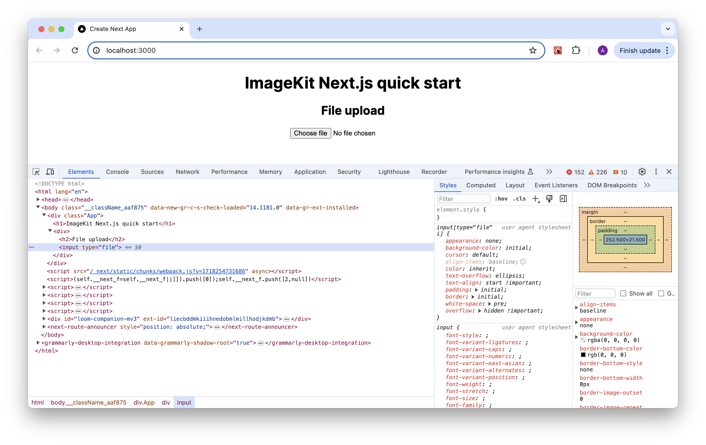

**Direct file uploading from the browser**

Let’s now upload an image by selecting a file from the file input.&#x20;

When you choose a file, the file is immediately uploaded. You can pass optional `onSuccess` and `onError` callback functions as props like we have.

You can verify that file was successfully uploaded by checking the browser console. In case of success, it should print a success message, like this:

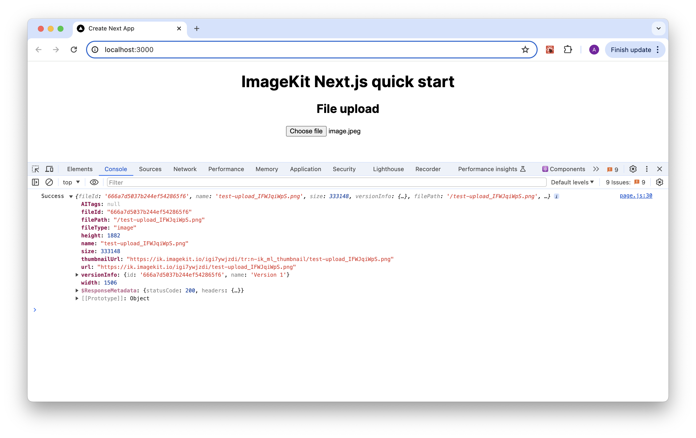

The response object would look similar to this (values may vary):

```jsx
{
    "fileId": "666a7d5037b244ef542865f6",
    "name": "test-upload_IFWJqiWpS.png",
    "size": 333148,
    "versionInfo": {
        "id": "666a7d5037b244ef542865f6",
        "name": "Version 1"
    },
    "filePath": "/test-upload_IFWJqiWpS.png",
    "url": "https://ik.imagekit.io/igi7ywjzdi/test-upload_IFWJqiWpS.png",
    "fileType": "image",
    "height": 1882,
    "width": 1506,
    "thumbnailUrl": "https://ik.imagekit.io/igi7ywjzdi/tr:n-ik_ml_thumbnail/test-upload_IFWJqiWpS.png",
    "AITags": null
}
```

After a successful upload, you should see the newly uploaded image in the [Media Library](https://imagekit.io/dashboard#media-library) section of your ImageKit dashboard.

If you don't see the image, check if there are any errors in the browser console log. Then verify whether the API [private key](../../api-reference/api-introduction/api-keys.md#private-key) has been configured correctly in the server app and if the server app is running.

**Fetching uploaded file**

Fetch uploaded image and show in UI using `IKImage` with the `filePath` returned in the upload response.

```jsx
<IKImage path="/test-upload_IFWJqiWpS.png" width="200" height="200" alt="Alt text" />
```

The app should display your uploaded image correctly!

## **Advanced file upload**

A more detailed example of how to use the file upload component (and an explanation of each advanced feature) is presented below:





```jsx
import React, { useRef } from "react";
import { IKContext, IKImage, IKUpload } from "imagekit-next";

const publicKey = "<YOUR_IMAGEKIT_PUBLIC_KEY>";
const urlEndpoint = "<YOUR_IMAGEKIT_URL_ENDPOINT>";
const authenticator = async () => {
  try {
    const response = await fetch("http://localhost:3001/auth");

    if (!response.ok) {
      const errorText = await response.text();
      throw new Error(`Request failed with status ${response.status}: ${errorText}`);
    }

    const data = await response.json();
    const { signature, expire, token } = data;
    return { signature, expire, token };
  } catch (error) {
    throw new Error(`Authentication request failed: ${error.message}`);
  }
};

const onError = (err) => {
  console.log("Error", err);
};

const onSuccess = (res) => {
  console.log("Success", res);
};

const onUploadProgress = (progress) => {
  console.log("Progress", progress);
};

const onUploadStart = (evt) => {
  console.log("Start", evt);
};

export default function Home() {
  const ikUploadRefTest = useRef(null);
  return (
    <div className="App">
      <h1>ImageKit React quick start</h1>
      <IKContext publicKey={publicKey} urlEndpoint={urlEndpoint} authenticator={authenticator}>
        <p>Upload an image with advanced options</p>
        <IKUpload
          fileName="test-upload.jpg"
          tags={["sample-tag1", "sample-tag2"]}
          customCoordinates={"10,10,10,10"}
          isPrivateFile={false}
          useUniqueFileName={true}
          responseFields={["tags"]}
          validateFile={(file) => file.size < 2000000}
          folder={"/sample-folder"}
          extensions={[
            {
              name: "remove-bg",
              options: {
                add_shadow: true,
              },
            },
          ]}
          webhookUrl="https://www.example.com/imagekit-webhook" // replace with your webhookUrl
          overwriteFile={true}
          overwriteAITags={true}
          overwriteTags={true}
          overwriteCustomMetadata={true}
          customMetadata={{
            "brand": "Nike",
            "color": "red",
          }}
          onError={onError}
          onSuccess={onSuccess}
          onUploadProgress={onUploadProgress}
          onUploadStart={onUploadStart}
          transformation={{
            pre: "l-text,i-Imagekit,fs-50,l-end",
            post: [
              {
                type: "transformation",
                value: "w-100",
              },
            ],
          }}
          style={{display: 'none'}} // hide the default input and use the custom upload button
          ref={ikUploadRefTest}
        />
        <p>Custom Upload Button</p>
        {ikUploadRefTest && <button onClick={() => ikUploadRefTest.current.click()}>Upload</button>}
        <p>Abort upload request</p>
        {ikUploadRefTest && <button onClick={() => ikUploadRefTest.current.abort()}>Abort request</button>}
      </IKContext>
      {/* ...other SDK components added previously */}
    </div>
  );
}
```





### **Custom Upload Button**

We have created a `ref` to the `input` used inside the `IKUpload` component called `ikUploadRefTest`. The `IKUpload` component can be given styling via `className` or `style` (`style={{display: 'none'}}`) to hide the default file selector. Then we can use the custom upload button as described above.

### **Abort uploads**

We have created a `ref` to the `IKUpload` component called `ikUploadRefTest`. This `ref` can be used to call the `abort` method in the `IKUpload` component and can be used to abort the ongoing upload.

### **Upload start**

The `onUploadStart` prop is called when the file upload starts. This can be used for common use cases like showing a spinner, progress bar, etc.

### **Show progress bar**

The `onUploadProgress` prop can be passed like above, which will have a [ProgressEvent](https://developer.mozilla.org/en-US/docs/Web/API/ProgressEvent). This can be used to show the percentage of upload progress to the end user.

### **Validate file before upload**

Arbitrary validation (file type, file size, file name) etc can be added using the `validateFile` prop. An example has been added above that shows how to prevent upload if the file size is bigger than 2 MB.

### **Additional options to the upload function**

All the parameters supported by the [ImageKit Upload API](https://docs.imagekit.io/api-reference/upload-file-api/client-side-file-upload) can be passed as shown above (e.g. `extensions`, `webhookUrl`, `customMetadata` etc.)

## **Rendering videos**

Rendering videos works similarly to rendering images in terms of usage of `urlEndpoint` param (either directly or via `IKContext`).

**Loading video from relative path:**
Import `IKVideo` from the SDK:

```jsx
import { IKVideo } from "imagekit-next";
```

Now let's add it to our App. Along with the video path prop, it also needs the relevant `urlEndpoint` (either directly or via `IKContext`):

```jsx
<IKContext urlEndpoint={<YOUR_IMAGEKIT_URL_ENDPOINT>}>
  <IKVideo
    path={videoPath}
    transformation={[{ height: 200, width: 200 }]}
    controls={true}
  />
</IKContext>
```

A more complex example:

```jsx
<IKContext urlEndpoint={<YOUR_IMAGEKIT_URL_ENDPOINT>}>
  <IKVideo
    path={videoPath}
    transformation={[{ height: 200, width: 600, b: '5_red', q: 95 }]}
    controls={true}
  />
</IKContext>
```
