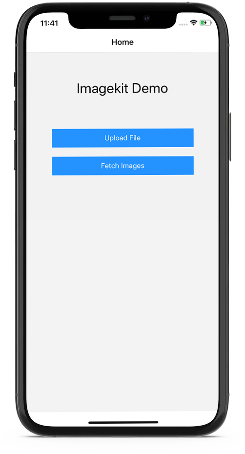
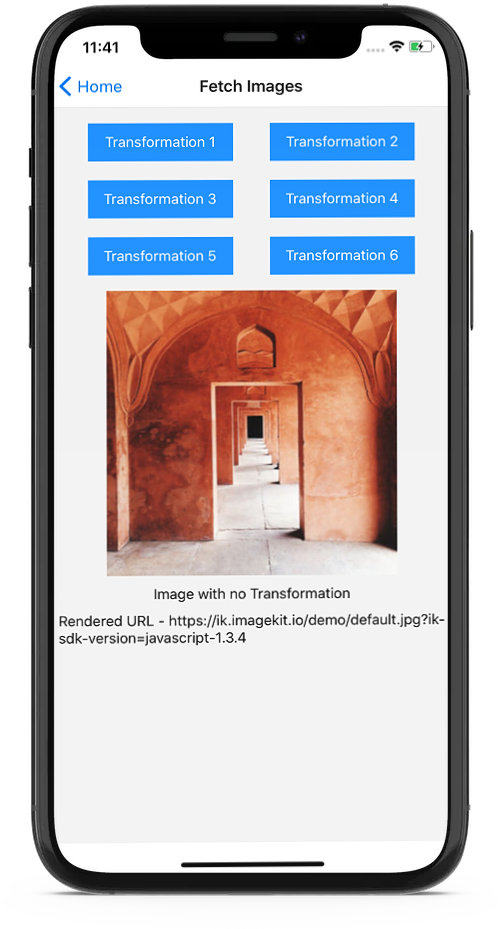
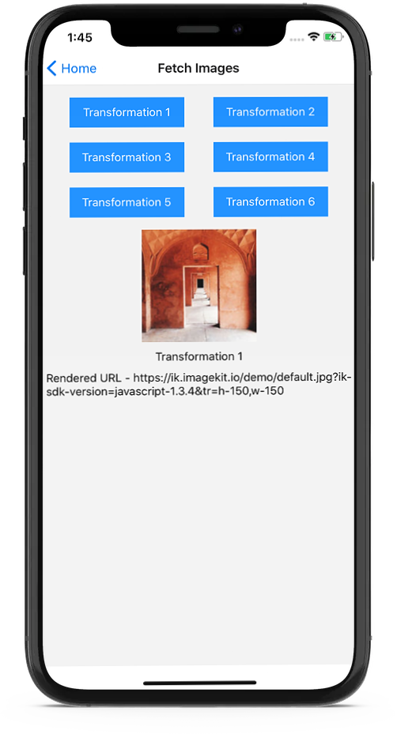
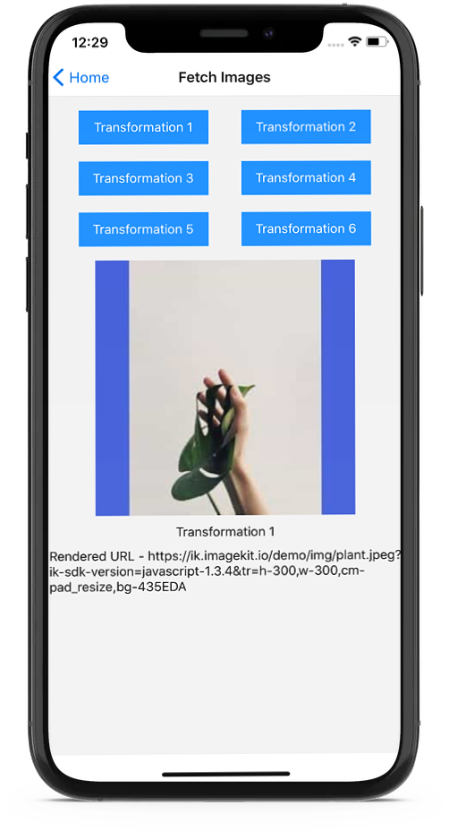
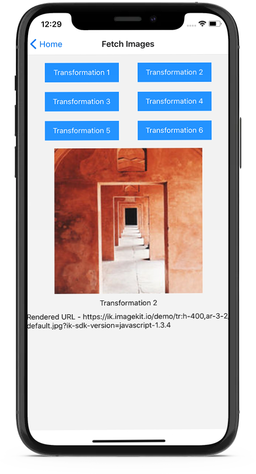
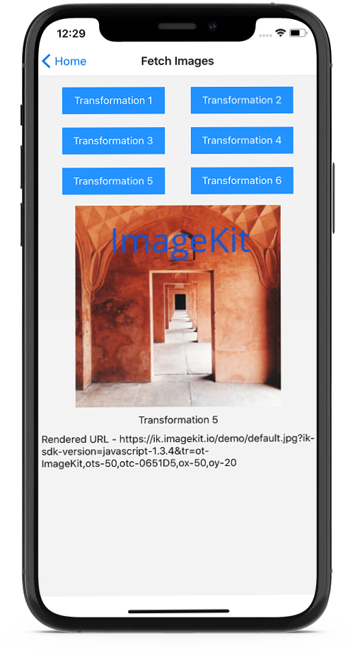
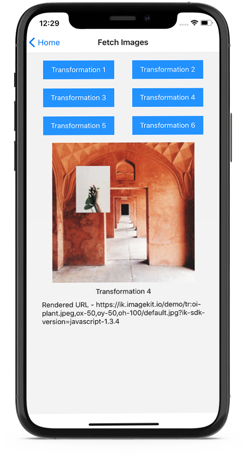

# React Native

This is a quick start guide to show you how to integrate ImageKit in a React Native app. The code samples covered here are hosted on Github - [https://github.com/imagekit-samples/quickstart/tree/master/react-native](https://github.com/imagekit-samples/quickstart/tree/master/react-native).

This guide walks you through the following topics:

* [Clone and run the tutorial app](react-native.md#clone-and-run-the-tutorial-app)
* [Setting up Imagekit Javascript SDK](react-native.md#setting-up-imagekit-javascript-sdk)
* [Rendering Images](react-native.md#rendering-images)
* [Applying common image manipulations](react-native.md#common-image-manipulation)
* [Adding overlays to images](react-native.md#adding-overlay-to-images)
* [Client-side file uploading](react-native.md#client-side-file-uploading)


If you are new to React Native app development, you can learn about setting up the development environment and creating a new project here [https://reactnative.dev/docs/environment-setup](https://reactnative.dev/docs/environment-setup).


## **Clone and run the tutorial app**

For this tutorial, it is recommended to use the sample React Native app as shown below. If you already have an existing React Native app, it is also possible to use that, although you would need to modify the terminal commands and configurations in this tutorial as applicable.

```bash
git clone 
https://github.com/imagekit-samples/quickstart.git
```

Navigate to the cloned repository, and install the npm packages that are needed to run the React Native app:

```bash
cd quickstart/react-native/
npm install
```

Start the metro server.

```bash
npx react-native start
```

And now to run the app in the ios simulator (you should have Xcode installed)

```bash
npx react-native run-ios
```

Or to run the app in the android simulator (you should have android studio installed)

```bash
npx react-native run-android
```

You should see the following screen. This means the sample app has been set up correctly.



## **Setting up Imagekit Javascript SDK**

We will be using [Imagekit javascript SDK](https://github.com/imagekit-developer/imagekit-javascript). So let's install it.

```bash
npm install --save imagekit-javascript
```


`imagekit-javascript` SDK uses URL [API](https://developer.mozilla.org/en-US/docs/Web/API/URL) to parse the URL internally. In React 16 and above, this API was [removed](https://github.com/facebook/react-native/issues/16434), so if you are using React 16 or above, you will have to implement a small [patch](https://github.com/facebook/react-native/issues/16434#issuecomment-557956079) with these steps.

1. Install the package with `npm install react-native-url-polyfill`
2. Import the package in your app's entry point i.e. App.js like this `import 'react-native-url-polyfill/auto'`


#### **Initializing the SDK**

Open `app/lib/imagekit.js` file, this is where we will initialize our SDK and create helper functions that will be used in the app.

Initialize the SDK with parameters set in the config file `app/config/imagekit.js` 

* `urlEndpoint` is the required parameter. You can get the value of URL-endpoint from your ImageKit dashboard - [https://imagekit.io/dashboard/url-endpoints](https://imagekit.io/dashboard/url-endpoints).
* `publicKey` and `authenticationEndpoint` parameters are optional and only needed if you want to use the SDK for client-side file upload. You can get these parameters from the developer section in your ImageKit dashboard - [https://imagekit.io/dashboard/developer/api-keys](https://imagekit.io/dashboard/developer/api-keys).


```javascript
import ImageKit from "imagekit-javascript";
import { urlEndpoint, publicKey, authenticationEndpoint } from "../config/imagekit";

var imagekitConfigOptions = { urlEndpoint };
if(publicKey) imagekitConfigOptions.publicKey = publicKey;
if(authenticationEndpoint) imagekitConfigOptions.authenticationEndpoint = authenticationEndpoint;

const imagekit = new ImageKit(imagekitConfigOptions);
```


## **Rendering Images**

Image URL can be created from an image path or using the absolute image URL. You can learn more about it in [docs](https://github.com/imagekit-developer/imagekit-javascript#url-generation).

To create a URL from the image source (full image URL), we can create a function like this, which takes the image source and a transformation array and returns the transformed image URL.


```javascript
module.exports.getImagekitUrlFromSrc = function(imageSrc, transformationArr){
		var ikOptions = {
			src: imageSrc,
			transformation: transformationArr
		}
		var imageURL = imagekit.url(ikOptions);
	
		return imageURL;
}
```


To create a URL from the image path, we can create a helper function like this below. This function takes the URL endpoint, image path, transformation array, and transformation position as parameters and returns the transformed image URL.


```javascript
module.exports.getImagekitUrlFromPath = function(imagePath, transformationArr, transformationPostion){
		var ikOptions = {
			urlEndpoint,
			path : imagePath,
			transformation: transformationArr
		};
		if(transformationPostion) ikOptions.transformationPostion = transformationPostion;
	
		var imageURL = imagekit.url(ikOptions);
	
		return imageURL;
}
```



The transformation position (path or query) is only valid when creating a URL from the image path. Transformations are always added as query parameters if the URL is created from an absolute image path using **src**.


Now, head over to `app/screens/Fetch/index.js` to fetch an image.

First, let's fetch the original image without any transformations.


```javascript
import React, { useState, useEffect } from 'react';
import { View } from 'react-native';

import Image from '../../components/Image/';
import getStyleSheet from './styles';

import { getImagekitUrlFromSrc, getImagekitUrlFromPath } from '../../lib/imagekit';
import { urlEndpoint } from '../../config/imagekit';

function Fetch() {
	  let styleSheet = getStyleSheet({});
	  
	  var imagePath = "/default.jpg";
		var imageSrc = urlEndpoint+imagePath;
		
		const [imageUrl, setImageUrl] = useState();
		
	  useEffect(() => {
				showTransformedImage();
		}, [])
		
		function showTransformedImage() {
				var transformedImageUrl = getImagekitUrlFromSrc(imageSrc, []);
				setImageUrl(transformedImageUrl);
		}
		
	  return (
				<View style={styleSheet.imgContainer}>
					{ 
						imageUrl && 
						<Image 
							source={{'uri' : imageUrl}} 
							style={{
								width: 300,
								height: 300,
							}}
						/> 
					}
				</View>
	  );
}

export default Fetch;
```


It will look as shown below. In the sample app, the buttons are present to demonstrate the use of different transformations. You can see the full list of supported transformations [here](https://github.com/imagekit-developer/imagekit-javascript#list-of-supported-transformations).




In the sample app, we are using our own custom `Text`, `Image`, `Button` components created using React native's components for consistency, you can use them, original or any other UI kit if you want.


## Common Image Manipulation

This section covers the basics:‌

* ​[Basic image resizing](react-native.md#basic-image-resizing)
* [Crop Mode](react-native.md#crop-mode)
* ​[Aspect Ratio](react-native.md#aspect-ratio)
* ​[Chained transformation](react-native.md#chained-transformation)

Imagekit Javascript SDK gives a name to each transformation parameter e.g. `height` for `h` and `width` for `w` parameter. It makes your code more readable. If the property does not match any of the available options, it is added as it is. See the [full list of supported transformations](https://github.com/imagekit-developer/imagekit-react#list-of-supported-transformations) in React SDK on Github.


You can also use `h` and `w` parameter instead of `height` and `width`.\
See the complete list of transformations supported in ImageKit [here](../../features/image-transformations/resize-crop-and-other-transformations.md).


### Basic image resizing

Let's resize the image to a height of 150 and a width of 150.

Note: You'll need to specify height and width in the Image component of react-native accordingly as we are fetching the image from a remote url.


```javascript
function showTransformedImage() {
		var transformedImageUrl = getImagekitUrlFromSrc(imageSrc, [{
				"height": 150,
				"width": 150,
		}]);
		setImageUrl(transformedImageUrl);
}
```


Output : 



### Crop Mode

Let’s now see how different crop mode works. We will try the [`pad_resize`](../../features/image-transformations/resize-crop-and-other-transformations.md#pad-resize-crop-strategy-cm-pad_resize) crop strategy.  In this strategy, the output image's dimension (height and width) is the same as requested, no cropping occurs, and the aspect ratio is preserved. This is accomplished by adding padding around the output image to get it to match the exact dimension as requested. You can read more about this [here](../../features/image-transformations/resize-crop-and-other-transformations.md#pad-resize-crop-strategy-cm-pad_resize). 


```javascript
function showTransformedImage() {
		var transformedImageUrl = getImagekitUrlFromSrc(imageSrc, [{
				"height": 200,
				"width": 300,
				"cropMode" : "pad_resize",
				"background" : "F3F3F3"
		}]);
		setImageUrl(transformedImageUrl);
}
```


Output : 



### Aspect Ratio

You can use the [ar parameter](../../features/image-transformations/resize-crop-and-other-transformations.md#aspect-ratio-ar) to change the aspect ratio like this**:**


```javascript
function showTransformedImage() {
		var transformedImageUrl = getImagekitUrlFromSrc(imageSrc, [{
				"height": 400,
				"aspectRatio" : "3-2"
		}]);
		setImageUrl(transformedImageUrl);
}
```


Output :



### Chained Transformation

[Chained transformations](https://docs.imagekit.io/features/image-transformations/chained-transformations) provide a simple way to control the sequence in which transformations are applied.

Let’s try it out by resizing an image, then [rotating](../../features/image-transformations/resize-crop-and-other-transformations.md#rotate-rt) it:


```javascript
function showTransformedImage() {
		var transformedImageUrl = getImagekitUrlFromSrc(imageSrc, [{
					"height": 300,
					"width" : 300
				}, {
					"rotation" : "90"
		}]);
		setImageUrl(transformedImageUrl);
}
```


Output :


## **Adding an overlay to images**

ImageKit.io allows you to add [text](../../features/image-transformations/overlay.md#text-overlay) and [image overlay](../../features/image-transformations/overlay.md) dynamically.

### Text Overlay

Text overlay can be used to superimpose text on an image. Try it like so:


```javascript
function showTransformedImage() {
		var transformedImageUrl = getImagekitUrlFromSrc(imageSrc, [{
					"overlayText": 'ImageKit',
					"overlayTextFontSize": 50,
					"overlayTextColor": '0651D5',
					"overlayX" : 50,
					"overlayY" : 20
		}]);
		setImageUrl(transformedImageUrl);
}
```


Output : 



### Image Overlay

Image overlay can be used like this:


```javascript
function showTransformedImage() {
		var transformedImageUrl = getImagekitUrlFromSrc(imageSrc, [{
					"overlayImage": "plant.jpeg",
					"overlayX" : 50,
					"overlayY" : 50,
					"overlayHeight" : 100,
		}]);
		setImageUrl(transformedImageUrl);
}
```


Output :** **



## **Client-side file uploading**

Let's learn how to upload an image to our media library.

For this, we would need a dummy backend app to authenticate our upload request. API authentication for upload always happens on the backend for security reasons.

The tutorial repository comes with a sample backend server that we can use. 

### **Setting up the backend app**

In a new terminal window, navigate to the `server` folder inside the tutorial project and install its npm packages:

```bash
cd server/
npm install
```

Copy the given server `sample.env` file to `.env`.

```bash
cp sample.env .env
```

Obtain your [API private key](../../api-reference/api-introduction/api-keys.md#private-key) from the developer section from the ImageKit dashboard, and paste it in the server `.env` file.

```bash
PRIVATE_KEY = <your_private_key>
```

Finally, run the backend app.

```bash
npm start
```

You should see a log line saying that the app is _**“Live on port 8080”**_.

#### **Configure the auth endpoint in the frontend app**

Head over to `app/config/imagekit.js` and replace the** **`authenticationEndpoint` with `http://localhost:8080/auth`

### **Upload an image**


Try using `react-native v0.63.3` which is the latest version at the time of writing this article, as the previous versions have a known [issue](https://github.com/facebook/react-native/issues/29021) in uploading files. If you are using a previous version and can't upgrade, you'll have to implement a [workaround](https://github.com/facebook/react-native/issues/29021#issuecomment-678829869).


For this, let's create another function in `app/lib/imagekit.js` file.


```javascript
module.exports.uploadFile = function(file) {
	return new Promise((resolve, reject) => {
		imagekit.upload({
			file,
			fileName: file.name, //you can change this and generate your own name if required
			tags: ["sample-tag-1", "sample-tag-2"] //change this or remove it if you want
		}, function(err, result) {
			if(err) reject(err);
			resolve(result);
		})
	})
}
```


For selecting a file, we will need a picker. Here we are using `react-native-document-picker` but you can use any picker.

```bash
npm install --save react-native-document-picker
```

This is how we implement file upload in `app/screens/Upload/index.js`


```javascript
import React, { useState } from 'react';
import { View } from 'react-native';
import DocumentPicker from 'react-native-document-picker';

import Button from '../../components/Button/';
import Text from '../../components/Text/';
import getStyleSheet from './styles';

import { uploadFile } from '../../lib/imagekit';

function Upload() {
	let styleSheet = getStyleSheet({});

	const [uploadFileUrl, setUploadFileUrl] = useState();

	async function openFileSelector(){
		try{
			var res = await DocumentPicker.pick({
				type: [DocumentPicker.types.allFiles],
			});
			
			uploadFileToImagekit(res);
		}catch(err){
			if (DocumentPicker.isCancel(err)) {
				// User cancelled the picker, exit any dialogs or menus and move on
			} else {
				throw err;
			}
		}
	}

	async function uploadFileToImagekit(fileData){
		try{
			const uploadedFile = await uploadFile(fileData);
			setUploadFileUrl(uploadedFile.url);
		}catch(err){
			//handle error in uploading file
		}
	}

	return (
		<>
			<View style={styleSheet.container}>
				<Button 
					cssProps={styleSheet.buttonCssProps} 
					onPress={() => openFileSelector()}
				>
					Upload File
				</Button>
				<View style={styleSheet.captionView}>
					{
						uploadFileUrl && 
						<Text>Uploaded File - {uploadFileUrl}</Text>
					}
				</View>
			</View>
		</>
	);
};

export default Upload;
```


Let’s upload an image by selecting a file using the file input. 

The uploader uploads whenever file input changes. You can verify that file was successfully uploaded by checking the browser console. It should print the file URL.

After a successful upload, you should see the newly uploaded file in the [Media Library](http://dev.imagekit.io/dashboard#media-library) of your ImageKit dashboard.

If you don't see the file, check if there are any errors in the browser console log. Make sure that the private API key has been configured. The server app is running. And the uploaded file type is [supported](../../api-reference/upload-file-api/#allowed-file-types-for-uploading) by ImageKit.

## What's next

The possibilities for image manipulation and optimization with ImageKit are endless. Learn more about it here: 

* [Image Transformations](https://docs.imagekit.io/features/image-transformations)
* [Image optimization](https://docs.imagekit.io/features/image-optimization)
* [Media Library](https://docs.imagekit.io/media-library/overview)
* [Performance monitoring](../../features/performance-monitoring.md)
