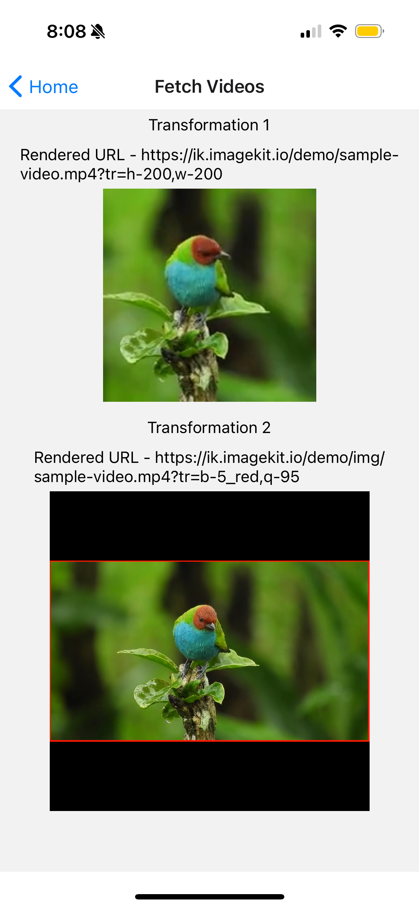

# React Native

This is a quick start guide to show you how to integrate ImageKit in a React Native app. The code samples covered here are hosted on Github - [https://github.com/imagekit-samples/quickstart/tree/master/react-native](https://github.com/imagekit-samples/quickstart/tree/master/react-native).

This guide walks you through the following topics:

* [Setting up React Native app](react-native.md#setting-up-react-native-app)
* [Setting up ImageKit JavaScript SDK](react-native.md#setting-up-imagekit-javascript-sdk)
* [Rendering Images](react-native.md#rendering-images)
* [Applying common image manipulations](react-native.md#common-image-manipulation)
* [Adding overlays](react-native.md#adding-overlays)
* [Client-side file uploading](react-native.md#client-side-file-uploading)
* [Rendering videos](react-native.md#rendering-videos)


If you are new to React Native app development, you can learn about setting up the development environment and creating a new project here [https://reactnative.dev/docs/environment-setup](https://reactnative.dev/docs/environment-setup).


## **Setting up React Native app**

For this tutorial, it is recommended to use the sample React Native app as shown below. If you already have an existing React Native app, it is also possible to use that, although you would need to modify the terminal commands and configurations in this tutorial as applicable.

Let's use the `react-native-cli` package to build a new project:

```bash
npx react-native@latest init imagekitReactNative
```

Navigate to the project directory:

```bash
cd imagekitReactNative/
```

Start the metro server.

```bash
npx react-native start
```

And now to run the app in the iOS simulator (you should have Xcode installed)

```bash
npm run ios
```

Or to run the app in the android simulator (you should have android studio installed)

```bash
npm run android
```

You should see the following screen. This means the sample app has been set up correctly.

<div style="text-align:center;">
	
</div>


### Let's configure the components required for the application.

Execute the provided command to install the packages required for the application.

```bash
npm install @react-navigation/native @react-navigation/stack react-native-gesture-handler react-native-safe-area-context react-native-screens
```


In the sample app, we are using our own custom `Button` component created using React Native's components to ensure consistency.



 

```js
import React from 'react';
import {Text, TouchableOpacity} from 'react-native';
import getStyleSheet from './styles';

function Button(props) {
  let styleSheet = getStyleSheet(props.cssProps || {});
  return (
    <TouchableOpacity onPress={props.onPress} style={styleSheet.button}>
      <Text style={styleSheet.text}>{props.children}</Text>
    </TouchableOpacity>
  );
}

export default Button;
```





```js
import {StyleSheet} from 'react-native';

function getStyleSheet(cssProps) {
  return StyleSheet.create({
    button: {
      height: 40,
      width: cssProps.width || 100,
      backgroundColor: 'dodgerblue',
      justifyContent: 'center',
      alignItems: 'center',
    },
    text: {
      color: cssProps.textColor || 'white',
      fontSize: 15,
      marginLeft: 10,
      marginRight: 10,
    },
  });
}

export default getStyleSheet;
```




Create `index.js` and `styles.js` files within the `app/screens/Main` directory. These files will render & style buttons facilitating navigation to different screens, which will be developed in the subsequent sections. This configuration serves as our home screen.


 

```js
import React from 'react';
import {View, Text} from 'react-native';
import Button from '../../components/Button/';
import getStyleSheet from './styles';

function Main({navigation}) {
  let styleSheet = getStyleSheet({});

  return (
    <>
      <View style={styleSheet.headContainer}>
        <Text style={styleSheet.text}>Imagekit Demo</Text>
      </View>
      <View style={styleSheet.btnContainer}>
        <View style={styleSheet.btnView}>
          <Button
            cssProps={styleSheet.buttonCssProps}
            onPress={() => navigation.navigate('Upload File')}>
            Upload File
          </Button>
        </View>
        <View style={styleSheet.btnView}>
          <Button
            cssProps={styleSheet.buttonCssProps}
            onPress={() => navigation.navigate('Fetch Images')}>
            Fetch Images
          </Button>
        </View>
        <View style={styleSheet.btnView}>
          <Button
            cssProps={styleSheet.buttonCssProps}
            onPress={() => navigation.navigate('Fetch Videos')}>
            Fetch Videos
          </Button>
        </View>
      </View>
    </>
  );
}

export default Main;
```




```js
import {StyleSheet} from 'react-native';

function getStyleSheet() {
  return StyleSheet.create({
    headContainer: {
      flex: 1,
      alignItems: 'center',
      justifyContent: 'center',
    },
    btnContainer: {
      flex: 4,
      alignItems: 'center',
      justifyContent: 'flex-start',
    },
    btnView: {
      marginTop: 10,
      marginBottom: 10,
    },
    buttonCssProps: {
      width: 300,
    },
    text: {
      color: 'black',
      fontSize: 30,
      marginLeft: 10,
      marginRight: 10,
    },
  });
}

export default getStyleSheet;
```





Create the `AppComponent.js` file within the `app` directory which will contain the screens. Add the home screen.
Open the `App.tsx` file and add the provided code to render the `AppComponent`.





```js
import React from 'react';
import {createStackNavigator} from '@react-navigation/stack';
import Main from './screens/Main';

const Stack = createStackNavigator();

function AppComponent() {
  return (
    <Stack.Navigator>
      <Stack.Screen name="Home" component={Main} />
    </Stack.Navigator>
  );
}
export default AppComponent;
```




```js
import 'react-native-gesture-handler';
import 'react-native-url-polyfill/auto';
import React from 'react';
import {SafeAreaView} from 'react-native';
import {NavigationContainer} from '@react-navigation/native';
import AppComponent from './app/AppComponent';

function App() {
  return (
    <SafeAreaView style={{flex: 1}}>
      <NavigationContainer>
        <AppComponent />
      </NavigationContainer>
    </SafeAreaView>
  );
}

export default App;
```




It will look as shown below.

<div style="text-align:center;">
	
</div>

## **Setting up ImageKit JavaScript SDK**

We will be using [ImageKit JavaScript SDK](https://github.com/imagekit-developer/imagekit-javascript). So let's install it.

```bash
npm install imagekit-javascript
```


`imagekit-javascript` SDK uses URL [API](https://developer.mozilla.org/en-US/docs/Web/API/URL) to parse the URL internally. In React 16 and above, this API was [removed](https://github.com/facebook/react-native/issues/16434), so if you are using React 16 or above, you will have to implement a small [patch](https://github.com/facebook/react-native/issues/16434#issuecomment-557956079) with these steps.

1. Install the package with `npm install react-native-url-polyfill`
2. Import the package in your app's entry point i.e. App.js like this `import 'react-native-url-polyfill/auto'`


#### **Initializing the SDK**

Create `app/lib/imagekit.js` file, this is where we will initialize our SDK and create helper functions that will be used in the app.

* `urlEndpoint` is the required parameter. You can get the value of URL-endpoint from your ImageKit dashboard - [https://imagekit.io/dashboard/url-endpoints](https://imagekit.io/dashboard/url-endpoints).
* `publicKey` and `authenticationEndpoint` parameters are optional and only needed if you want to use the SDK for client-side file upload. You can get these parameters from the developer section in your ImageKit dashboard - [https://imagekit.io/dashboard/developer/api-keys](https://imagekit.io/dashboard/developer/api-keys).

Also initialize the SDK with parameters set in the config file `app/config/imagekit.js`


 

```js
module.exports.urlEndpoint = ''; //insert your own url end point here
module.exports.publicKey = ''; //insert your own public key here
module.exports.authenticationEndpoint = ''; //your auth api path
```




```javascript
import ImageKit from 'imagekit-javascript';
import {
  urlEndpoint,
  publicKey,
  authenticationEndpoint,
} from '../config/imagekit';

const imagekitConfigOptions = {urlEndpoint};
if (publicKey) imagekitConfigOptions.publicKey = publicKey;
if (authenticationEndpoint)
  imagekitConfigOptions.authenticationEndpoint = authenticationEndpoint;

const imagekit = new ImageKit(imagekitConfigOptions);
```




## **Rendering Images**

Image URL can be created from an image path or using the absolute image URL. You can learn more about it in [docs](https://github.com/imagekit-developer/imagekit-javascript#url-generation).

To create a URL from the image source (full image URL), we can create a function like this, which takes the image source and a transformation array and returns the transformed image URL.


```javascript
module.exports.getImagekitUrlFromSrc = function (imageSrc, transformationArr) {
  const ikOptions = {
    src: imageSrc,
    transformation: transformationArr,
  };
  const imageURL = imagekit.url(ikOptions);

  return imageURL;
};
```


To create a URL from the image path, we can create a helper function like this below. This function takes the URL endpoint, image path, transformation array, and transformation position as parameters and returns the transformed image URL.


```javascript
module.exports.getImagekitUrlFromPath = function (
  imagePath,
  transformationArr,
  transformationPostion,
) {
  const ikOptions = {
    urlEndpoint,
    path: imagePath,
    transformation: transformationArr,
  };
  if (transformationPostion)
    ikOptions.transformationPostion = transformationPostion;

  const imageURL = imagekit.url(ikOptions);

  return imageURL;
};
```



The transformation position (path or query) is only valid when creating a URL from the image path. Transformations are always added as query parameters if the URL is created from an absolute image path using **src**.


Now, let's create `app/screens/Fetch/index.js` to fetch an image. Also, update `app/AppComponent.js` to include the fetch image screen.




```js
import React from 'react';
import {createStackNavigator} from '@react-navigation/stack';

import Main from './screens/Main';
import Fetch from './screens/Fetch';

const Stack = createStackNavigator();

function AppComponent() {
  return (
    <Stack.Navigator>
      <Stack.Screen name="Home" component={Main} />
      <Stack.Screen name="Fetch Images" component={Fetch} />
    </Stack.Navigator>
  );
}

export default AppComponent;
```




```javascript
import React, {useState, useEffect} from 'react';
import {View, Text, Image} from 'react-native';

import Button from '../../components/Button/';
import getStyleSheet from './styles';

import {
  getImagekitUrlFromSrc,
  getImagekitUrlFromPath,
} from '../../lib/imagekit';
import {urlEndpoint} from '../../config/imagekit';

function Fetch() {
  let styleSheet = getStyleSheet({});

  const imagePath = '/default.jpg';
  let imageSrc = urlEndpoint + imagePath;

  const [imageUrl, setImageUrl] = useState();
  const [currentTr, setCurrentTr] = useState();
  const [imageDimesions, setImageDimensions] = useState();

  useEffect(() => {
    currentTr == 'Transformation 1'
      ? setImageDimensions({height: 150, width: 150})
      : setImageDimensions({height: 300, width: 300});
    showTransformedImage(currentTr);
  }, [currentTr]);

  function showTransformedImage(transformationType) {
    let transformationArr = [];
    let transformedImageUrl;

    switch (transformationType) {
      case 'Transformation 1': //basic image resizing
        transformationArr = [
          {
            height: 150,
            width: 150,
          },
        ];
        transformedImageUrl = getImagekitUrlFromSrc(
          imageSrc,
          transformationArr,
        );
        break;

      case 'Transformation 2': //crop mode and url from source
        imageSrc = 'https://ik.imagekit.io/demo/img/plant.jpeg';
        transformationArr = [
          {
            height: 300,
            width: 300,
            cropMode: 'pad_resize',
            background: '435EDA',
          },
        ];
        transformedImageUrl = getImagekitUrlFromSrc(
          imageSrc,
          transformationArr,
        );
        break;

      case 'Transformation 3': //aspect ratio and url from path and transformations as query param
        transformationArr = [
          {
            height: 400,
            aspectRatio: '3-2',
          },
        ];
        transformedImageUrl = getImagekitUrlFromPath(
          imagePath,
          transformationArr,
          'query',
        );
        break;

      case 'Transformation 4': //overlay image with x,y and its height
        transformationArr = [
          {
            raw: 'l-image,i-plant.jpeg,h-100,b-10_CDDC39,l-end',
          },
        ];
        transformedImageUrl = getImagekitUrlFromPath(
          imagePath,
          transformationArr,
        );
        break;

      case 'Transformation 5': //overlay text example
        transformationArr = [
          {
            raw: 'l-text,i-Imagekit,co-0651D5,fs-50,l-end',
          },
        ];
        transformedImageUrl = getImagekitUrlFromSrc(
          imageSrc,
          transformationArr,
        );
        break;

      case 'Transformation 6': //chained transformation
        transformationArr = [
          {
            height: 300,
            width: 300,
          },
          {
            rotation: '90',
          },
        ];
        transformedImageUrl = getImagekitUrlFromSrc(
          imageSrc,
          transformationArr,
        );
        break;

      default:
        transformedImageUrl = getImagekitUrlFromSrc(imageSrc, []);
        break;
    }

    setImageUrl(transformedImageUrl);
  }

  return (
    <>
      <View style={styleSheet.btnContainer}>
        <View style={styleSheet.btnView}>
          <Button
            cssProps={styleSheet.buttonCssProps}
            onPress={() => setCurrentTr('Transformation 1')}>
            Transformation 1
          </Button>
          <Button
            cssProps={styleSheet.buttonCssProps}
            onPress={() => setCurrentTr('Transformation 2')}>
            Transformation 2
          </Button>
        </View>
        <View style={styleSheet.btnView}>
          <Button
            cssProps={styleSheet.buttonCssProps}
            onPress={() => setCurrentTr('Transformation 3')}>
            Transformation 3
          </Button>
          <Button
            cssProps={styleSheet.buttonCssProps}
            onPress={() => setCurrentTr('Transformation 4')}>
            Transformation 4
          </Button>
        </View>
        <View style={styleSheet.btnView}>
          <Button
            cssProps={styleSheet.buttonCssProps}
            onPress={() => setCurrentTr('Transformation 5')}>
            Transformation 5
          </Button>
          <Button
            cssProps={styleSheet.buttonCssProps}
            onPress={() => setCurrentTr('Transformation 6')}>
            Transformation 6
          </Button>
        </View>
      </View>

      <View style={styleSheet.imgContainer}>
        {imageUrl && (
          <>
            <Image
              source={{uri: imageUrl}}
              style={{
                width: imageDimesions.width,
                height: imageDimesions.height,
              }}
            />
            <View style={styleSheet.captionView}>
              {currentTr ? (
                <Text style={styleSheet.text}>{currentTr}</Text>
              ) : (
                <Text style={styleSheet.text}>
                  Image with no Transformation
                </Text>
              )}
            </View>
            <View style={styleSheet.captionView}>
              <Text style={styleSheet.text}>Rendered URL - {imageUrl}</Text>
            </View>
          </>
        )}
      </View>
    </>
  );
}

export default Fetch;
```




It will look as shown below. In the sample app, the buttons are present to demonstrate the use of different transformations. You can see the full list of supported transformations [here](https://github.com/imagekit-developer/imagekit-javascript#list-of-supported-transformations).

<div style="text-align:center;">
	
</div>

## Common Image Manipulation

This section covers the basics:‌

* ​[Basic Image Resizing](react-native.md#basic-image-resizing)
* [Crop Mode](react-native.md#crop-mode)
* ​[Aspect Ratio](react-native.md#aspect-ratio)
* ​[Chained transformation](react-native.md#chained-transformation)

ImageKit JavaScript SDK gives a name to each transformation parameter e.g. `height` for `h` and `width` for `w` parameter. It makes your code more readable. If the property does not match any of the available options, it is added as it is. See the [full list of supported transformations](https://github.com/imagekit-developer/imagekit-javascript?tab=readme-ov-file#list-of-supported-transformations) in Javascript SDK on Github.


You can also use `h` and `w` parameter instead of `height` and `width`.\
See the complete list of transformations supported in ImageKit [here](../../features/image-transformations/resize-crop-and-other-transformations.md).


### Basic Image Resizing

Let's resize the image to a height of 150 and a width of 150.

Note: You'll need to specify height and width in the Image component of react-native accordingly as we are fetching the image from a remote url.


```javascript
function showTransformedImage() {
  let transformedImageUrl = getImagekitUrlFromSrc(imageSrc, [
    {
      height: 150,
      width: 150,
    },
  ]);
  setImageUrl(transformedImageUrl);
}
```


Output : 

<div style="display:flex; flex-direction:row; justify-content:center;">
	
</div>

### Crop Mode

Let’s now see how different crop mode work. We will try the [`pad_resize`](../../features/image-transformations/resize-crop-and-other-transformations.md#pad-resize-crop-strategy-cm-pad_resize) crop strategy.

In this strategy, the output image's dimension (height and width) is the same as requested, no cropping occurs, and the aspect ratio is preserved. This is accomplished by adding padding around the output image to get it to match the exact dimension as requested. You can read more about this [here](../../features/image-transformations/resize-crop-and-other-transformations.md#pad-resize-crop-strategy-cm-pad_resize). 


```javascript
function showTransformedImage() {
  let transformedImageUrl = getImagekitUrlFromSrc(imageSrc, [
    {
      height: 200,
      width: 300,
      cropMode: 'pad_resize',
      background: 'F3F3F3',
    },
  ]);
  setImageUrl(transformedImageUrl);
}
```


Output : 

<div style="text-align:center;">
	
</div>

### Aspect Ratio

You can use the [ar parameter](../../features/image-transformations/resize-crop-and-other-transformations.md#aspect-ratio-ar) to change the aspect ratio like this


```javascript
function showTransformedImage() {
  let transformedImageUrl = getImagekitUrlFromSrc(imageSrc, [
    {
      height: 400,
      aspectRatio: '3-2',
    },
  ]);
  setImageUrl(transformedImageUrl);
}
```


Output :

<div style="text-align:center;">
	
</div>

### Chained Transformation

[Chained transformations](https://docs.imagekit.io/features/image-transformations/chained-transformations) provide a simple way to control the sequence in which transformations are applied.

Let’s try it out by resizing an image, then [rotating](../../features/image-transformations/resize-crop-and-other-transformations.md#rotate-rt) it:


```javascript
function showTransformedImage() {
  let transformedImageUrl = getImagekitUrlFromSrc(imageSrc, [
    {
      height: 300,
      width: 300,
    },
    {
      rotation: '90',
    },
  ]);
  setImageUrl(transformedImageUrl);
}
```


Output :

<div style="text-align:center;">
	
</div>

## **Adding overlays**

ImageKit.io enables you to apply overlays to [images](../../features/image-transformations/overlay-using-layers.md) and [videos](../../features/video-transformation/overlay.md) using the raw parameter with the concept of [layers](../../features/image-transformations/overlay-using-layers.md#layers). The raw parameter facilitates incorporating transformations directly in the URL. A layer is a distinct type of transformation that allows you to define an asset to serve as an overlay, along with its positioning and additional transformations.

### Text Overlay

Text overlay can be used to place text on an image. Here's how:


```javascript
function showTransformedImage() {
  let transformedImageUrl = getImagekitUrlFromSrc(imageSrc, [
    {
      raw: 'l-text,i-Imagekit,co-0651D5,fs-50,l-end',
    },
  ]);
  setImageUrl(transformedImageUrl);
}
```


Output : 

<div style="text-align:center;">
	
</div>

### Image Overlay

Image overlay can be used like this:


```javascript
function showTransformedImage() {
  let transformedImageUrl = getImagekitUrlFromSrc(imageSrc, [
    {
      raw: 'l-image,i-plant.jpeg,h-100,b-10_CDDC39,l-end',
    },
  ]);
  setImageUrl(transformedImageUrl);
}
```


Output :

<div style="text-align:center;">
	
</div>

## **Client-side file uploading**

Let's learn how to upload an image to our media library.

For this, we would need a dummy backend app to authenticate our upload request. API authentication for upload always happens on the backend for security reasons.

In the following section, we will create a backend server that we can use.

### **Setting up the backend app**

For this quickstart guide, we will create a sample Node.js server which will provide an authentication endpoint at `http://localhost:8080/auth`.&#x20;

Let's create a file `index.js` inside `server` folder in the project root.

```bash
mkdir server
touch server/index.js
```

Install the basic packages needed to create a dummy server for ImageKit backend authentication:

```js
npm install express uuid cors
```

We will use the [ImageKit Node.js SDK](https://github.com/imagekit-developer/imagekit-nodejs) to implement `http://localhost:8080/auth`.

The backend SDK requires your API [public key](../../api-reference/api-introduction/api-keys.md#public-key), [private key](../../api-reference/api-introduction/api-keys.md#private-key), and [URL endpoint](../../integration/url-endpoints.md). You can obtain them from [Developer Options](https://imagekit.io/dashboard/developer/api-keys) and [URL-endpoint](https://imagekit.io/dashboard/url-endpoints) pages respectively.

This is how `server/index.js` file should look now.




```javascript
const express = require('express');
const router = express.Router();
const cors = require('cors');
const app = express();
app.use(cors());

const uuid = require('uuid');
const crypto = require('crypto');

const privateKey = ''; //insert your own private key here
router.get('/auth', function (req, res) {
  const token = req.query.token || uuid.v4();
  const expire = req.query.expire || parseInt(Date.now() / 1000) + 2400;
  const privateAPIKey = `${privateKey}`;
  const signature = crypto
    .createHmac('sha1', privateAPIKey)
    .update(token + expire)
    .digest('hex');
  res.status(200);
  res.send({
    token,
    expire,
    signature,
  });
});

app.use('/', router);

app.listen(8080, function () {
  console.log('Live at Port 8080');
});
```




Obtain your [API private key](../../api-reference/api-introduction/api-keys.md#private-key) from the developer section from the ImageKit dashboard, and paste it in the server `index.js` file.

Let's run the backend server.

```
cd server
node index.js
```

You should see a log saying that the app is _**'Live at port 8080'**_.

If you GET `http://localhost:8080/auth`, you should see a JSON response like this. Actual values will vary.

```javascript
{
    token: "5dd0e211-8d67-452e-9acd-954c0bd53a1f",
    expire: 1601047259,
    signature: "dcb8e72e2b6e98186ec56c62c9e62886f40eaa96"
}
```

#### **Configure the auth endpoint in the frontend app**

Head over to `app/config/imagekit.js` and replace the `authenticationEndpoint` with `http://localhost:8080/auth`

### **Upload an image**


Try using `react-native v0.73.0` which is the latest version at the time of writing this article, as some of the previous versions have a known [issue](https://github.com/facebook/react-native/issues/29021) in uploading files. If you are using a previous version and can't upgrade, you'll have to implement a [workaround](https://github.com/facebook/react-native/issues/29021#issuecomment-678829869).


For this, let's create couple of functions in `app/lib/imagekit.js` file and update `app/AppComponent.js` to include the upload screen.





```javascript
const authenticator = async () => {
  try {
    // You can pass headers as well and later validate the request source in the backend, or you can use headers for any other use case.
    const response = await fetch(authenticationEndpoint);
    if (!response.ok) {
      const errorText = await response.text();
      throw new Error(
        `Request failed with status ${response.status}: ${errorText}`,
      );
    }
    const data = await response.json();
    const {signature, expire, token} = data;
    return {signature, expire, token};
  } catch (error) {
    throw new Error(`Authentication request failed: ${error.message}`);
  }
};

module.exports.uploadFile = async function (file) {
  const res = await authenticator();
  return new Promise((resolve, reject) => {
    imagekit.upload(
      {
        file,
        fileName: file.name, //you can change this and generate your own name if required
        tags: ['sample-tag-1', 'sample-tag-2'], //change this or remove it if you want
        ...res,
      },
      function (err, result) {
        if (err) reject(err);
        resolve(result);
      },
    );
  });
};
```





```js
import React from 'react';
import {createStackNavigator} from '@react-navigation/stack';

import Main from './screens/Main';
import Fetch from './screens/Fetch';
import Upload from './screens/Upload';
import Videos from './screens/Videos';

const Stack = createStackNavigator();

function AppComponent() {
  return (
    <Stack.Navigator>
      <Stack.Screen name="Home" component={Main} />
      <Stack.Screen name="Fetch Images" component={Fetch} />
      <Stack.Screen name="Upload File" component={Upload} />
    </Stack.Navigator>
  );
}

export default AppComponent;
```





We are going to use `react-native-document-picker` to select files.

```bash
npm install react-native-document-picker
```

This is how we implement file upload in `app/screens/Upload/index.js`





```javascript
import React, {useState} from 'react';
import {View} from 'react-native';
import DocumentPicker from 'react-native-document-picker';

import Button from '../../components/Button/';
import Text from '../../components/Text/';
import getStyleSheet from './styles';

import {uploadFile} from '../../lib/imagekit';

function Upload() {
  let styleSheet = getStyleSheet({});

  const [uploadFileUrl, setUploadFileUrl] = useState();

  async function openFileSelector() {
    try {
      const res = await DocumentPicker.pick({
        type: [DocumentPicker.types.allFiles],
      });

      uploadFileToImagekit(res);
    } catch (err) {
      if (DocumentPicker.isCancel(err)) {
        // User cancelled the picker, exit any dialogs or menus and move on
      } else {
        throw err;
      }
    }
  }

  async function uploadFileToImagekit(fileData) {
    try {
      const uploadedFile = await uploadFile(fileData);
      setUploadFileUrl(uploadedFile.url);
    } catch (err) {
      //handle error in uploading file
    }
  }

  return (
    <>
      <View style={styleSheet.container}>
        <Button
          cssProps={styleSheet.buttonCssProps}
          onPress={() => openFileSelector()}>
          Upload File
        </Button>
        <View style={styleSheet.captionView}>
          {uploadFileUrl && <Text>Uploaded File - {uploadFileUrl}</Text>}
        </View>
      </View>
    </>
  );
}

export default Upload;
```




```js
import {StyleSheet} from 'react-native';

function getStyleSheet(cssProps) {
  return StyleSheet.create({
    container: {
      flex: 1,
      alignItems: 'center',
      justifyContent: 'center',
    },
    buttonCssProps: {
      width: 150,
    },
    captionView: {
      marginTop: 10,
    },
    text: {
      color: 'black',
      fontSize: 15,
      marginLeft: 10,
      marginRight: 10,
    },
  });
}

export default getStyleSheet;
```





Let’s upload an image by selecting a file using the file input. 

The uploader uploads whenever file input changes. You can verify that file was successfully uploaded by checking the browser console. It should print the file URL.

After a successful upload, you should see the newly uploaded file in the [Media Library](http://dev.imagekit.io/dashboard#media-library) of your ImageKit dashboard.

If you don't see the file, check if there are any errors in the log. Make sure that the private API key has been configured. The server app is running. And the uploaded file type is [supported](../../api-reference/upload-file-api/#allowed-file-types-for-uploading) by ImageKit.

## **Rendering videos**

Rendering videos works similarly to rendering images.

We're going to use the [`react-native-video`](https://www.npmjs.com/package/react-native-video) package to play video files, but you can use any other video player.

```bash
npm install react-native-video
```

Update the `app/screens/Videos/index.js` and `app/AppComponent.js` file to fetch video.




```javascript
import React from 'react';
import {View, ScrollView, Text} from 'react-native';
import getStyleSheet from './styles';
import {getImagekitUrlFromSrc} from '../../lib/imagekit';
import {urlEndpoint} from '../../config/imagekit';
import Video from 'react-native-video';

function Videos() {
  let styleSheet = getStyleSheet({});

  const videoPath = '/sample-video.mp4';
  let videoSrc = urlEndpoint + videoPath;

  function showTransformedVideo(transformationType) {
    let transformationArr = [];
    let transformedVideoUrl;

    switch (transformationType) {
      case 'Transformation 1': //basic video resizing
        transformationArr = [
          {
            height: 200,
            width: 200,
          },
        ];
        transformedVideoUrl = getImagekitUrlFromSrc(
          videoSrc,
          transformationArr,
        );
        break;

      case 'Transformation 2': //crop mode and url from source
        videoSrc = 'https://ik.imagekit.io/demo/img/sample-video.mp4';
        transformationArr = [
          {
            b: '5_red',
            q: 95,
          },
        ];
        transformedVideoUrl = getImagekitUrlFromSrc(
          videoSrc,
          transformationArr,
        );
        break;

      default:
        transformedVideoUrl = getImagekitUrlFromSrc(videoSrc, []);
        break;
    }

    return transformedVideoUrl;
  }

  return (
    <ScrollView>
      <View style={styleSheet.imgContainer}>
        <>
          <View style={styleSheet.captionView}>
            <Text style={styleSheet.text}>{'Transformation 1'}</Text>
          </View>
          <View style={styleSheet.captionView}>
            <Text style={styleSheet.text}>
              Rendered URL - {showTransformedVideo('Transformation 1')}
            </Text>
          </View>
          <Video
            source={{uri: showTransformedVideo('Transformation 1')}}
            style={{
              width: 200,
              height: 200,
            }}
            controls={true}
          />
        </>
      </View>
      <View style={styleSheet.imgContainer}>
        <>
          <View style={styleSheet.captionView}>
            <Text style={styleSheet.text}>{'Transformation 2'}</Text>
          </View>
          <View style={styleSheet.captionView}>
            <Text style={styleSheet.text}>
              Rendered URL - {showTransformedVideo('Transformation 2')}
            </Text>
          </View>
          <Video
            source={{uri: showTransformedVideo('Transformation 2')}}
            style={{
              width: 300,
              height: 300,
            }}
            controls={true}
          />
        </>
      </View>
    </ScrollView>
  );
}

export default Videos;
```




```js
import {StyleSheet} from 'react-native';

function getStyleSheet() {
  return StyleSheet.create({
    btnContainer: {
      flex: 1,
      alignItems: 'stretch',
      justifyContent: 'center',
    },
    imgContainer: {
      flex: 3,
      alignItems: 'center',
      justifyContent: 'flex-start',
      marginBottom: 10,
    },
    btnView: {
      flexDirection: 'row',
      justifyContent: 'space-evenly',
      alignItems: 'center',
      marginTop: 10,
      marginBottom: 10,
    },
    buttonCssProps: {
      width: 150,
    },
    captionView: {
      margin: 5,
    },
    text: {
      color: 'black',
      fontSize: 15,
      marginLeft: 10,
      marginRight: 10,
    },
  });
}

export default getStyleSheet;
```




```js
import React from 'react';
import {createStackNavigator} from '@react-navigation/stack';

import Main from './screens/Main';
import Fetch from './screens/Fetch';
import Upload from './screens/Upload';
import Videos from './screens/Videos';

const Stack = createStackNavigator();

function AppComponent() {
  return (
    <Stack.Navigator>
      <Stack.Screen name="Home" component={Main} />
      <Stack.Screen name="Fetch Images" component={Fetch} />
      <Stack.Screen name="Upload File" component={Upload} />
      <Stack.Screen name="Fetch Videos" component={Videos} />
    </Stack.Navigator>
  );
}

export default AppComponent;
```




It will look as shown below.

<div style="text-align:center;">
	
</div>

## What's next

The possibilities for image manipulation and optimization with ImageKit are endless. Learn more about it here: 

* [Image Transformations](https://docs.imagekit.io/features/image-transformations)
* [Image optimization](https://docs.imagekit.io/features/image-optimization)
* [Media Library](https://docs.imagekit.io/media-library/overview)
* [Performance monitoring](../../features/performance-monitoring.md)
