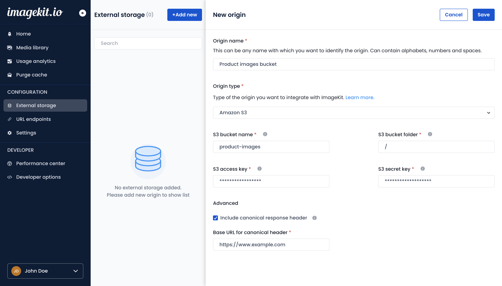

# Amazon S3 bucket

You can add your existing Amazon S3 bucket as an origin in ImageKit.io. This allows you to use ImageKit.io real-time image optimization and resizing features on all existing images stored in the bucket.

**Note:** We do not start copying images from your bucket as soon as you add it. Instead, we will fetch the particular image when you request it through ImageKit.io URL-endpoint. [Learn more](../how-it-works.md) to understand how this works. The images accessed from this origin will not appear in your [Media library](../../media-library/overview/).


Amazon S3 buckets in regions launched after 2019-03-20, such as South Africa (Cape Town), Middle East (Bahrain) and Asia Pacific (Hong Kong), must be added to ImageKit as S3 compatible external storages with the endpoint of that region, (e.g. `https://af-south-1.s3.amazonaws.com`). Read more about [how to add S3 compatible external storages to ImageKit](../../integration/configure-origin/s3-compatible-external-storages.md).


## Step 1: Configure origin

1. Go to the [external storage section](https://imagekit.io/dashboard#external-storage) in your ImageKit.io dashboard, and under the Origins section, click on the "Add origin" button.
2. Choose **Amazon S3 bucket** from the origin type dropdown.
3. Give your origin a name, it will appear in the list of origins you have added. For example - **Product images bucket**.
4. Fill out the S3 bucket name.
5. Specify the S3 bucket folder in which your images are present. If you have to access files at the root (i.e., present directly in the bucket and not inside a folder), enter `/`.
6. Specify the Endpoint corresponding to your AWS region. You can find complete information about region-wise endpoints on [this page](https://docs.aws.amazon.com/vpc/latest/userguide/vpc-endpoints-s3.html).
7. Fill out S3 access and secret keys. These keys should provide read-only access to ImageKit.io as explained below.
8. Leave the [advanced options](amazon-s3-bucket-origin.md#advanced-options-for-s3-type-origin) as it is for now.
9. Click on the Submit button.


**Read-only permission required**\
ImageKit.io needs read-only access to your S3 bucket. You can provide this by using the AWS Identity and Access Management (AIM) policy for your S3 bucket. Ideally, you should create a separate user for this purpose and assign the AIM policy for that particular user and the required buckets only.


Note that you need to provide permission for the operation s3::GetObject on the objects in your bucket. The minimal permission policy should look like below:

Note, that you need to change the bucket name to that of your bucket.

```javascript
{
    "Version": "2012-10-17",
    "Statement": [
        {
            "Sid": "VisualEditor0",
            "Effect": "Allow",
            "Action": "s3:GetObject",
            "Resource": [
                "arn:aws:s3:::my-bucket-name",
                "arn:aws:s3:::my-bucket-name/*"
            ]
        }
    ]
}
```

If you are not sure about how to create this policy in AWS console and needs a step by step guide with screenshots, check out this blog post.



## Step 2: Access the image through ImageKit.io URL-endpoint

When you add your first origin in the dashboard, the origin is by default made accessible through the [default URL-endpoint](../url-endpoints.md#default-url-endpoint) of your ImageKit.io account. For subsequent origins, you can either create a separate URL-endpoint or edit existing URL-endpoint (including default) and make this newly added origin accessible by editing the [origin preference list](../url-endpoints.md#image-origin-preference). 

Let's look at a few examples to fetch the images:

* **Original image through S3 bucket (old URL)**\
  [https://example.com/rest-of-the-path.jpg](https://example.com/rest-of-the-path.jpg)
* **The same master image using ImageKit.io URL-endpoint**\
  [https://ik.imagekit.io/your_imagekit_id/rest-of-the-path.jpg](https://ik.imagekit.io/your_imagekit_id/rest-of-the-path.jpg)
* **Resized 300x300 image**\
  [https://ik.imagekit.io/your_imagekit_id/`tr:w-300,h-300`/rest-of-the-path.jpg](https://ik.imagekit.io/your_imagekit_id/tr:w-300,h-300/rest-of-the-path.jpg)

So when you request `https://ik.imagekit.io/your_imagekit_id/rest-of-the-path.jpg`, ImageKit.io internally access object at path `rest-of-the-path.jpg` in your bucket.



```markup
            URL-endpoint                transformation      image path                                    
┌─────────────────────────────────────┐┌─────────────┐┌───────────────────┐
https://ik.imagekit.io/your_imagekit_id/tr:w-300,h-300/rest-of-the-path.jpg
```



If you get a "Not found" error while accessing the image, check out this [troubleshooting guide](../../limits-and-troubleshooting/404-not-found-error-troubleshooting.md).


:man_mage:**Tips:** You can also use a [custom domain](../../testing-and-infrastructure-setup/using-custom-domain-name.md) like images.example.com.


## Step 3: Integrate and Go live

Now start using ImageKit.io URL endpoint in your application to accelerate image loading.

**Get started with our quick start guides and SDKs:**


[quickstart-guides](../../getting-started/quickstart-guides/)



[sdk.md](../../api-reference/api-introduction/sdk.md)


**Learn about real-time image resizing:**


[image-transformations](../../features/image-transformations/)


## Handling special characters in filename or object key

If you’ve configured an S3 bucket as an origin and the bucket has objects with special characters, ImageKit might not be able to fetch images with such names and return a `404 Not Found` response. For example, if the key in S3 is `image%2Bexample.jpg`, it may not work with ImageKit.

To overcome this, add your S3 bucket as a Web Server origin with the Base URL as the S3 bucket URL(usually https://bucketname.s3.amazonaws.com). Map this origin to the same endpoint where you've already added the S3 bucket as an origin after the S3 bucket.

After doing this, your endpoint mapping should contain the S3 bucket (with native integration to S3) followed by the S3 bucket added as a Web Server.


### Include canonical response header

When enabled, the image response contains a Link header with the appropriate URL and rel=canonical. You will have to specify the base URL for the canonical header.



For example, if you set `https://www.example.com` as the base URL for canonical header, then the image response for URL `https://ik.imagekit.io/your_imagekit_id/rest-of-the-path.jpg` will have a Link header like this:

```http
Link: <https://www.example.com/rest-of-the-path.jpg>; rel="canonical"
```
