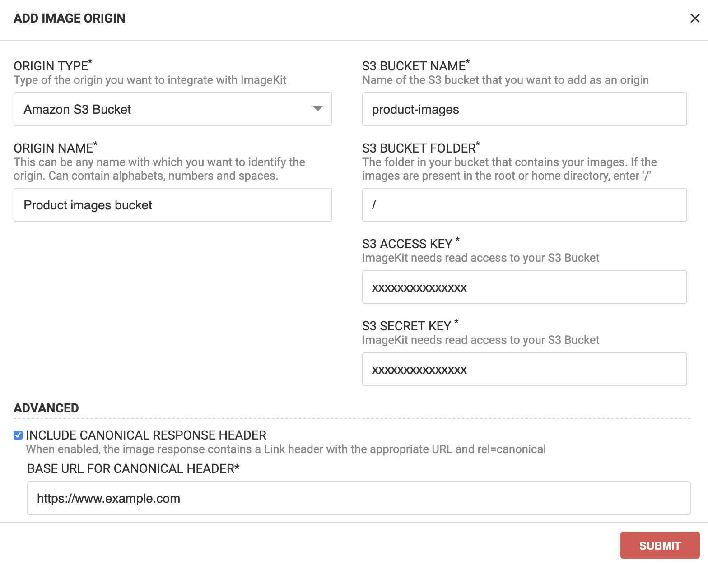

# Amazon S3 bucket

You can add your existing Amazon S3 bucket as an origin in ImageKit.io. This allows you to use ImageKit.io real-time image optimization and resizing features on all existing images stored in the bucket.

**Note:** We do not start copying images from your bucket as soon as you add it. Instead, we will fetch the particular image when you request it through ImageKit.io URL-endpoint. [Learn more](../how-it-works.md) to understand how this works. The images accessed from this origin will not appear in your [Media library](../../media-library/overview/).

## Step 1: Configure origin

1. Go to the [external storage section](https://imagekit.io/dashboard#external-storage) in your ImageKit.io dashboard, and under the Origins section, click on the "Add origin" button.
2. Choose **Amazon S3 bucket** from the origin type dropdown.
3. Give your origin a name, it will appear in the list of origins you have added. For example - **Product images bucket**.
4. Fill out the S3 bucket name.
5. Specify the S3 bucket folder in which your images are present. If you have to access files at the root \(i.e., present directly in the bucket and not inside a folder\), enter `/`.
6. Fill out S3 access and secret keys. These keys should provide read-only access to ImageKit.io as explained below.
7. Leave the [advanced options](amazon-s3-bucket-origin.md#advanced-options-for-s3-type-origin) as it is for now.
8. Click on Submit button.


**Read-only permission required**  
ImageKit.io needs read-only access to your S3 bucket. You can provide this by using the AWS Identity and Access Management \(AIM\) policy for your S3 bucket. Ideally, you should create a separate user for this purpose and assign the AIM policy for that particular user and the required buckets only.


Note that you need to provide permission for the operation s3::GetObject on the objects in your bucket. The minimal permission policy should look like:

```javascript
{
  "Sid": "VisualEditor1",
  "Effect": "Allow",
  "Action": [
      "s3:GetObject",
  ],
  "Resource": [
      "arn:aws:s3:::my-bucket-name",
      "arn:aws:s3:::my-bucket-name/*"
  ]
}
```

## Step 2: Access the image through ImageKit.io URL-endpoint

When you add your first origin in the dashboard, the origin is by default made accessible through the [default URL-endpoint](../url-endpoints.md#default-url-endpoint) of your ImageKit.io account. For subsequent origins, you can either create a separate URL-endpoint or edit existing URL-endpoint \(including default\) and make this newly added origin accessible by editing the [origin preference list](../url-endpoints.md#image-origin-preference). 

Let's look at a few examples to fetch the images:

* **Original image through S3 bucket \(old URL\)** [https://example.com/rest-of-the-path.jpg](https://example.com/rest-of-the-path.jpg)
* **The same master image using ImageKit.io URL-endpoint** [https://ik.imagekit.io/your\_imagekit\_id/rest-of-the-path.jpg](https://ik.imagekit.io/your_imagekit_id/rest-of-the-path.jpg)
* **Resized 300x300 image** [https://ik.imagekit.io/your\_imagekit\_id/`tr:w-300,h-300`/rest-of-the-path.jpg](https://ik.imagekit.io/your_imagekit_id/tr:w-300,h-300/rest-of-the-path.jpg)

So when you request `https://ik.imagekit.io/your_imagekit_id/rest-of-the-path.jpg`, ImageKit.io internally access object at path `rest-of-the-path.jpg` in your bucket.



```markup
            URL-endpoint                transformation      image path                                    
┌─────────────────────────────────────┐┌─────────────┐┌───────────────────┐
https://ik.imagekit.io/your_imagekit_id/tr:w-300,h-300/rest-of-the-path.jpg
```




🧙♂**Tips:** You can also use a [custom domain](../../features/using-custom-domain.md) like images.example.com.


## Step 3: Integrate and Go live

Now start using ImageKit.io URL endpoint in your application to accelerate image loading.

**Quickly get started with our SDKs:**



**Learn about real-time image resizing:**



## Handling special characters in file name

While fetching images from your S3 bucket with special characters in the name, you will get a `404 NOT FOUND` response. For example, let’s assume that there is a key `image%2Bexample.jpg` in your S3 bucket, and the request is made using `image+example.jpg` in the URL. In this case, ImageKit.io tries to fetch `image+example.jpg` object from the S3 bucket resulting in a 404 error as this object does not exist.

While adding S3 bucket as a source in your ImageKit.io account, you are now provided with an option to encode the keys while fetching the object from your S3 bucket. By default, this option is disabled. When enabled, the requests made while fetching images will be made using encoded keys.


**Note:**  
At present, this feature can only be enabled upon request, please email support at support@imagekit.io.


## Advanced options for S3 type origin

### Include canonical response header

When enabled, the image response contains a Link header with the appropriate URL and rel=canonical. You will have to specify the base URL for the canonical header.



For example, if you set `https://www.example.com` as the base URL for canonical header, then the image response for URL `https://ik.imagekit.io/your_imagekit_id/rest-of-the-path.jpg` will have a Link header like this:

```http
Link: <https://www.example.com/rest-of-the-path.jpg>; rel="canonical"
```

