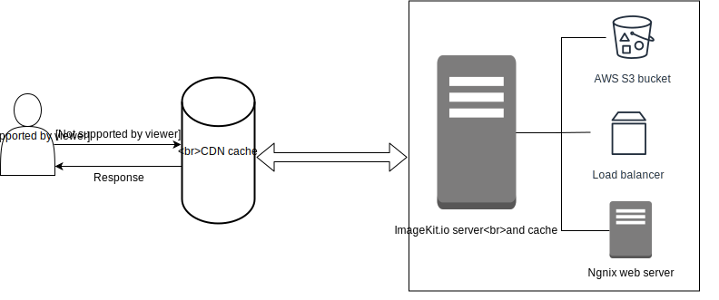

# How it works?

ImageKit.io plugs into your existing infrastructure with minimal code change, or no code change at all if you are using a [custom domain name](../features/using-custom-domain.md). Here is the complete flow of events when you request an image or static file through ImageKit.io.

### Request flow in ImageKit.io

Let's suppose you request `https://ik.imagekit.io/your_imagekit_id/example-image.jpg`, here is what happens:

1. DNS routes the request to the nearest CDN edge location that can best serve the request, typically the nearest POP in terms of latency.
2. If the file is found in the CDN cache, a response is returned to the user. In over 90% of the cases, the response is returned from the CDN cache. If not, the CDN does the following step.
3. The request is sent to the nearest ImageKit.io processing server, and the file is checked in internal caches. If the file is found in the cache, a response is returned. The CDN caches the new file and returns the response to the user. If the internal cache doesn't have the file then the following step is taken.
4. ImageKit.io fetches the original image from your origin \(which could be your AWS S3 bucket, a load balancer or an Nginx web server, or any other type of origin\), optimizes and transforms the image as per your account's default settings and the URL parameters, and a response is returned. The file also gets saved in ImageKit.io's internal cache & CDN cache, and the final response is returned to the user.

