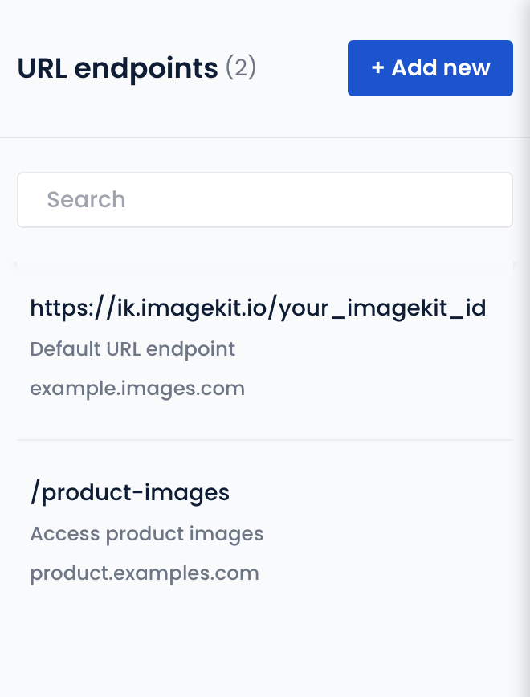

# URL-endpoints

You can add multiple origins in the same ImageKit.io account. URL endpoints allow you to configure which origins are accessible through your account and set their preference order as well.

## Default URL-endpoint

When you signup, a default URL endpoint is created in your ImageKit.io dashboard. The default URL endpoint is always `https://ik.imagekit.io/your_imagekit_id`. The first origin that you add automatically becomes accessible through this default URL endpoint.

## How to add a new URL-endpoint?

You can add multiple URL endpoints and control which origins are accessible over which URL endpoint. You can create a one-to-one mapping between origin and URL endpoints or add multiple websites (origins) behind a single URL endpoint.

Here are the steps to add a new URL endpoint:

1. Go to the [URL Endpoints section](https://imagekit.io/dashboard/url-endpoint) in your ImageKit.io dashboard, and click on the "Add New" button.
2. Fill the identifier field. It will become part of the URL endpoint. So, suppose you want to create a URL-endpoint just to access product images bucket, and you want it to be like `https://ik.imagekit.io/your_imagekit_id/product-images/`  , then enter **product-images** in this field.
3. Enter a description. This is just for you to add a note for the URL endpoint and will appear in the list of endpoints.
4. Now define the [sequence of origins](url-endpoints.md#image-origin-preference) for this URL endpoint.
5. The first origin is always ImageKit.io Media Library (or internal cache) and cannot be changed.
6. Choose the second origin, which would be our **Product images bucket**.
7. Click "Save".

## Image origin preference

A single URL endpoint can be configured to fetch an image from multiple image origins. You can decide the order in which ImageKit.io should try to access images from these origins.

Let's understand this with an example. When an image is requested at `https://ik.imagekit.io/your_imagekit_id/rest-of-the-path.jpg`, here is what happens:

1. `rest-of-the-path.jpg` is first looked at in our internal caches and storage, i.e., ImageKit.io Media Library. If the image is found, a response is returned. If not:
2. Second image origin is accessed, i.e., **S3 Bucket Product Images.** If the image is found, a response is returned. If not, we move to the third origin.
3. Third image origin is accessed, i.e., **Backup S3 Images Bucket.** If the image is found, a response is returned. If not, a default image, or `404` response is returned as there are no more image origins configured with this URL-endpoint.

## Mapping custom domain for a URL endpoint

You can configure a [custom domain](../testing-and-infrastructure-setup/using-custom-domain-name.md) for a particular URL endpoint. Once a [custom domain](../testing-and-infrastructure-setup/using-custom-domain-name.md) is configured on your account, it is an alias for the default URL endpoint `https://ik.imagekit.io/your_imagekit_id`. So, if you create new URL endpoints, with different Identifier values, then you would just need to add the identifier in your image URL along with the custom domain name. `ik.imagekit.io` or the ImageKit.io ID no longer appears in the URL.

You can also configure multiple custom domains and create a one-to-one mapping with the URL endpoints.

For example, in the screenshot below, we have two URL-endpoints:

1. One is default URL-endpoint - `https://ik.imagekit.io/your_imagekit_id`. This is associated with a custom domain `https://images.example.com`. So your image URL would become `https://images.example.com/rest-of-the-path.jpg`.
2. And the second one is  - `https://ik.imagekit.io/your_imagekit_id/product-images`. This is associated with a custom domain `https://products.example.com`. So your image URL would become `https://products.example.com/rest-of-the-path.jpg`. Note that with products.example.com, which is mapped to a particular URL endpoint, you do not have to add the endpoint identifier (product-images) in the image URL.


**How to add new custom domain names or map a custom domain to a URL endpoint?**\
****This addition and mapping of [custom domain](../testing-and-infrastructure-setup/using-custom-domain-name.md) names is currently done by the ImageKit.io support team. Please create a support ticket using chat or by dropping us an email at support@imagekit.io.

