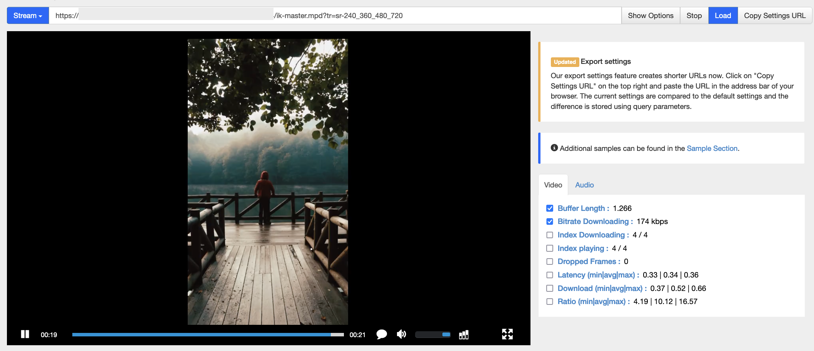
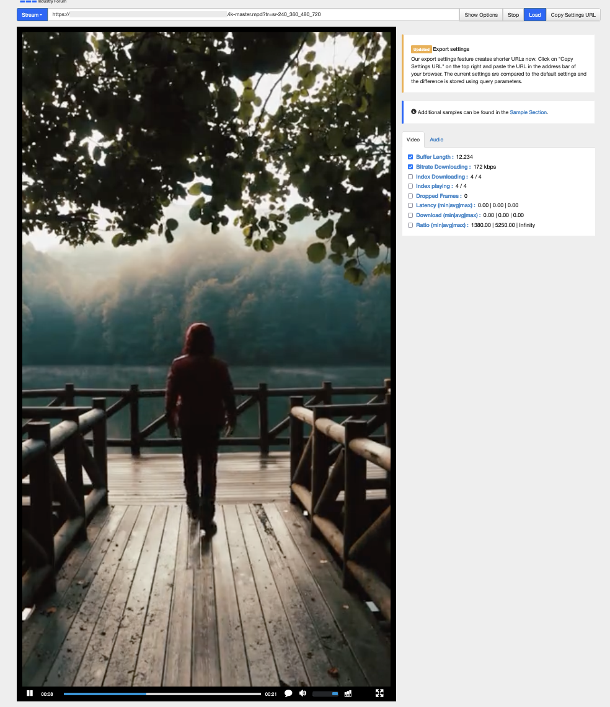
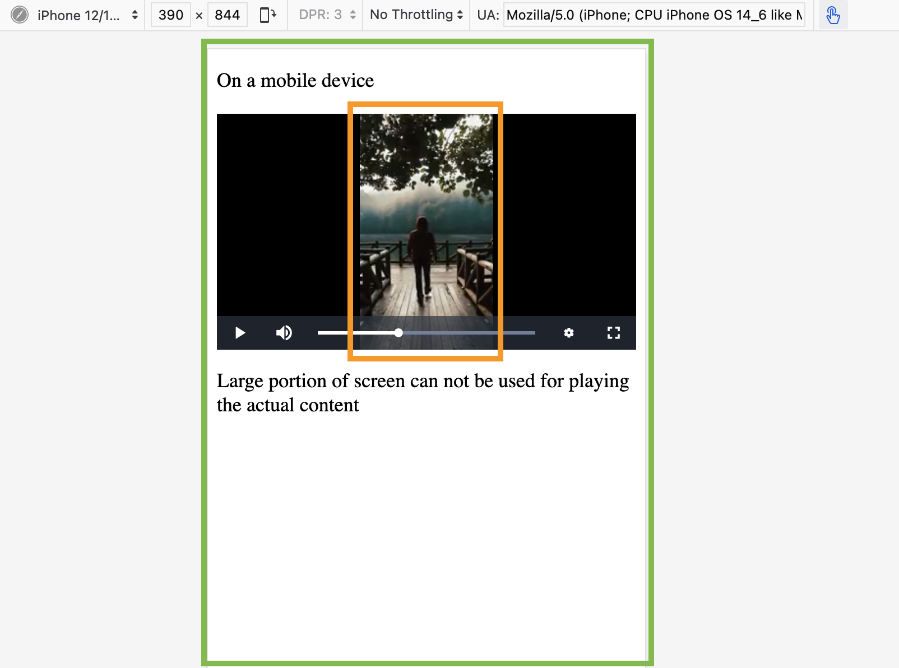

# Modifications in resizing method for ABS representations

As of 23 March 2023, Imagekit resizes the ABS representations using [pad_resize crop mode](../features/video-transformation/resize-crop-and-other-common-video-transformations.md#pad-resize-crop-strategy---cm-pad_resize), to a strict aspect ratio of 16:9 for all the resolutions. This adds black color padding for inputs that don't have aspect ratio of 16:9.

For playlist URL <https://ik.imagekit.io/demo/sample-portrait.mp4/ik-master.m3u8?tr=sr-240_360_480_720> as of 23 March 2023:



After the planned modifications in April 2023, to resize the representations Imagekit will use [at_max cropping strategy](../features/video-transformation/resize-crop-and-other-common-video-transformations.md#max-size-cropping-strategy---c-at_max). This will preserve the orignal aspect ratio of input and not add padding to the output.

For playlist URL <https://ik.imagekit.io/demo/sample-portrait.mp4/ik-master.m3u8?tr=sr-240_360_480_720> after modifications:



## Why is this behavior changing?

Adding black padding to the output restricted the experience of portrait videos on portrait screens.

Mobile devices in portrait mode, would not utilize their entire screen area efficiently, as the 16:9 ratio will restrict the player to a small portion of the screen & the black padding further reduces the size of the actual video content being rendered.



## Handling this change

So far Imagekit’s ABS was ensuring that the output will always have an aspect ratio of 16:9, irrespective of the input’s dimensions. In case you have designed your user interface such that it relies on the dimension of the output, you will have to adjust it to be independent of that, as now the output will have the aspect ratio of the input video.

### With video.js

If you want to preserve the 16:9 aspect ratio of the play, you can consider using aspect-ratio setting in the video.js layout options.

```javascript
videojs('my-player', {
    controls: true,
    aspectRatio: "16:9" // Set aspect ratio that suits your UI
});
```

[Learn more in video.js docs](https://videojs.com/guides/layout/#setting-aspect-ratio)
