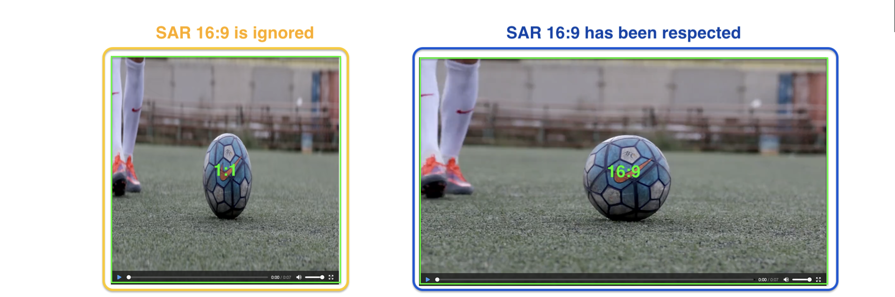
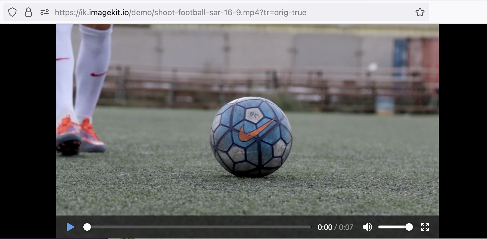
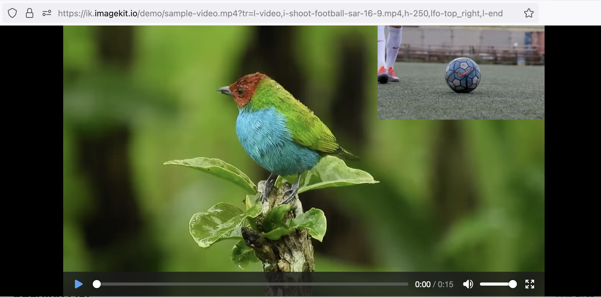
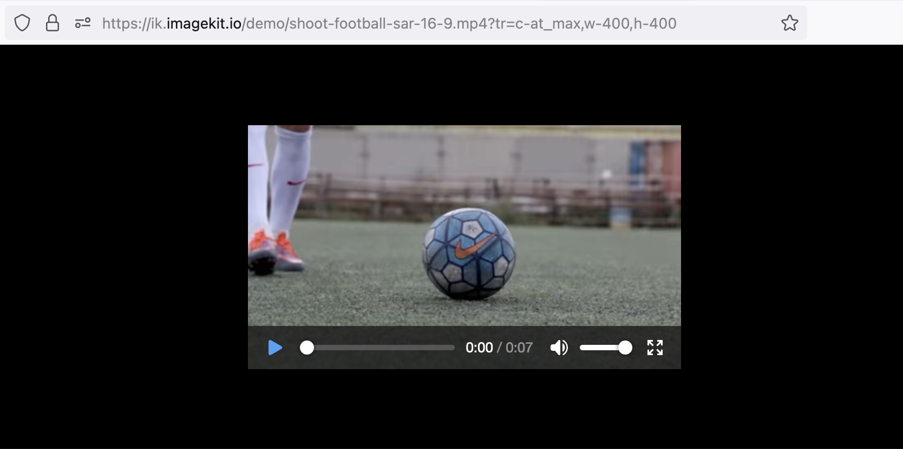
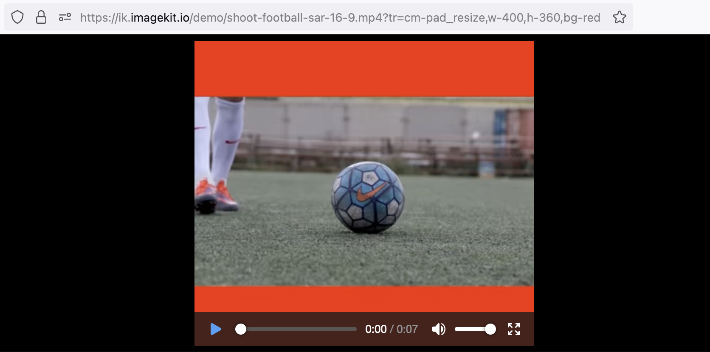
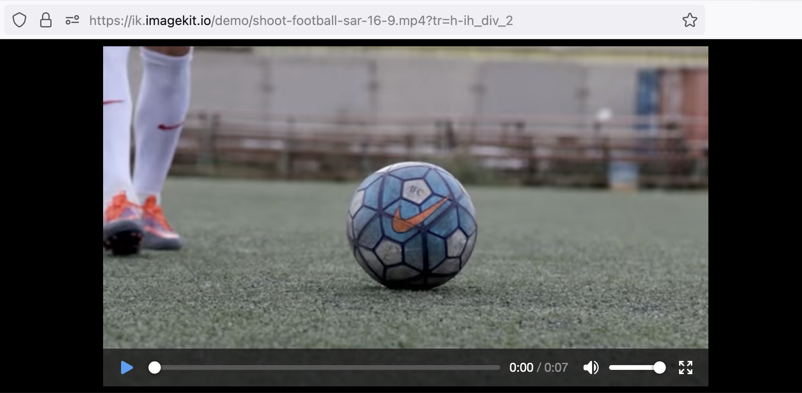

# Respecting display-aspect-ratio (DAR) for Videos with Non-Square Pixels

MediaEncoding API ensures that videos with non-square pixels (Sample Aspect Ratio, SAR ≠ 1) are displayed correctly by respecting their display-aspect-ratio (DAR). This functionality ensures visual consistency of videos during optimization and transformation.

## Technical Overview

Below are the key parameters that control how videos are handled and displayed in terms of aspect ratio:

**Aspect Ratio**: This is the ratio of the number of pixel columns to the number of pixel rows in the video frame. For example, a video with a resolution of 1920x1080 pixels has an aspect ratio of 16:9.

**Sample Aspect Ratio (SAR)**: This is the ratio of the width of a pixel to its height. Most videos have a SAR of 1:1, meaning the pixels are square. When SAR is not equal to 1, the pixels are not square, and the video may appear stretched or squeezed if not correctly handled.

**Display Aspect Ratio (DAR)**: This is the ratio of the width of the displayed video to its height, considering the SAR. The DAR is what viewers ultimately see when the video is played.

### Upscaling

**Upscaling** refers to the process of increasing the resolution of a video by adding more pixels.

Suppose you have a video with a resolution of 1080x1080 pixels (aspect ratio 1:1) and a DAR of 16:9. To upscale this video, we adjust the number of pixels to match the aspect ratio of 16:9. The video will be upscaled to 1920x1080 pixels.

### Why SAR of videos must be respected?

Most videos have a SAR of 1:1, meaning the pixels are square. When SAR is not equal to 1, the pixels are not square, and the video may appear stretched or squeezed if not correctly handled. Respecting the SAR ensures the videos are displayed correctly, maintaining the intended visual experience.

To understand this let's consider a video that has a resolution of 720x720 pixels and a SAR of 16:9. This means the video must be rendered with an aspect ratio of 16:9 (therefore DAR is 16:9) if handled correctly.

In the demonstration below, we have screenshots of the same video played with and without considering its SAR.

- The image on the left shows a screenshot of the video being played without considering SAR, which results in distorted aspect ratio of 1:1.
- The image on the right shows a screenshot of the same video being played with consideration of SAR, resulting in aspect ratio of 16:9, that is the intended display-aspect-ratio (DAR).

## Handling of videos in Media encoding API

In scenarios where SAR ≠ 1, Imagekit's Media encoding API upscales all video inputs to ensure their intended DAR is respected.

Whether you are performing any of the following actions with your videos, Media encoding API ensures that the intended DAR is consistently maintained:

### Re-encoding to Optimized Formats

When re-encoding videos to different formats, the Media encoding API ensures the original DAR is preserved, maintaining the intended appearance in the new format.

Example: Re-encoding a video from MP4





<https://ik.imagekit.io/demo/shoot-football-sar-16-9.mp4?tr=f-orig-true>

The original video has a resolution of 720x720 and a SAR of 16:9, so the intended DAR is 16:9.





<https://ik.imagekit.io/demo/shoot-football-sar-16-9.mp4?tr=f-mp4>

The video is upscaled to resolution of 1080x720, thus maintaining the intended DAR of 16:9, while keeping SAR to 1:1.




### Adding Video Layers

The Media encoding API respects the DAR for each layer, ensuring the composite video maintains the correct aspect ratio and visual consistency.

Example: Add video as an overlay

<https://ik.imagekit.io/demo/sample-video.mp4?tr=l-video,i-shoot-football-sar-16-9.mp4,h-250,lfo-top_right,l-end>

The football shoot video has been overlayed at the top right of the frame after being resized to height of 250px while preserving the DAR of the original video.

### Resizing Videos

Using crop modes that preserve aspect ratios, such as `c-at_max`, `c-maintain_ratio`, `cm-pad_resize`, etc., the Media encoding API  maintains the intended DAR, preventing distortion and ensuring correct proportions.

**Examples:**





<https://ik.imagekit.io/demo/shoot-football-sar-16-9.mp4?tr=f-orig-true>

The original video has a resolution of 720x720 and a SAR of 16:9, so the intended DAR is 16:9.





<https://ik.imagekit.io/demo/shoot-football-sar-16-9.mp4?tr=c-at_max,w-400,h-400>

The resulting video has a resolution of 400x226 and SAR of 1:1. Thus preserving the intended DAR of 16:9.





<https://ik.imagekit.io/demo/shoot-football-sar-16-9.mp4?tr=cm-pad_resize,w-400,h-360,bg-red>

The resulting video has resolution of 400x360. The video component from the original video maintains 16:9 aspect ratio, while remaining area on top & bottom has red padding.





<https://ik.imagekit.io/demo/shoot-football-sar-16-9.mp4?tr=h-ih_div_2>

Using expression `ih_div_2` we instructed Imagekit's endpoint to resize the video to half the original width while preserving the original DAR.

The resulting video has a dimension of 640x360 and SAR of 1:1. Thus preserving the intended DAR of 16:9.





### Creating Adaptive Bitrate Streaming (ABS) Playlists

The Media encoding API ensures that each variant in ABS playlists maintains the DAR of the input video.

### Extracting Thumbnails

When extracting thumbnails, the Media encoding API respects the DAR, ensuring the thumbnails accurately represent the video's intended appearance without distortion.

Example:

<https://ik.imagekit.io/demo/shoot-football-sar-16-9.mp4/ik-thumbnail.jpg>

The extracted thumbnail maintains the intended DAR of 16:9
