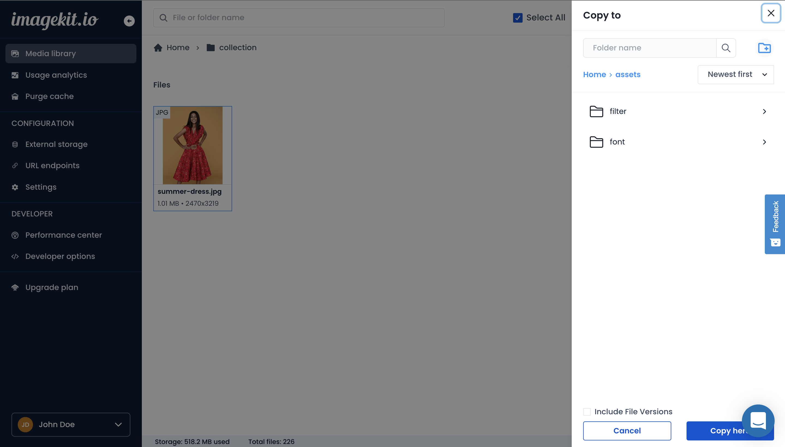

# Copy and move files

ImageKit.io provides users with the ability to copy and move files across different locations within the Media Library.

## Copy & move files

1. Select single or multiple files by pressing and holding the Command key in Mac or the Ctrl key in Windows.
2. Either right-click on any selected item to see available operations or click the copy/move icon at the top.
3. Choose the new location from the right drawer as shown in the screenshot.


**Old files are deleted during the move operation**\
****When you move files, the old files are deleted in the process. If you don't want the old files to be deleted, copy them instead of moving.


In a copy operation, the 'Include file version' option lets you copy all versions of the source files to the destination.

## Access control and permissions

## Copy file
A restricted media library user needs to have at least "contribute" permission on both the file and destination folder to be able to do this action.

On completion of a copy file operation, access control and permission levels for the source file remain unchanged. If a file at the destination location with the same name exists, new file versions would be created, and the ownership, access control, and permissions present at the destination location's file would persist. If no file exists in the destination folder, the copied asset's ownership is set to the user who did the copy operation. Additionally, the destination location’s permissions from shared parent folders would come into effect.

## Move file
A restricted media library user needs to have at least "manage" permission on both the file and destination folder to be able to do this action.

If a file at the destination location with the same name exists, new file versions would be created, and the ownership, access control, and permissions present at the destination location's file would persist. If the source file was added to any media collection, the destination file would also now be added to those media collections along with any existing media collections it was added to. If no file exists in the destination folder, the moved asset's ownership, access control, and permissions remain unchanged. Additionally, the destination location’s permissions from shared parent folders would come into effect.


Copy multiple files

