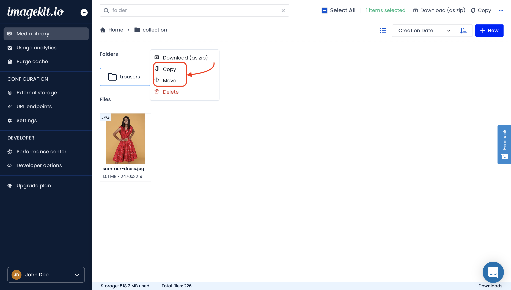

# Copy and move folders

ImageKit.io provides users with the ability to copy and move folders across different locations within the Media Library.

## Copy & move folders

1. Select single or multiple folders by pressing and holding the Command key in Mac or the Ctrl key in Windows.
2. Either right-click on any selected item to see available operations or click the copy/move icon at the top.
3. Choose the new location from the right drawer as shown in the screenshot.


**Old folders are deleted during the move operation**\
****When you move folders, the old folders are deleted in the process. If you don't want the old folders to be deleted, copy them instead of moving.


## Access control and permissions

## Copy folder
A restricted media library user needs to have at least "contribute" permission on both the folder and destination folder to be able to do this action.

On completion of a copy folder operation, access control and permission levels for the source folder remain unchanged. If a folder with the same name exists at the destination location, the ownership, access control, and permissions present at the destination location's folder would persist. If no folder exists in the destination folder, the copied asset's ownership is set to the user who did the copy operation. The nested folders would also be copied similarly. Additionally, the destination location’s permissions from shared parent folders would come into effect.

## Move folder
A restricted media library user needs to have at least "manage" permission on both the folder and destination folder to be able to do this action.

If a folder with the same name exists at the destination location, the ownership, access control, and permissions present at the destination location's folder would persist. If the source folder was added to any media collection, the destination folder would also now be added to those media collections, along with any existing media collections it was added to. If no folder exists in the destination folder, the moved asset's ownership, access control, and permissions remain unchanged. The nested folders would also be moved similarly. Additionally, the destination location’s permissions from shared parent folders would come into effect.

The change of access control and ownership on copy and move operations for nested files is described [here](./copy-and-move-files.md#access-control-and-permissions).


Copy folder

