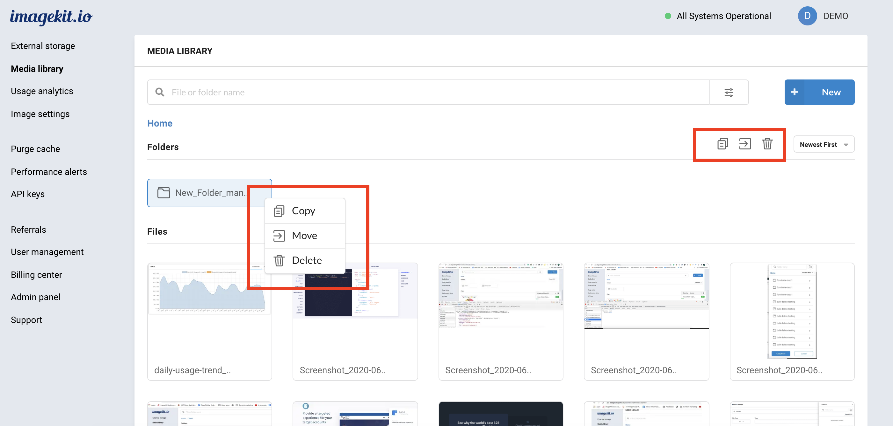
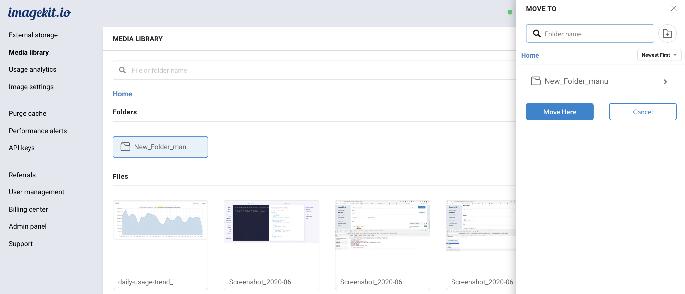

# Copy and move folders

ImageKit.io provides users with the ability to copy and move folders across different locations within the Media Library.

## Copy & move folders

1. Select single or multiple folders by pressing and holding the Command key in Mac or the Ctrl key in Windows.
2. Either right-click on any selected item to see available operations or click the copy/move icon at the top.
3. Choose the new location from the right drawer as shown in the screenshot.


**Old folders are deleted during the move operation**  
When you move folders, the old folders are deleted in the process. If you don't want the old folders to be deleted, copy them instead of moving.




