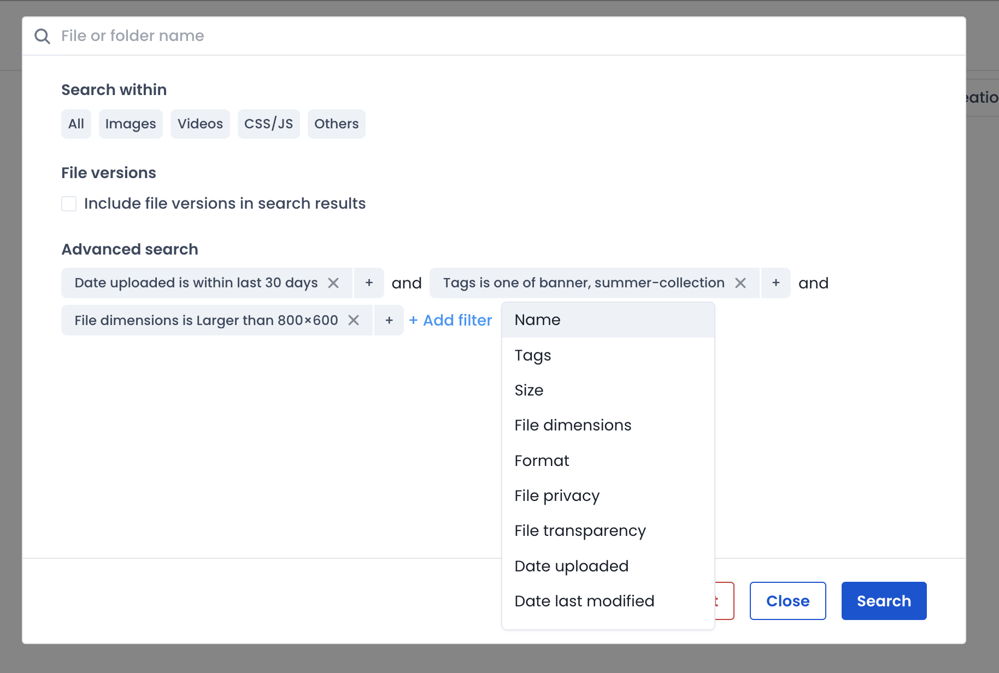
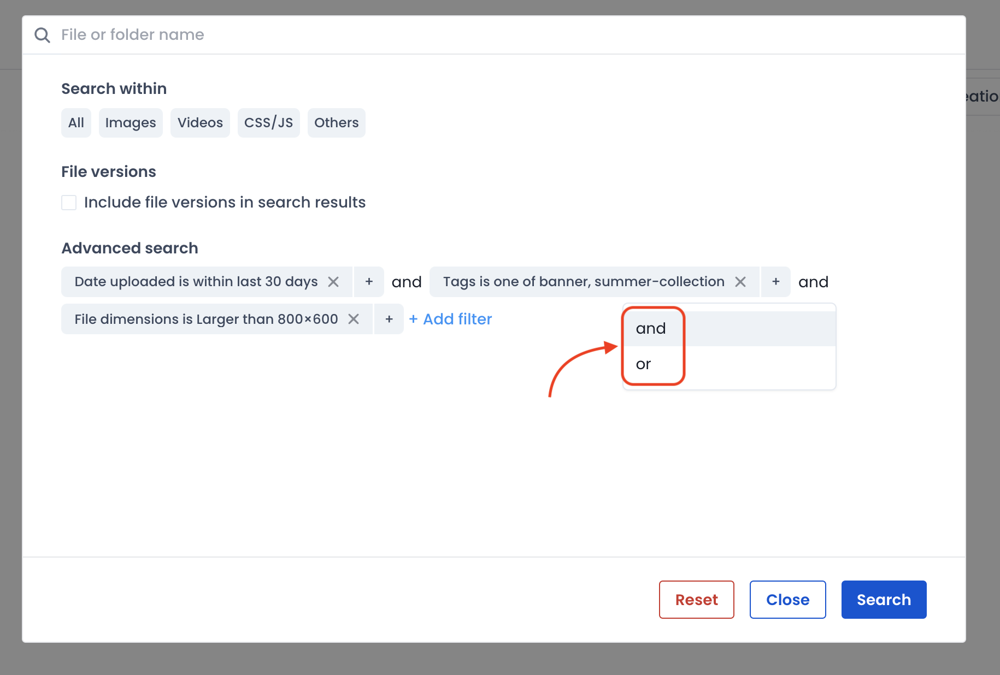
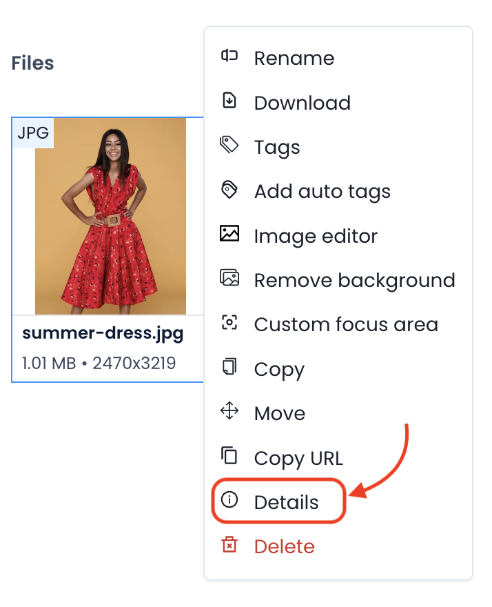
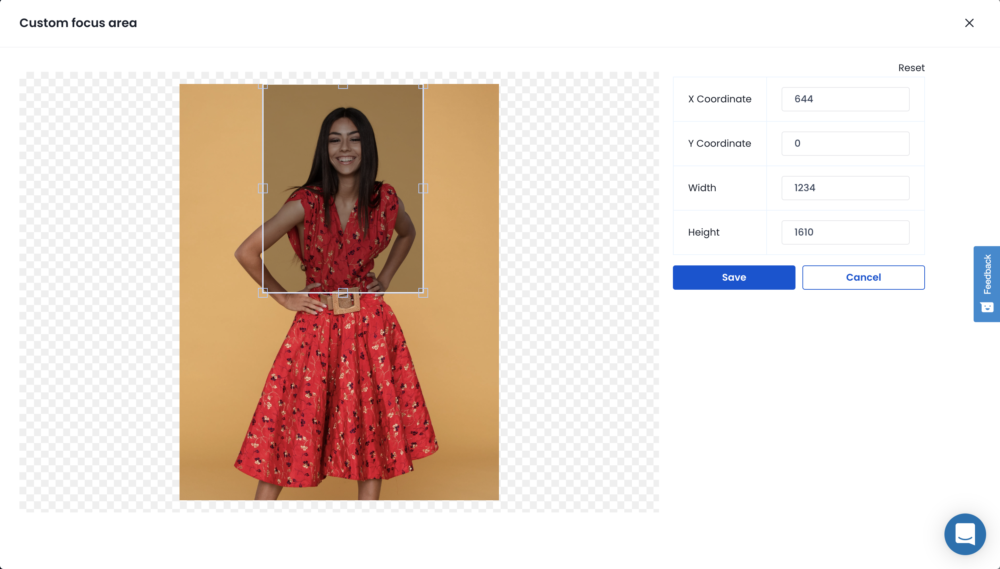

# Search, update & delete files

ImageKit.io provides the ability to search, delete, [tag](image-tags.md), and update files easily.

## File Search

You can access search functionality from the top of the Media Library section. There are two search modes available.

### Basic searching

Basic searching allows you to search a file or folder by name. Enter the full name or the characters at the beginning of the name and hit enter.

All files or folders whose name either matches exactly or begins with the provided input will be returned.

By clicking on the options given under the 'Search within' section, you can limit the search to a certain type of file.

By default, all files are searched, but if you are only looking for an image file then select images in this dropdown.

### Advanced searching

The advanced search mode can be accessed by clicking on the filter icon in the search bar. This mode allows you to create complex search queries to find the exact file(s) you are looking for. The advanced search mode allows searching based on -

* Name
* [Tags](image-tags.md)
* File size
* Dimensions (applicable for images)
* Format
* [Private images](../../features/security/private-images.md)
* Transparency (applicable for images)
* First upload date
* Last modified date

For example, let's say you want to find a file -

* That was uploaded within the last month.
* And has either the `banner` or the `summer-collection` tag set.
* And the dimension is larger than `1024x768`.

You can set these filters in the media library UI to get all files that match the above search criteria.

#### Grouping of multiple searches queries

You can also create more complex queries by combining multiple search parameters and changing how they are grouped.

There are two places where you can add a new search query -

1. Clicking on the `+` icon next to an existing filter lets you combine other search parameters in the same filter.
2. Clicking on `+ Add Filter` link lets you add another filter in parallel to the existing one. This new filter can be combined either to narrow (`and` operator) or to expand (`or` operator) the results from other search filters.

## File Deletion

Right-click the file to open menu options. Select the "Delete" item. This will open a confirmation popup. Click on "Submit" to permanently delete your file. Upon confirmation, the file is deleted permanently from the Media Library.


Delete file


## Bulk File Delete

You can select multiple files together by pressing and holding the Command key in Mac or the Ctrl key in Windows. Right-click any file and click the "Delete" option to delete all files in one go.

## File Update

ImageKit.io currently supports adding and editing [tags](image-tags.md), updating custom coordinates, and applying [extensions](../../extensions/overview/README.md) from the media library.

To view file details, right-click the file and click the "Details" option.

This will open a detailed section that has all the file details, including file name, file size, and more. Here, you can add new or edit existing tags, apply extensions, etc.

By clicking on the 'Custom focus area' option in the dropdown menu, you can update the custom coordinates of the image.

## Using API

ImageKit.io also provides APIs to upload, delete, and search for image files within its media library. The documentation for the same can be found here:

1. [Upload API](../../api-reference/upload-file-api/).
2. [Search API](../../api-reference/media-api/list-and-search-files.md).
3. [Image Delete API](../../api-reference/media-api/delete-file.md).

If you have any questions regarding Uploading, Deleting, or Updating a file, please get in touch with our team at [support@imagekit.io](mailto:customer-support@imagekit.io).
