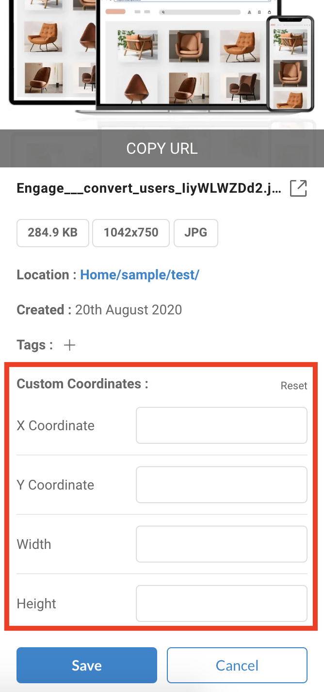

# Search, update & delete Files

ImageKit.io provides users with the ability to search, delete, [tag](image-tags.md), and update files from within the Media Library.

## Using the Dashboard

### File Search

ImageKit.io's easy-to-use search functionality can be accessed from the top of the [Media Library](https://imagekit.io/dashboard#media-library) section. You can search based on file type, file/folder name, and tags. 

#### Search by file or folder name

Enter the file or folder name in the top search input field and hit enter. All matching files or folders will be displayed below.



#### Search by tags

You can also search your media assets based on tags. Tags provide an easy way to organize similar files and then search them later.

When searching based on tags, all files matching any of the tags will be included in the search results.



### File Deletion

Right-click the file to open menu options. Select the "Delete" item. This will open a confirmation popup. Click on "Submit" to permanently delete your file. Upon confirmation, the file is deleted permanently from the Media Library.



### Bulk File Delete

You can select multiple files together by pressing and holding the Command key in Mac or the Ctrl key in Windows. Right-click any file and click the "Delete" option to delete all files in one go.

### File Update

ImageKit.io currently supports [image tags](image-tags.md) and custom crop area coordinate update within the media library.

To open file details, right-click the file and click the "Details" option.

This will open a side-bar that has all image details including File Name, File Size, and more. Here, you can add or change image tags as well as the crop area coordinates. Click on the "Save" button to save all the new information associated with the file.

## Using API

ImageKit.io also provides APIs to upload, delete, and search for image files within its media library. The documentation for the same can be found here:

1. [Upload API](../../api-reference/upload-file-api/).
2. [Search API](../../api-reference/media-api/list-and-search-files.md).
3. [Image Delete API](../../api-reference/media-api/delete-file.md).

If you have any questions regarding Uploading, Deleting, or Updating a file, please get in touch with our team at [support@imagekit.io](mailto:customer-support@imagekit.io)

