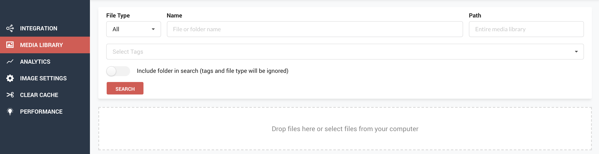
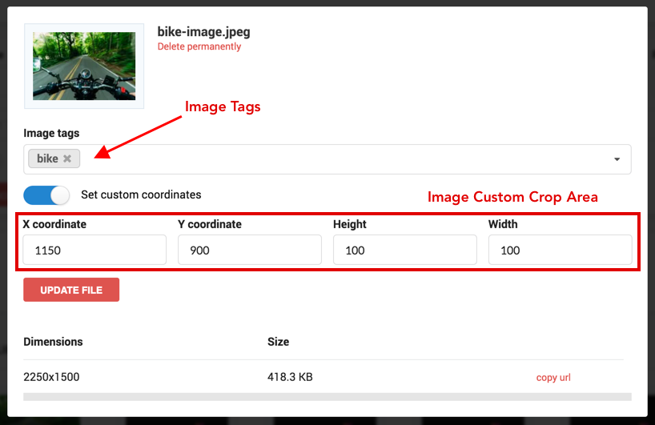

# Search, Update & Delete

ImageKit.io provides users with the ability to search, delete, [tag](image-tags.md), and update files from within the Media Library.

## Using the Dashboard

### File Search

ImageKit.io's easy-to-use search functionality can be accessed from the top of the [Media Library](https://imagekit.io/dashboard#media-library) section.

Some points to note:

1. All searches are `case sensitive` .
2. By default, folders are excluded from the search. This behaviour can be changed by turning ON the toggle switch within the search bar.
3. All searches are exact match searches. For example, a search for 'image' will match all files and folders containing the string 'image'\(image123, image\_\_\_nature, IMAGE\_banner\).
4. You can search for images by tag names.
5. You can search for an image within a particular folder by specifying the folder's name in the `Path` field.

### File Deletion

To delete a file, click on the file in any view - 'Image View', 'Directory View', or 'Search Results'. This would open a popup with details like File Name, File Dimensions, File Size, and more. The option - 'Delete Permanently' appears just below the file name within the popup.

You will be asked to confirm the deletion once you click on 'Delete Permanently'. Upon confirmation, the file is deleted permanently from the Media Library.

### File Update

ImageKit.io currently supports [image tags](image-tags.md) and custom crop area coordinate update within the media library.

When you click on a file, Image details popup shows all the file details including File Name, File Size, and more. Here, you can add or change image tags as well as the crop area coordinates. Click on 'Update File' to save all the new information associated with the file.

### Using API

ImageKit.io also provides APIs to upload, delete, and search for image files within its media library. The documentation for the same can be found here:

1. [Upload API](../../api-reference/upload-file-api/).
2. [Search API](../../api-reference/media-api/list-and-search-files.md).
3. [Image Delete API](../../api-reference/media-api/delete-file.md).

If you have any questions regarding Uploading, Deleting, or Updating a file, please get in touch with our team at [support@imagekit.io](mailto:customer-support@imagekit.io)

