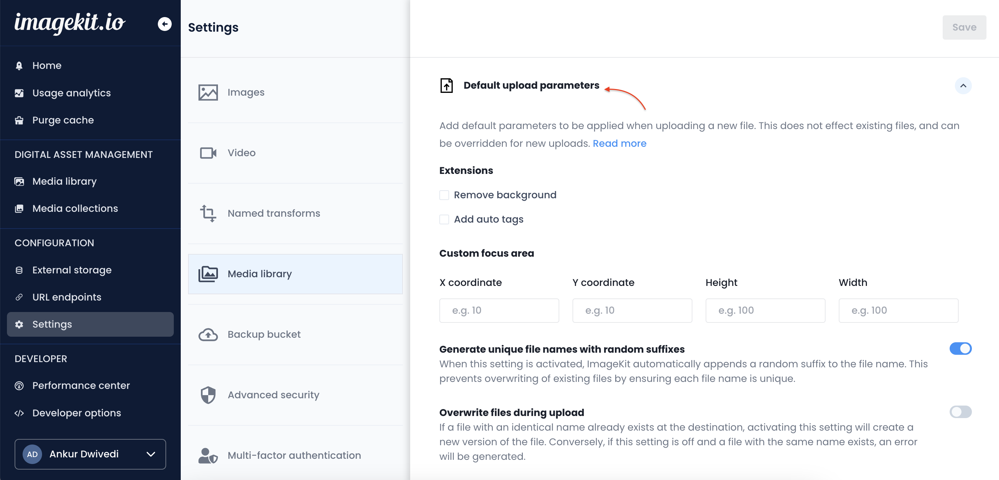
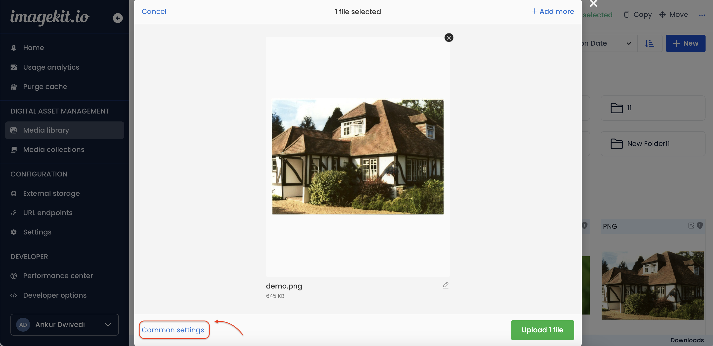
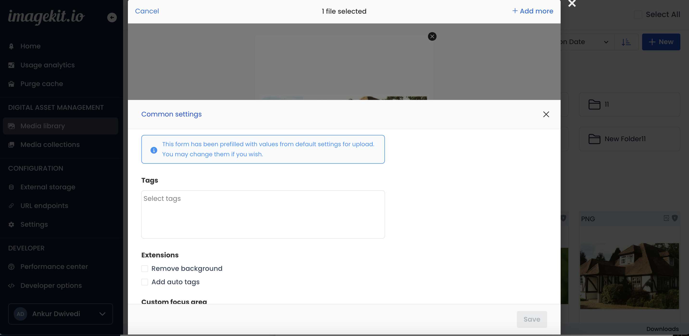
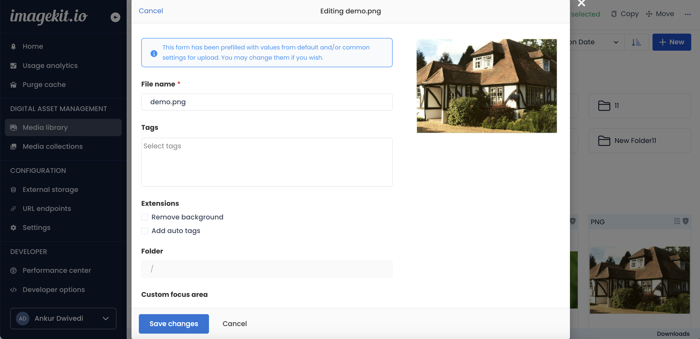

# Upload files

Currently, you can upload images and static files to the media library in two ways - using the dashboard, and using the [upload API](../../api-reference/upload-file-api/). ImageKit.io currently supports [these formats for upload](../../api-reference/upload-file-api/#allowed-mime-types-for-uploading).


**File size limit**\
The maximum upload file size is limited to 25MB on the free plan. On paid plan, this limit is 300MB for video files.


## Using Dashboard

Within the dashboard, navigate to the 'Media Library' section.

To upload files, either drag and drop files anywhere on the screen or

### Select the file and upload

 Click on the New button on the top right corner and select File Upload.

Select the file from the local device to start uploading.


Select file and upload


### Drag & drop file upload

You can drag multiple files anywhere on the media library screen to upload.


Drag and drop file upload



**Info:** When uploading images, ImageKit.io appends a random string to the image file name to avoid replacing images with the same file name. You can turn off this setting within the Upload Section of [Image Settings](https://imagekit.io/dashboard#settings) within the dashboard.


## Asset ownership

If a new file is uploaded through the ImageKit media library, the uploader of the file will be its "owner". Asset ownership governs the access and permission level of the user on an asset. They would have "manage" access to the file. Learn how asset ownership controls access and permission levels [here](../../collaboration-and-sharing/README.md#access-and-permission-management).

The file will not have any ownership info if it is not uploaded via the dashboard, e.g. via the API or an SDK. Note that when creating new file versions, the owner of the file does not change.

## Access control and permissions

A restricted media library user cannot upload files at the root of the media library unless they are creating a new version of a file that exists at the root and is shared with at least "contribute" permission with them. Such a user needs at least "contribute" permission on the parent folder of any location to be able to create new folders.

You can share a folder with a restricted user by providing "Can contribute" or "Can manage" access to it; this will allow them to start uploading their own assets.

## Using the Upload API

You can also upload images to ImageKit.io's media library programmatically. Read the Upload API documentation [here](../../api-reference/upload-file-api/).

## Upload settings

You have the option to set up upload parameters for files that you plan to upload. These upload parameters can be customized in the media library dashboard from three locations:

* Default upload parameters in media library settings
* Common settings in the upload modal
* File-specific settings in the upload modal

#### Default upload parameters in media library settings

Navigate to media library settings to set default upload parameters. These settings will serve as the default configuration for any new files being uploaded. It's important to note that this does not impact existing files and can be overridden for new uploads.

<figure><figcaption>
Default upload parameters
</figcaption></figure>

#### Common settings

You can locate common settings in the upload modal while uploading files. These settings are automatically applied to all currently selected files for upload. By default, the common settings are pre-filled with the upload parameters configured in the media library settings.

<figure><figcaption></figcaption></figure>

 

<figure><figcaption></figcaption></figure>


If an upload parameter is set in both common settings and the default upload parameters within the media library settings, the common setting will take precedence.


#### File-specific settings

You can also set upload parameters individually for a specific file during the upload process. To customize the upload parameters for a particular file, click on the edit icon located below the selected file in the file upload modal.

<figure><figcaption>
File edit button
</figcaption></figure>

 

<figure><figcaption>
File edit modal
</figcaption></figure>


File-specific settings hold the highest priority compared to both common settings and default upload parameters.


### Upload parameters

* Extensions

Extensions let you perform certain advanced operations on your assets during upload. For reference about extensions, [read here](../../extensions/overview).

* Custom focus area

Define an important area in the image during upload. This is an optional field and is only relevant for image type files. To learn more about Custom focus area, [read here](./custom-focus-area.md).

* Generate unique filenames with random suffixes

When this setting is activated, ImageKit automatically appends a random suffix to the file name. This prevents overwriting of existing files by ensuring each file name is unique.

* Overwrite files during upload

If a file with an identical name already exists at the destination, activating this setting will create a new version of the file. Conversely, if this setting is off and a file with the same name exists, an error will be generated.

* Set files as private during upload

This setting allows you to mark files as private. When this setting is enabled, the file is set as private, which limits access to the original file URL and unnamed transformations without signed URLs. Without the signed URL, only named transformations can be applied to private assets.

* Overwrite AI tags during upload

If this feature is enabled and a file with the same name already exists at the target destination, the existing AI tags of the file will be replaced with new ones or removed if no tagging extension is applied. Conversely, if this setting is off, the existing AI tags of the file will be preserved in the new version. To learn more about AI based auto tagging, [read here](../../extensions/overview/ai-based-auto-tagging.md).

* Overwrite user-set tags during upload

If this feature is enabled and a file with the same name already exists at the target destination, the user-set tags of the file will be replaced with new ones or removed if no tags are provided. Conversely, if this setting is off, the existing user-set tags of the file will be preserved in the new version.

* Overwrite custom metadata during upload

If this feature is enabled and a file with the same name already exists at the target destination, the custom metadata of the file will be replaced with new one or removed if no custom metadata is provided. Conversely, if this setting is off, the existing custom metadata of the file will be preserved in the new version.

* Custom metadata

Custom metadata fields can be used to store any type of data about your images in key-value pairs during upload. Before setting any custom metadata on an asset you have to create the field from media library settings or using custom metadata fields API.