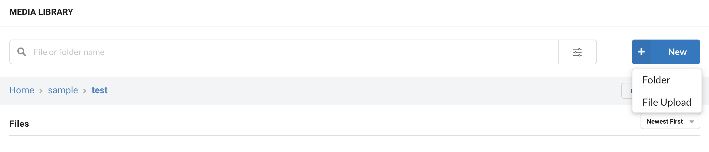

# Upload files

Currently, you can upload images and static files to the media library in two ways - using the dashboard, and using the [upload API](../../api-reference/upload-file-api/). ImageKit.io currently supports [these formats for upload](../../api-reference/upload-file-api/#allowed-mime-types-for-uploading).


**File size limit**\
The maximum upload file size is limited to 25MB on the free plan. On paid plan, this limit is 300MB for video files.


## Using Dashboard

Within the dashboard, navigate to the 'Media Library' section.

To upload files, either drag and drop files anywhere on the screen or

### Select the file and upload

 Click on the New button on the top right corner and select File Upload.

Select the file from the local device to start uploading.


Select file and upload


### Drag & drop file upload

You can drag multiple files anywhere on the media library screen to upload.


Drag and drop file upload



**Info:** When uploading images, ImageKit.io appends a random string to the image file name to avoid replacing images with the same file name. You can turn off this setting within the Upload Section of [Image Settings](https://imagekit.io/dashboard#settings) within the dashboard.


## Asset ownership

If a new file is uploaded through the ImageKit media library, the uploader of the file will be its "owner". Asset ownership governs the access and permission level of the user on an asset. They would have "manage" access to the file. Learn how asset ownership controls access and permission levels [here](../../collaboration-and-sharing/README.md#access-and-permission-management).

The file will not have any ownership info if it is not uploaded via the dashboard, e.g. via the API or an SDK. Note that when creating new file versions, the owner of the file does not change.

## Access control and permissions

A restricted media library user cannot upload files at the root of the media library unless they are creating a new version of a file that exists at the root and is shared with at least "contribute" permission with them. Such a user needs at least "contribute" permission on the parent folder of any location to be able to create new folders.

You can share a folder with a restricted user by providing "Can contribute" or "Can manage" access to it; this will allow them to start uploading their own assets.

## Using the Upload API

You can also upload images to ImageKit.io's media library programmatically. Read the Upload API documentation [here](../../api-reference/upload-file-api/).
