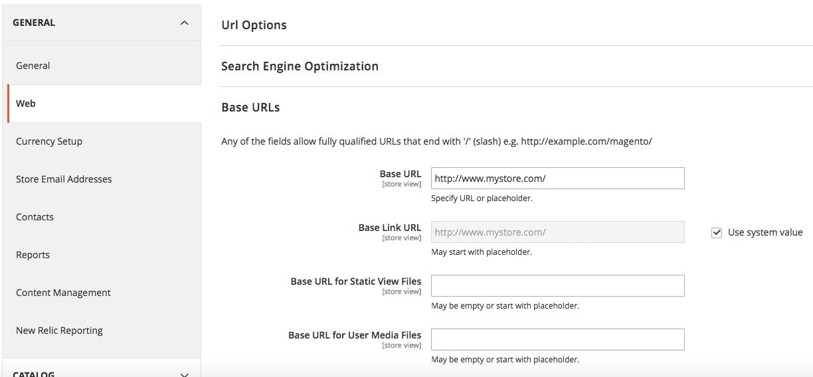

# Magento

 

Magento is one of the most popular eCommerce platform to build your own self-hosted eCommerce business.

## Integration steps

ImageKit.io offers a straightforward integration to optimize all the images on your Magento website. Here is what you need to do:

### Step 1: Configure origin in ImageKit.io dashboard

Configure origin based on where your images are stored. For example, [Amazon S3 bucket origin](../integration/configure-origin/amazon-s3-bucket-origin.md) or [web server](../integration/configure-origin/web-server-origin.md).


**Base URL for web server origin**  
If you are serving files directly from your web server, then the value of the base URL is the same as your website, e.g.`https://www.example.com`.


### Step 2: Fetch image through ImageKit.io endpoint

Let's quickly fetch the image using ImageKit.io [URL-endpoint](../integration/url-endpoints.md) and see if it's working.

When you add the first origin in your account, it automatically becomes accessible through the [default URL-endpoint](../integration/url-endpoints.md#default-url-endpoint), that is `https://ik.imagekit.io/your_imagekit_id`. Otherwise, you will have to [configure an existing](../integration/url-endpoints.md#image-origin-preference) URL endpoint or create a new one to fetch images from this newly added origin.

If your old image URL was [`https://www.example.com/media/catalog/product/p/p/pphsaj50030132-2_1.jpg`](https://www.example.com/media/catalog/product/p/p/pphsaj50030132-2_1.jpg) , then the same image should be accessible through new URL. i.e. [`https://ik.imagekit.io/your_imagekit_id/media/catalog/product/p/p/pphsaj50030132-2_1.jpg`](https://ik.imagekit.io/your_imagekit_id/media/catalog/product/p/p/pphsaj50030132-2_1.jpg)


**Unable to fetch image?**  
Contact [support@imagekit.io](mailto:support@imagekit.io) if you are not able to fetch the image as explained above. In such a situation, do not move to step 3 as this could break your website images.


### Step 3: Replace the base URL for user media files in Magento

Once the above image works with the ImageKit.io URL endpoint, you will need to make changes within the Magento admin panel to switch the image delivery and optimization to ImageKit.io.

In Magento 2, go to Stores ➡ Configurations ➡Web:

Fill **Base URL for User Media Files** with the `your_imagekit_url_endpoint/media.` Note that we added `/media` in the end.

1. Save these settings.
2. Use the sidebar to navigate to System ➡ Cache Management and Flush Magento Cache. Learn about [cache management](https://docs.magento.com/m2/ce/user_guide/system/cache-management.html) in Magento.
3. Refresh the webpage of your Magento storefront, and you should see images loading via ImageKit.io.


**Note:**  
If you set up Magento as per the docs, and you see `/pub/` in your image URLs, then, in this case, change the value of Base URL for User Media Files in the Magento admin panel to `your_imagekit_url_endpoint/pub/media`


## Using ImageKit.io to deliver non-image static assets like JS or CSS

You can also use ImageKit.io to deliver non-image type static assets like JS, CSS, or font files. Navigate to Stores ➡Configurations ➡ Web:

1. For **Base URL for Static View Files**, set `your_imagekit_url_endpoint/media`  or `your_imagekit_url_endpoint/pub/media`  depending on your setup.


You have successfully integrated your Magento storefront with ImageKit.io and all your images, moving forward, will be optimized and delivered in the right format.


