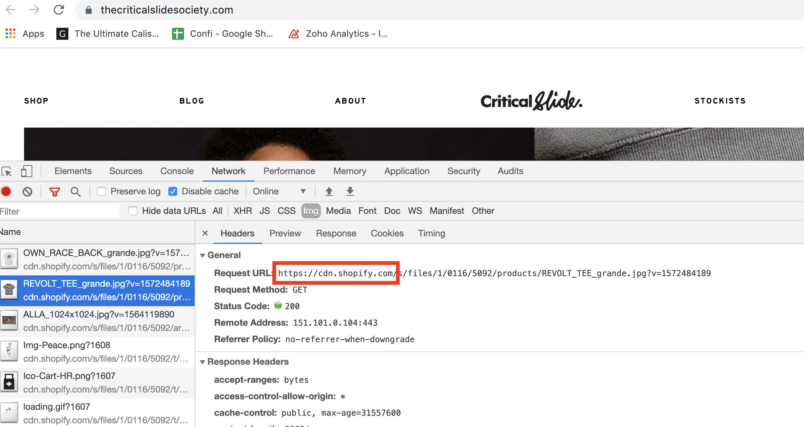

# Shopify

 

Shopify is a e-commerce platform that has gained quite a lot of traction in the last few years given the great feature set, ease of use and nominal pricing that comes with starting an e-commerce store on Shopify.

## Integration steps

Integrating ImageKit on Shopify store allows you to improve your image quality and delivery speed.


The integration with Shopify involves making some changes to your website’s theme files.


Here are the steps to optimize images on your Shopify website

### Step 1: Configure origin in ImageKit.io dashboard

Configure a [web server](../integration/configure-origin/web-server-origin.md) origin based on where your images are stored. In Shopify, this is your CDN base URL i.e. `https://cdn.shopify.com`, `https://cdn2.shopify.com` or `https://cdn.shopifycloud.com`. You can check this under the network panel tab in Chrome like shown in the screenshot below:



### Step 2: Fetch image through ImageKit.io endpoint

Let's quickly fetch the image using ImageKit.io [URL-endpoint](../integration/url-endpoints.md) and see if it's working.

When you add the first origin in your account, it automatically becomes accessible through the [default URL-endpoint](../integration/url-endpoints.md#default-url-endpoint), that is `https://ik.imagekit.io/your_imagekit_id`. Otherwise, you will have to [configure an existing](../integration/url-endpoints.md#image-origin-preference) URL endpoint or create a new one to fetch images from this newly added origin.

If your old image URL was [`https://cdn.shopify.com/img/s/files/1/1510/6482/t/22/assets/logo-mobile.png`](https://cdn.shopify.com/img/s/files/1/1510/6482/t/22/assets/logo-mobile.png) , then the same image should be accessible through ImageKit.io URL-endpoint, i.e., [`https://ik.imagekit.io/your_imagekit_id/img/s/files/1/1510/6482/t/22/assets/logo-mobile.png`](https://ik.imagekit.io/your_imagekit_id/img/s/files/1/1510/6482/t/22/assets/logo-mobile.png)


**Unable to fetch image?**\
****Contact [support@imagekit.io](mailto:support@imagekit.io) if you are not able to fetch the image as explained above. In such a situation, do not move to step 3 as this could break your website images.


### Step 3: Create settings_schema.json

If the above image did work correctly, we can now proceed to make the changes in our Shopify settings and theme files to switch the image delivery and optimization to ImageKit.

From your Shopify admin, click **Online Store** :arrow_right:**Themes**. Find the theme you want to edit, click the `...` button, and then click **Edit HTML/CSS**.

Under **Config**, click `settings_schema.json` and copy the code below as the last section of config file and hit save.

```javascript
{
    "name": "ImageKit",
    "settings": [
        {
            "type": "paragraph",
            "content": "Check out ImageKit's [ImageKit.io and Shopify integration](https://docs.imagekit.io/imagekit-docs/shopify) to learn more about this."
        },
        {
            "type": "checkbox",
            "id": "enableImageKit",
            "label": "Enable Imagekit"
        },
        {
            "type": "text",
            "id": "imagekitUrl",
            "label": "ImageKit url endpoint",
            "info":"The url endpoint you set within ImageKit. Example: `https://ik.imagekit.io/your_imagekit_id/`."
        },
        {
            "type": "text",
            "id": "imagekitShopifyCdnUrl",
            "label": "Shopify CDN domain",
            "default":"//cdn.shopify.com",
            "info":"Do not change this unless you have a proxy in place. Not sure? Leave it as is."
        }
    ]
}
```

### Step 4: Create imagekit.liquid file

Create a new file `imagekit.liquid` under Snippets directory. Copy the code below into that file, and save it.

```javascript

  
    
      
        {{ src }}
        
      
      
    
    {{ src }}
        
    
      
      
        
          
          
        
      
    
    
        {{ src }}
        
      
    
      
      
      
      
      
        
      
    
    {{ newSrc | default:src }}
    
  
    {{ src }}
  
{{ IMAGEKIT | strip | replace:'  ' | strip_newlines }}
```

### Step 5: Enable ImageKit.io

Navigate to **Online store** :arrow_right:**Themes** :arrow_right:**Customize theme**. In the sidebar, under general settings open ImageKit and enable it. Fill out the below two fields:

* Default URL endpoint - It should be `https://ik.imagekit.io/your_imagekit_id`
* Shopify CDN domain - Its value should be `//cdn2.shopify.com,//cdn.shopify.com`
* Hit the "Save" button.

### Step 6: Edit theme files

Now we get to editing your theme files. We first need to find out the files which are responsible for the output of image on your store and start editing them.


**Backup your theme files**\
****Before making changes in these files, it is recommended that you download and save them securely to be able to restore it later, in case of error.


Here are a couple of examples indicating the change that needs to be made in the theme files. You can follow similar steps to change all of your theme files.

**Example 1**

```markup
Before


After


```

**Example 2**

```markup
Before:


After:


```

**Example 3**

If there is a tag inside image URL and you cannot simply assign it, use [capture](https://help.shopify.com/en/themes/liquid/tags/variable-tags#capture)

```markup
Before:


After:







```

## FAQ

### Can I disable ImageKit.io with a single click?

Yes you can enable and disable ImageKit.io on your Shopify store with a single click. Navigate to **Online store** > **Themes** > **Customize theme**. In the sidebar, under general settings open ImageKit.io and enable/disable it.

### Can ImageKit.io automatically detect the right image dimension and load it?

No ImageKit.io only changes the base URL of your images because there is no way the server would have knowledge of your website layout. However, just by loading images through ImageKit.io URL-endpoint, your images are automatically optimized for format and quality.

### How do I make sure my integration is working?

Once you are done editing these files, save these files. Now refresh the webpage for your Shopify store and check the image URLs. They should now load from URLs beginning with `https://ik.imagekit.io/your_imagekit_id`. You can use the Chrome Developer Tools to check that all the images are being loaded via ImageKit.io and that all images are loading correctly. If you find that images on a particular page or section is still being served from Shopify, then find out the responsible theme file and edit it as well.
