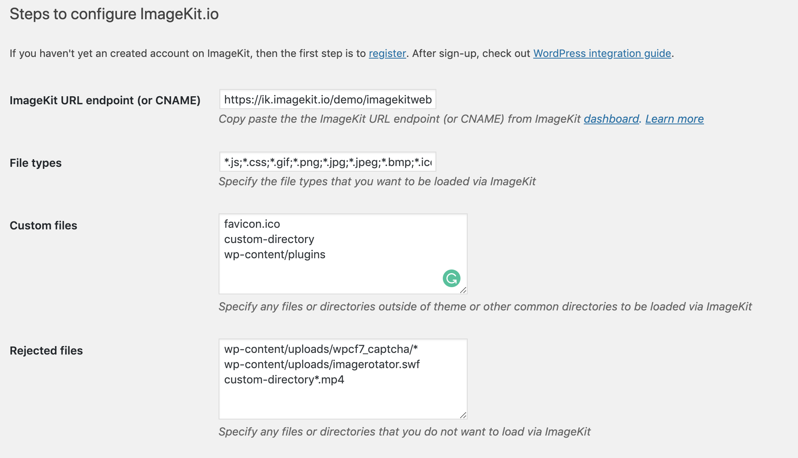

# WordPress

 

Wordpress is the most widely used platform to build websites across the globe. From small blogs to full-fledged eCommerce websites, Wordpress provides the flexibility to build different kinds of websites with minimal technical effort.

You can easily integrate ImageKit.io in your WordPress website using our [official WordPress plugin](https://wordpress.org/plugins/imagekit/).

## Plugin capabilities

| Feature | Available |
| :--- | :--- |
| Serve images in next-gen formats \(automatic image format conversion\) | **Yes** All new and old images in existing posts are automatically  delivered in the right image format including WebP using ImageKit.io.  |
| Automatic image optimization \(metadata removal and quality optimization\) | **Yes** All new and old images in existing posts are automatically  optimized during delivery using ImageKit.io. Original images are not modified. |
| Automatic image resizing \(Resizing image as per layout\) | **No** WordPress 4.4 has [added native support for responsive image](https://make.wordpress.org/core/2015/11/10/responsive-images-in-wordpress-4-4/). [Learn more](https://viastudio.com/optimizing-your-theme-for-wordpress-4-4s-responsive-images/) to make your themes image responsive. |
| Lazy loading images | **No** You can use a plugin like [a3 Lazy Load](https://wordpress.org/plugins/a3-lazy-load/) to lazy load images. |

## Integration steps

Here is what you need to do:

### Step 1: Configure origin in ImageKit.io dashboard

Configure origin based on where your images are stored. For example, [Amazon S3 bucket origin](../integration/configure-origin/amazon-s3-bucket-origin.md) or [web server](../integration/configure-origin/web-server-origin.md).

### Step 2: Fetch image through ImageKit.io endpoint

Let's quickly fetch the image using ImageKit.io [URL-endpoint](../integration/url-endpoints.md) and see if it's working.

When you add the first origin in your account, it automatically becomes accessible through the [default URL-endpoint](../integration/url-endpoints.md#default-url-endpoint), that is `https://ik.imagekit.io/your_imagekit_id`. Otherwise, you will have to [configure an existing](../integration/url-endpoints.md#image-origin-preference) URL endpoint or create a new one to fetch images from this newly added origin.

If your old image URL was [`https://www.example.com/wp-content/uploads/image.jpg`](https://www.example.com/wp-content/uploads/image.jpg), then the same image should be accessible through ImageKit.io URL-endpoint, i.e., [`https://ik.imagekit.io/your_imagekit_id/wp-content/uploads/image.jpg`](https://ik.imagekit.io/your_imagekit_id/wp-content/uploads/image.jpg)

### Step 3: Install and configure ImageKit.io plugin in WordPress

1. Install and activate [ImageKit.io WordPress plugin](https://wordpress.org/plugins/imagekit/).
2. Go to Settings➡ImageKit.io setting.
3. Fill the **ImageKit URL endpoint \(or CNAME\)** with `your_imagekit_url_endpoint`. Copy and paste from the ImageKit.io dashboard.
4. Click  "Save changes" button.
5. Flush cache, if any.


Now all the image files under theme directory on your WordPress site \(with extensions matching one of gif, png, jpg, jpeg, bmp, ico, webp\) will be loaded via ImageKit.io.


## Using ImageKit.io to deliver non-image static assets like JS or CSS

By default, ImageKit.io plugin is configured to load only image files through ImageKit.io URL-endpoint, but you can override this setting by changing the value in _File types_ field.

Enter the semicolon-separated list to allow JS and CSS files as well, for example - `*.js;*.css;*.gif;*.png;*.jpg;*.jpeg;*.bmp;*.ico;*.webp`

## Loading files from custom directories outside theme folder

By default ImageKit.io WordPress plugin loads files from theme folder. But you can override this setting by adding new paths in _Custom files_ field. All the values in this field are separated by a new line. Wildcard \(\*\) is allowed.

## Restrict loading specific files through ImageKit.io

There could be a case where you don't want the files on a specific path or pattern to be loaded via ImageKit.io. This can be done by setting the right values in _Rejected files_ field. All the values in this field are separated by a new line. Wildcard \(\*\) is allowed.

For example, we want to avoid loading captcha assets through ImageKit.io, so we can enter `wp-content/uploads/wpcf7_captcha/*` under rejected files, as shown in the screenshot above.

