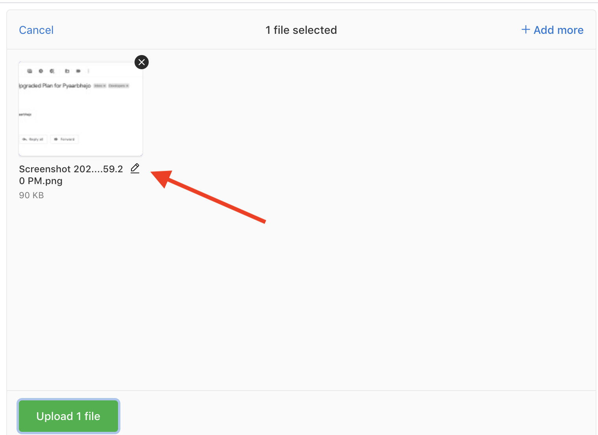
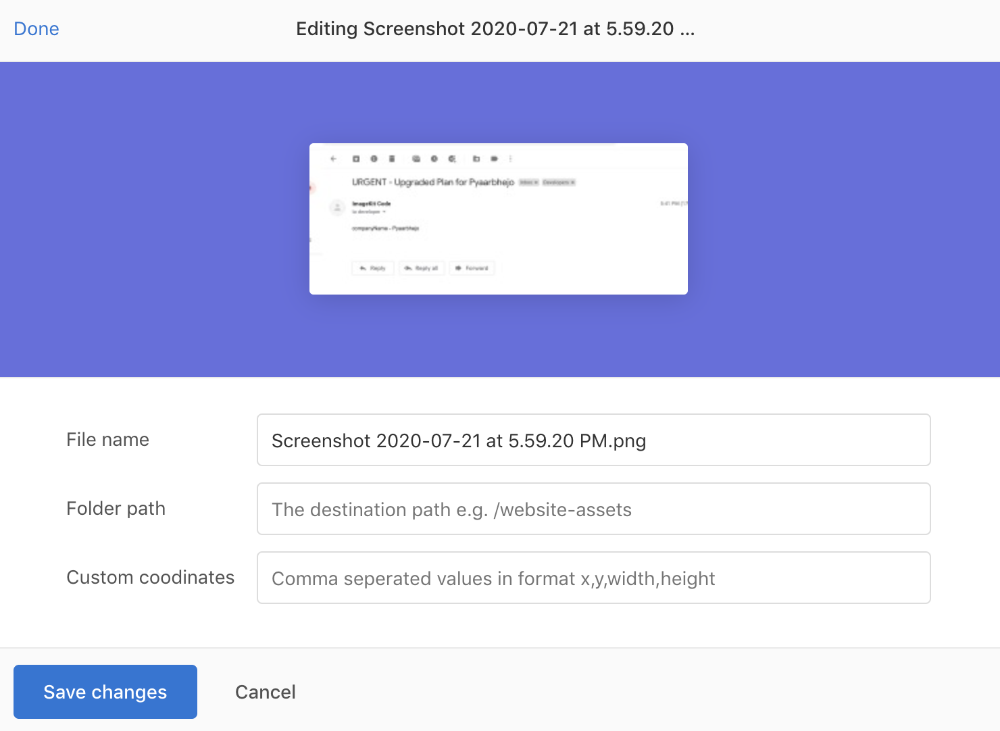

# Uppy upload widget - Plain JS

[Uppy](https://github.com/transloadit/uppy/tree/master) is a sleek, modular JavaScript file uploader that integrates seamlessly with any application.

In this sample project, we will demonstrate the integration of ImageKit.io [upload API](../../api-reference/upload-file-api/) with Uppy using the official [ImageKit Uppy plugin](https://github.com/imagekit-developer/imagekit-uppy-plugin). 

## Live demo

You can see a hosted demo of this sample project [here](https://066dn.sse.codesandbox.io) or [fork the repository on codesandbox.io](https://codesandbox.io/s/github/imagekit-samples/uppy-uploader).


## Features

This sample project has the following features. The best way to integrate an upload widget in your application is to clone this application or copy and paste the relevant part.

:white_check_mark:Upload files from the local device.\
:white_check_mark:Upload files using remote URLs.\
:white_check_mark:Let users [choose files from Google Drive, Dropbox, Instagram, or Facebook](uppy-upload-widget.md#using-dropbox-drive-and-other-cloud-storage-options).\
:white_check_mark:Option to record a selfie using the device camera and upload it.\
:white_check_mark:Preview added file.\
:white_check_mark:[Customize](uppy-upload-widget.md#modify-file-name-destination-path-or-add-tags-during-upload) the [upload request parameters](../../api-reference/upload-file-api/client-side-file-upload.md#request-structure-multipart-form-data) like file name, tags, folder path, custom coordinates, private file attribute, etc using a nice interface. 

## Minimal setup

#### Step 1: Clone this [sample application](https://github.com/imagekit-samples/uppy-uploader) directly from Github.

```
git clone git@github.com:imagekit-samples/uppy-uploader.git
```

#### Step 2: Install dependencies

Both npm and yarn should work, but we used yarn during the development and testing of this demo.

```
yarn install
```

#### **Step 3: Configure .env file**

Create a copy of `env.example` file and save it as `.env` file. This file contains your private keys, which will be used on the server-side. For a minimal setup, you need to put the following required variables i.e. `IMAGEKIT_PUBLIC_KEY`, `IMAGEKIT_PRIVATE_KEY`, `IMAGEKIT_URL_ENDPOINT`, and `SERVER_BASE_URL`.

```
# Required variables. If running in Codesandbox, please add secrets in your fork
IMAGEKIT_PUBLIC_KEY=
IMAGEKIT_PRIVATE_KEY=
IMAGEKIT_URL_ENDPOINT=

# Don't add trailing slash in SERVER_BASE_URL. It should be either http://localhost:3020 or your Codesandbox URL
SERVER_BASE_URL=yarn build
```

#### **Step 4: Start the application**

```
yarn start
```

The above command will create the JS and CSS bundles files required on the client-side and start the server.

Open [http://localhost:3020](http://localhost:3020) in your browser. This address will be equal to `SERVER_BASE_URL` variable value that you entered in **.env** file.

## **Using DropBox, Drive and other cloud storage options**

The minimal setup that we completed above gives the option to upload files from the local device or snap a selfie from the camera and upload it to ImagKit.io. In addition to that Uppy allows users to choose files from Google Drive, Dropbox, Facebook, or Instagram. 

To use these options, you need to set up [Companion](https://uppy.io/docs/companion/) on the server-side. If a user selects a big file from Dropbox, then the Companion will upload the file directly to ImageKit.io from server to server. Your users won't have to download that big file. It makes uploading files very fast. 


This sample project is already configured to use Companion in the backend. If you plan to run Companion on a different backend or as a standalone application, please follow the [Uppy documentation](https://uppy.io/docs/companion/).


Steps to configure third-party application:

1. Create a third party application and based on the platform, set up redirect URLs, checkout [Uppy docs](https://uppy.io/docs/dropbox/).
2. Specify the `key` and `secret` for your applications in **.env** file. We created this file during the setup.
3. Restart the backend server `node server/index.js`.
4. Refresh the page [http://localhost:3020](http://localhost:3020).

The **.env** file should look like this:

```
# Required variables. If your are running this in Codesandbox, please add secrets in your fork.
IMAGEKIT_PUBLIC_KEY=
IMAGEKIT_PRIVATE_KEY=
IMAGEKIT_URL_ENDPOINT=
# Don't add trailing slash in SERVER_BASE_URL. It should be either http://localhost:3020 or your Codesandbox URL
SERVER_BASE_URL=

# Optional third party app's credentials
FACEBOOK_KEY=
FACEBOOK_SECRET=
DROPBOX_KEY=
DROPBOX_SECRET=
DRIVE_KEY=
DRIVE_SECRET=
```

## Modify file name, destination path or add tags during upload

You can give users the option to change the file name, destination folder, tags, custom coordinates, or private attribute during upload.

To allow users to edit these fields, we need to configure Uppy like this.




```javascript
// Define all the fields you want on the form
const metaFields = [
    {
        id: 'name', name: 'File name', placeholder: 'Enter the file name'
    },
    {
        id: 'folder', name: 'Folder path', placeholder: 'The destination path e.g. /website-assets'
    },
    {
        id: 'tags', name: 'Tags', placeholder: 'Comma seperated tags e.g. t-shirt,summer'
    }
    // Refer to the file in project for other fields
];

// Set the value of metaFields in Dashboard options
const uppy = Uppy({ debug: true, autoProceed: false })
    .use(Dashboard, {
        inline: true,
        trigger: '#uppyDashboard',
        metaFields: metaFields
    })
```




This will show an edit icon right next to the file preview.



Once the user clicks on it, they will see a nice UI with an option to set the values.



By default, the [ImageKit Uppy plugin](https://github.com/imagekit-developer/imagekit-uppy-plugin) will send all properties of file meta object as string values with the upload requests. We can control which properties to send as part of the upload request using `metaFields` field while initializing the ImageKit Uppy plugin. Ideally, you should only allow the supported [upload request parameters](../../api-reference/upload-file-api/client-side-file-upload.md#request-structure-multipart-form-data) to avoid any surprises as we have done in this sample application.

```javascript
.use(ImageKitUppyPlugin, {
        id: 'ImageKit',
        authenticator,
        publicKey: IMAGEKIT_PUBLIC_KEY,
        metaFields: [
            "useUniqueFileName",
            "tags",
            "folder",
            "isPrivateFile",
            "customCoordinates",
            "responseFields"
        ]
    })
```

## Code walkthrough

Let's go through the code to understand different parts of it. 

### Client-side

We only have a single JS file which is **client/vanillajs/index.js**. First, we will include all the dependencies.

```javascript
import 'regenerator-runtime/runtime' // when using async await

import Uppy from '@uppy/core'
import '@uppy/core/dist/style.css'
import '@uppy/dashboard/dist/style.css'
import Url from '@uppy/url'
import Dashboard from '@uppy/dashboard'
import ImageKitUppyPlugin from "imagekit-uppy-plugin"
import GoogleDrive from '@uppy/google-drive'
import Dropbox from '@uppy/dropbox'
import Facebook from '@uppy/facebook'
import Webcam from "@uppy/webcam"
import '@uppy/webcam/dist/style.css'
```

All these dependencies are installed when you run `npm install` or `yarn install`.

Then we pick the value for `SERVER_BASE_URL` and `IMAGEKIT_PUBLIC_KEY`, that is already set in HTML by the server.

```javascript
const SERVER_BASE_URL = window.SERVER_BASE_URL;
const IMAGEKIT_PUBLIC_KEY = window.IMAGEKIT_PUBLIC_KEY;
```

Now we will configure the Uppy to render an inline upload widget in element `#uppyDashboard`

```javascript
const uppy = Uppy({ debug: true, autoProceed: false })
    .use(Dashboard, {
        inline: true,
        trigger: '#uppyDashboard',
        metaFields: metaFields
    })
```

This will render an upload widget, but we need to configure Uppy to give the option of choosing files from Dropbox, remote URL, Google Drive, etc as well. So we will use the respective plugins and set the options. 

```javascript
import Url from '@uppy/url'
import GoogleDrive from '@uppy/google-drive'
import Dropbox from '@uppy/dropbox'
import Facebook from '@uppy/facebook'

const uppy = Uppy({ debug: true, autoProceed: false })
    .use(Dashboard, {
        inline: true,
        trigger: '#uppyDashboard',
        metaFields: metaFields
    })
    .use(GoogleDrive, { target: Dashboard, companionUrl: SERVER_BASE_URL }) // don't add trailing slash
    .use(Dropbox, { target: Dashboard, companionUrl: SERVER_BASE_URL })
    .use(Facebook, { target: Dashboard, companionUrl: SERVER_BASE_URL })
    .use(Url, { target: Dashboard, companionUrl: SERVER_BASE_URL })
```

Note that the `companionUrl` is set to the root of the server running in this application. If you plan to run Companion on a different backend or as a standalone application, please follow the [Uppy documentation](https://uppy.io/docs/companion/).

Next, we need to configure Uppy to use the [ImageKit plugin](https://github.com/imagekit-developer/imagekit-uppy-plugin) for handling the actual upload.

```javascript
import ImageKitUppyPlugin from "imagekit-uppy-plugin"

const authenticator = async () => {
    try {
        const response = await fetch(`${SERVER_BASE_URL}/auth`);

        if (!response.ok) {
            const errorText = await response.text();
            throw new Error(`Request failed with status ${response.status}: ${errorText}`);
        }

        const data = await response.json();
        const { signature, expire, token } = data;
        return { signature, expire, token };
    } catch (error) {
        throw new Error(`Authentication request failed: ${error.message}`);
    }
};

const uppy = Uppy({ debug: true, autoProceed: false })
    ...
    .use(ImageKitUppyPlugin, {
        id: 'ImageKit',
        authenticator,
        publicKey: IMAGEKIT_PUBLIC_KEY,
        metaFields: [
            "useUniqueFileName",
            "tags",
            "folder",
            "isPrivateFile",
            "customCoordinates",
            "responseFields"
        ]
    })
```

This plugin accepts the following values. Read [docs](https://github.com/imagekit-developer/imagekit-uppy-plugin) for more information.

1. `id` which is how Uppy identifies plugins uniquely.
2. `authenticator` expects an asynchronous function that returns a promise, which resolves with an object containing the security parameters  `signature`, `token`, and `expire`. These parameters are required to authenticate the upload request originating from the browser. In this application, within the `authenticator` function, we are making an API call to the endpoint we have implemented at the path `/auth`. In the `authenticator` function, you can also pass custom headers in the API request for the validation of the request source.
3. `publicKey` is your ImageKit account [public key](../../api-reference/api-introduction/api-keys.md#public-key).
4. `metaFields` is an array of meta properties you want to be sent to every upload request. By default, this plugin will send all properties in the`file.meta` object.

That's it. To bundle all the dependencies into one single file which can be used on the browser, we are using Parcel in the project. Every time you run `yarn build` or `npm build`, Parcel creates bundle.js and bundle.css files in the dist folder.

### Server-side

The server is used for two things:

1. Implementing an authentication endpoint that is required by the client-side during the implementation of `authenticator` function for fetching the security parameters.
2. Running [Companion](https://uppy.io/docs/companion/) to allow the option of choosing files from third-party storage services like - Google Drive, Dropbox, Facebook, or Instagram.

This demo application is implemented in Node.js because Companion's implementation is available in Node.js. But you can implement authentication endpoint wherever you want in many programming languages using one of the ImageKit's [server-side SDKs](../../api-reference/api-introduction/sdk.md#server-side-sdks). 

Even if you are not familiar with Node.js, just run this demo application and make changes as required later. 

Alright, let's go through the code quickly. The backend code lives in the **server/index.js** file.

First, we require all the dependencies.

```javascript
const express = require('express')
const companion = require('@uppy/companion')
const bodyParser = require('body-parser')
const session = require('express-session')
const ImageKit = require("imagekit");
const path = require('path');
require('dotenv').config()
```

We are storing all the confidential private keys in **.env** file. The dotenv modules pick those values and make them available as environment variables in Node.js 

Let's configure the ImageKit Node.js SDK which we will use to generate authentication parameters.

```javascript
var imagekit = new ImageKit({
  publicKey: process.env.IMAGEKIT_PUBLIC_KEY,
  privateKey: process.env.IMAGEKIT_PRIVATE_KEY,
  urlEndpoint: process.env.IMAGEKIT_URL_ENDPOINT
});
```

Now, we will configure the express server to use body-parser and define the location for serving static files i.e. our JS and CSS files. Note that dist folder is not committed in the repository, so you should run `yarn build` or `npm build` as part of the [minimal setup](uppy-upload-widget.md#minimal-setup).

```javascript
const app = express()
app.set('view engine', 'ejs');
app.use("/dist", express.static(path.join(__dirname, '..', 'dist')));
app.use(bodyParser.json())
app.use(session({
  secret: 'some-secret',
  resave: true,
  saveUninitialized: true
}))
app.use((req, res, next) => {
  res.setHeader('Access-Control-Allow-Origin', '*')
  res.setHeader('Access-Control-Allow-Methods', '*');
  res.setHeader('Access-Control-Allow-Headers', 'Authorization, Origin, Content-Type, Accept, *');
  next()
})
```

Note that we have set many Access-Control headers to allow CORS requests. The Companion needs few headers on the request for it to work properly. I would suggest starting with the above options, figure out what you absolutely need during testing, and remove the rest. In addition to this, we are also setting a session middleware that is required by Companion.

Let's add the authentication endpoint at the path `/auth`

```javascript
app.get("/auth", (req, res, next) => {
  res.send(imagekit.getAuthenticationParameters());
})
```

`getAuthenticationParameters` function available Node.js SDK returns the required JSON.

All good so far. Let's deliver the HTML on the root `/`

```javascript
// Routes
app.get('/', (req, res) => {
  res.render(path.join(__dirname, "..", "client", "index"), {
    IMAGEKIT_PUBLIC_KEY: process.env.IMAGEKIT_PUBLIC_KEY,
    SERVER_BASE_URL: process.env.SERVER_BASE_URL
  });
})
```

Here is how **client/index.ejs** looks:

```markup
<!DOCTYPE html>
<html lang="en">
  <head>
    <title></title>
    <meta charset="UTF-8">
    <meta name="viewport" content="width=device-width, initial-scale=1">
    <link href="./dist/bundle.css" rel="stylesheet">
  </head>
  <body>
    <div id="uppyDashboard"></div>
    <script>
      window.IMAGEKIT_PUBLIC_KEY = "<%= IMAGEKIT_PUBLIC_KEY %>";
      window.SERVER_BASE_URL = "<%= SERVER_BASE_URL %>";
    </script>
    <script src="./dist/bundle.js"></script>
  </body>
</html>

```

Now let's finally set up the Companion related code. We have modified the code from the [official example](https://github.com/transloadit/uppy/tree/master/examples/uppy-with-companion) on Uppy repo to make this work our use-case.


In the production setup, you should change the value of `server` property in `uppyOptions` variable along with port and secret value.


```javascript
// initialize uppy
const uppyOptions = {
  providerOptions: {
    facebook: {
      key: process.env.FACEBOOK_KEY,
      secret: process.env.FACEBOOK_SECRET
    },
    drive: {
      key: process.env.DRIVE_KEY,
      secret: process.env.DRIVE_SECRET,
    },
    dropbox: {
      key: process.env.DROPBOX_KEY,
      secret: process.env.DROPBOX_SECRET
    }
  },
  server: {
    host: new URL(process.env.SERVER_BASE_URL).host, // the host including port e.g. localhost:3020
    protocol: new URL(process.env.SERVER_BASE_URL).protocol.replace(":","") // it should be http or https
  },
  filePath: '/tmp',
  secret: 'some-secret',
  debug: true
}

app.use(companion.app(uppyOptions))

// handle 404
app.use((req, res, next) => {
  return res.status(404).json({ message: 'Not Found' })
})

// handle server errors
app.use((err, req, res, next) => {
  console.error('\x1b[31m', err.stack, '\x1b[0m')
  res.status(err.status || 500).json({ message: err.message, error: err })
})

companion.socket(app.listen(3020), uppyOptions)

console.log(`Listening on ${process.env.SERVER_BASE_URL}`)

```

## Support

If something doesn't work as expected, please reach out to us at support@imagekit.io or create an issue on the Github repo.
