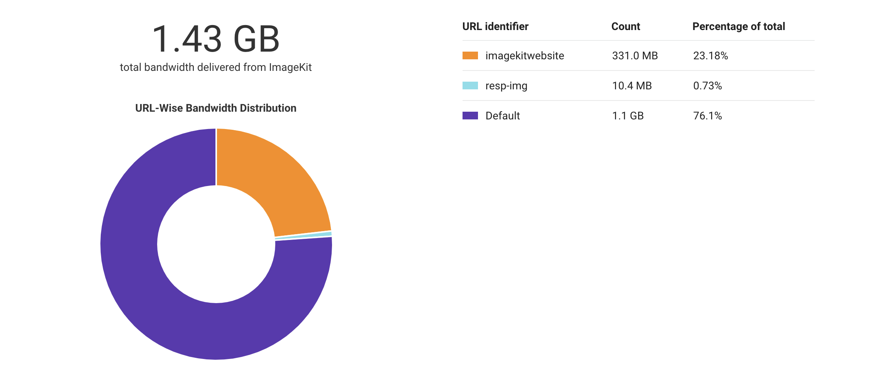
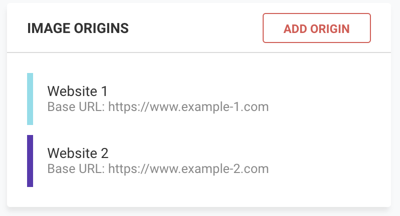
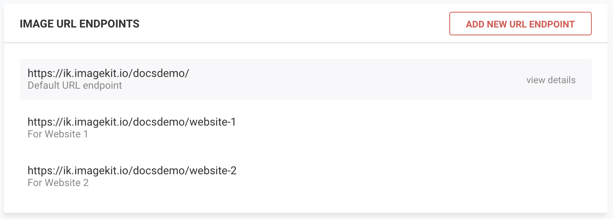
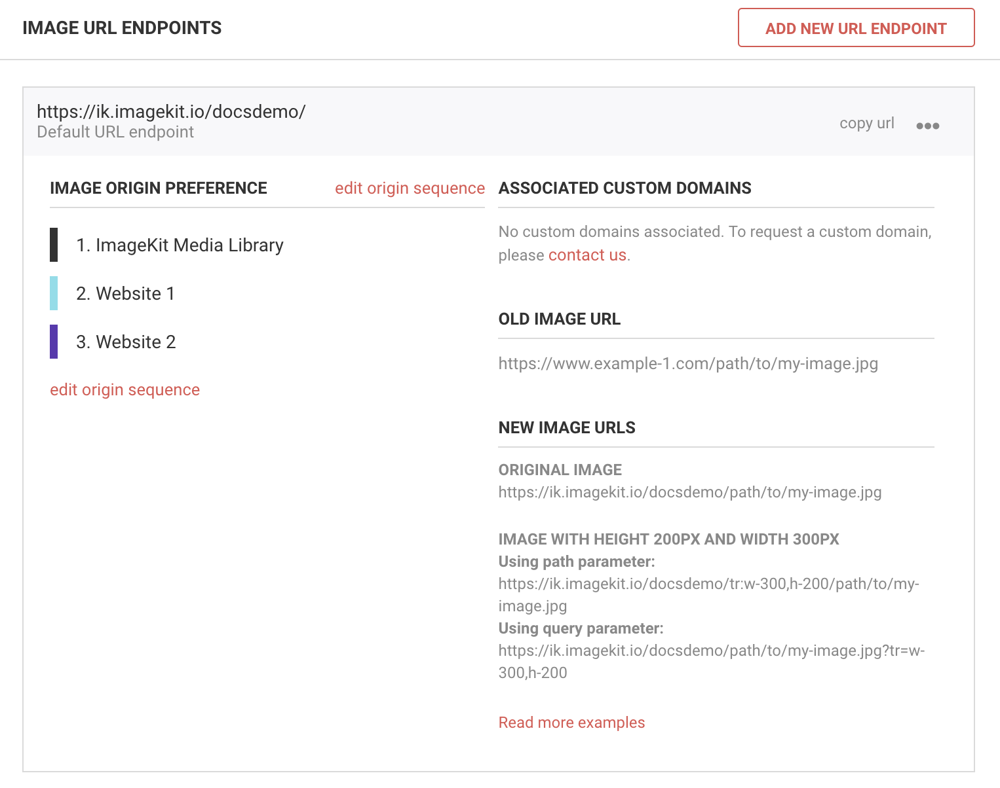

# Using on multiple websites

You can use single ImageKit.io account for multiple websites. This is very useful for a web development agency that handles multiple clients from the same account.

ImageKit.io's custom pricing plans start at the usage of over 1TB per month. Combining websites in this way under a single ImageKit.io account also allows you to get a volume discount on pricing if the total bandwidth consumption exceeds 1TB. Every time you want to integrate ImageKit.io on a website or an app, do the following:

1. [Configure the origin](../integration/configure-origin/) for a new site in the ImageKit.io dashboard.
2. Map this newly configured origin against a [URL-endpoint](../integration/url-endpoints.md), either by creating a new [URL-endpoint](../integration/url-endpoints.md#how-to-add-a-new-url-endpoint) or adding it in the [origin preference](../integration/url-endpoints.md#image-origin-preference) of an existing URL-endpoint.
3. Change the image URL on your website and app, and test different pages.
4. Go live on production.
5. Continuously check different pages of the website for performance improvements using ImageKit.io [website analyser](https://imagekit.io/website-analyzer).

## Usage analytics for different websites

Check the usage analytics for this new website in the [Analytics section](https://imagekit.io/dashboard#analytics) of the ImageKit.io dashboard. You will get a break up of the entire usage on the basis of the URL endpoint as shown in the screenshot below.

## Example setup

Suppose we have two websites, [https://www.example-1.com](https://www.example-1.com) and [https://www.example-2.com](https://www.example-2.com). Here is what we need to do:

### Step 1: Configure both the origins

We will add both the origins and give them a proper name so that we can recall them later by looking at the list. It should look like below:

### Step 2: Configure URL-endpoints

You can either create a new [URL-endpoint](../integration/url-endpoints.md) or change the [origin preference](../integration/url-endpoints.md#image-origin-preference) of an existing URL endpoint. We have created two separate URL-endpoints for these two origins:

1. `https://ik.imagekit.io/docsdemo/website-1 -`this will allow us to access images from origin named Website 1 \([https://www.example-1.com](https://www.example-1.com)\).
2. `https://ik.imagekit.io/docsdemo/website-2 -`this will allow us to access images from origin named Website 2 \([https://www.example-2.com](https://www.example-2.com)\).

It should look like this:

You can also configure a single URL endpoint to fetch images from these two origins. For example, we can change the [origin preference](../integration/url-endpoints.md#image-origin-preference) of the default URL endpoint in this example `https://ik.imagekit.io/docsdemo/` so that it can fetch images from both the origins, first from Website 1, and if not found there, then from Website 2.


You have successfully configured two websites in a single ImageKit.io account. The same approach is useful in testing different environments, like staging or production.


